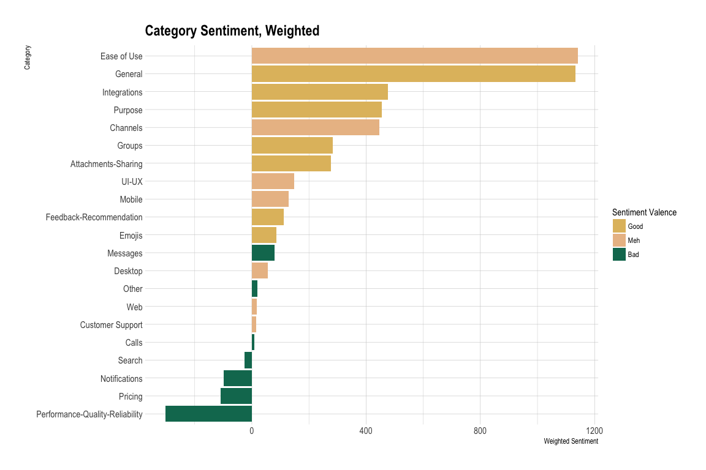

# Sentiment Analysis with MonkeyLearn

 

This is an analysis of reviews of Slack from Capterra processed using the [MonkeyLearn](https://monkeylearn.com/) API via the [`monkeylearn`](https://github.com/ropensci/monkeylearn) R package.

**Part 1**: scraping and categorizing in [`prep.md`](https://github.com/aedobbyn/sentiment-analysis-monkeylearn/blob/master/prep.md)

**Part 2**: analysis in [`analysis.md`](https://github.com/aedobbyn/sentiment-analysis-monkeylearn/blob/master/analysis.md)

