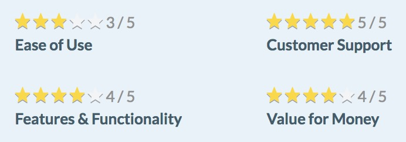

```{r setup, echo=FALSE}
library(knitr)
opts_chunk$set(
  echo = TRUE, warning = FALSE, message = FALSE,
  cache = TRUE, autodep = TRUE,
  fig.width = 12, fig.height = 8,
  cache.extra = list()
)

options(knitr.table.format = "html")
```


```{r}
library(here)
library(tidyverse)
library(rvest)
library(monkeylearn)
library(glue)
library(knitr)
library(dobtools)
library(tidytext)
library(kableExtra)
```


```{r styles}
pal <- wesanderson::wes_palette("Rushmore1")
pal2 <- wesanderson::wes_palette("Moonrise3")

round_dec <- function(x, n_dec = 3) {
  if (is.numeric(x)) {
    x <- x %>% round(digits = 2)
  } 
  x
}

add_kable <- function(df, round_decimals = TRUE, 
                      replace_na = FALSE, capitalize = TRUE,
                      add_scrollbox = FALSE, ...) {
  
  if (round_decimals == TRUE) {
    df <- df %>% 
      map_dfc(round_dec)
  }
  
  if (replace_na == TRUE) {
    df <- 
      df %>% dobtools::replace_na_df()
  }
  
  if (capitalize == TRUE) {
    df <- 
      df %>% dobtools::cap_df()
  }
  
  df <- df %>% 
    kable() %>% 
    kable_styling(full_width = F)
  
  if (add_scrollbox == TRUE) {
    df <- df %>% 
      scroll_box(height = "500px")
  }
  
  df
}
```


```{r source_in, echo=FALSE, message=FALSE}
all_reviews_slack <- read_csv(here("data", "derived", "all_reviews_slack.csv"))
reviews_with_subratings_nested <- read_csv(here("data", "derived", "reviews_with_subratings_nested.rds"))
reviews_with_subratings_unnested <- read_csv(here("data", "derived", "capterra_slack_reviews_with_subratings_unnested.csv"))

data_dir <- glue(here::here("data", "raw"), "/")

# dat <-
#   read_csv(here("data", "derived", "dat.csv"))

dat <-
  read_rds(here("data", "derived", "dat.rds"))
dat$rating_perc <- dat$rating_perc %>% as.numeric()
```


## Analysis

We've got data! `r emo::ji("tada") ` Let's take a look at it. 

```{r, dependson="source_in"}
dat %>%
  slice(1:50) %>% 
  add_kable(capitalize = FALSE, add_scrollbox = TRUE) 
```

<br>

Since there are multiple rows per review, we'll want a unique identifier for each review. Each `page_num, review_num` combination represents a unique review. We could hash these two values but since we have the benefit of knowing that the reviews happen in chronological order, it seems better to number them, starting with 1 for our oldest review.

For good measure I also created a `doc_identifier` by smushing together the page and review number.

```{r}
dat <- dat %>%
  mutate(
    doc_identifier = str_c("r", review_num, "p", page_num, sep = "_")
  )

uuids <- dat %>%
  arrange(page_num, review_num) %>%
  nest(-doc_identifier) %>%
  mutate(doc_uuid = nrow(.) - row_number() + 1) %>%
  select(-data)

dat <- dat %>%
  left_join(uuids)
```


There are only three possible sentiments for an opinion unit to have,

```{r}
dat$sentiment %>% factor() %>% levels()
```

so we can assign a number to each type of sentiment in order to be able to represent them on an ordinal scale. 


```{r numerise_sentiment, dependson="source_in"}
dat <- dat %>%
  rowwise() %>%
  mutate(
    sentiment_num = switch(sentiment,
      "Negative" = -1,
      "Neutral" = 0,
      "Positive" = 1
    )
  ) %>%
  ungroup()
```


```{r, include=FALSE}
dat$sentiment <- dat$sentiment %>% 
  fct_relevel(c("Positive", "Neutral", "Negative"))
```


What about categories?

```{r}
dat$category %>% factor() %>% levels()
```

We can see there are some opinion units labeled with the category "None". It's tough to know how to interpret these, so we can filter out these rows in a new `dat_clean` dataframe. We'll also filter out low-probability sentiments and categories -- anything that the classifier is less than 55% sure is classified correctly. 

```{r dat_clean}
probability_cutoff <- 0.55

dat_clean <-
  dat %>%
  filter(!is.na(probability_unit) & !is.na(probability_unit) &
    category != "None" &
    probability_sentiment > probability_cutoff & probability_unit > probability_cutoff)
```

After cleaning, we've got `r length(unique(dat_clean$doc_uuid))` unique opinion units to work with, each with a single sentiment and multiple classifications.

<br>

#### Initial exploring

Now let's get the lay of the land by seeing what the breakdown of sentiments is overall.

```{r sentiment_breakdown}
sentiment_breakdown <-
  dat_clean %>%
  group_by(sentiment) %>%
  count() %>%
  rename(by_sentiment = n) %>%
  ungroup() %>%
  mutate(
    total = sum(by_sentiment),
    sentiment_prop = by_sentiment / total
  )
```

<br>

```{r sentiment_breakdown_graph, echo=FALSE}
ggplot(sentiment_breakdown) +
  geom_bar(aes(fct_relevel(sentiment, "Positive", "Neutral", "Negative"), sentiment_prop, 
               fill = fct_relevel(sentiment, "Positive", "Neutral", "Negative")),
           position = "dodge", stat = "identity", width = 0.5) +
  geom_text(aes(sentiment, sentiment_prop + 0.03, 
                label = paste0(round(sentiment_prop * 100, digits = 2), "%")),
    fontface = "italic", size = 3
  ) +
  scale_y_continuous(labels = scales::percent) +
  ggtitle("Sentiment Breakdown, Overall") +
  labs(x = "Sentiment", y = "Percent", fill = "Sentiment") +
  theme_bw() +
  scale_fill_manual(values = pal2)
```

<br>

We can see there are very few reviews that have a Neutral sentiment, which is useful for us. It's easier to draw conclusions about the strengths and weaknesses of a product when most of the feedback is either definitively positive or negative. (That could also be a reflection of the tendency of reviewers to feel more strongly about the product they're reviewing than the general user base. But whether or not these reviews are an unbiased reflection of most users' true feelings about the product is neither here nor there `r emo::ji("laughing")`.)

<br>

#### Overall ratings

We might ask how users' overall ratings of the product line up with sentiments assigned to each opinion unit by MonkeyLearn. 

It's important to remember that there is a one:many relationship between ratings and opinion units here; each review gets a at most single rating, but reviews are later parceled into multiple opinions.

```{r}
ratings_by_sentiment <-
  dat_clean %>%
  distinct(doc_uuid, .keep_all = TRUE) %>% 
  group_by(sentiment) %>%
  summarise(
    mean_rating = mean(rating_perc, na.rm = TRUE)
  )

ratings_by_sentiment %>% 
  add_kable()
```

There is very little difference in overall ratings of the product across opinion unit sentiments. This indicates that despite critiques (which people are encouraged to think of and express in the Cons section), most overall reviews remain positive.

<br>

#### Sentiment and Category

What is the interaction between the two main things of interest here, category and sentiment? Let's get a summary of the mean sentiment (based off of our numerical representation of sentiment) for opinion units that have been classified into each category.


```{r sentiment_by_category}
sentiment_by_category <-
  dat_clean %>%
  group_by(category) %>%
  summarise(
    mean_sentiment = mean(sentiment_num)
  ) %>%
  arrange(desc(mean_sentiment))
```

`r sentiment_by_category[which(sentiment_by_category$mean_sentiment == min(sentiment_by_category$mean_sentiment)), ]$category` gets the lowest average sentiment, whereas `r sentiment_by_category[which(sentiment_by_category$mean_sentiment == max(sentiment_by_category$mean_sentiment)), ]$category` gets the highest.

Next I want to split these mean sentiment ratings into three equal parts and assign those parts valences that describe the mean sentiment for that category. We'll find the tertiles (a word I thought I made up but turns out it's a thing) of the mean sentiments so we can divide them three groups as they relate to each other.

```{r sentiment_by_category_summary}
tertiles <- c(
    sentiment_by_category$mean_sentiment %>% quantile(1/3),
    sentiment_by_category$mean_sentiment %>% quantile(2/3)
    )

sentiment_by_category_summary <-
  tibble(name = names(tertiles), 
         value = tertiles) 

sentiment_by_category_summary %>% 
  add_kable() 
```


We'll use these tertiles as the bounds for assigning valences. 


```{r}
bad_sentiment_upper_bound <- 
  sentiment_by_category_summary %>% 
  filter(name == sentiment_by_category_summary$name[1]) %>% pull(value)
good_sentiment_lower_bound <- 
  sentiment_by_category_summary %>% 
  filter(name == sentiment_by_category_summary$name[2]) %>% pull(value)

sentiment_by_category <-
  sentiment_by_category %>% 
  mutate(
    sentiment_valence = case_when(
      mean_sentiment < bad_sentiment_upper_bound ~ "Bad",
      mean_sentiment >= bad_sentiment_upper_bound & 
        mean_sentiment <= good_sentiment_lower_bound ~ "Meh",
      mean_sentiment > good_sentiment_lower_bound ~ "Good"
    ) %>% factor()
  )

sentiment_by_category %>%
  add_kable(add_scrollbox = TRUE)

sentiment_valence_order <- c("Good", "Meh", "Bad")

sentiment_by_category$sentiment_valence <-
  sentiment_by_category$sentiment_valence %>% fct_relevel(sentiment_valence_order)
```


NB that "Meh" != "Neutral". These category valences are only meaningful relative to one another because categories tend to be rated positively on the whole (`r round(mean(sentiment_by_category$mean_sentiment), digits=2)`) on average. That means that even the lower bound of "Meh", `r round(bad_sentiment_upper_bound, digits = 2)` exceeds Neutral, which we've coded as 0.

Now we can colo(u)r the bars of our plot with those valences. This will be useful when we shake up the order of the categories as we arrange them by different variables while retaining the measure of sentiment per category.

<br> 

```{r, echo=FALSE}
ggplot(sentiment_by_category) +
  geom_bar(aes(fct_reorder(category, mean_sentiment), mean_sentiment, fill = sentiment_valence), stat = "identity") +
  theme_bw() +
  ggtitle("Sentiment by Category") +
  labs(x = "Category", y = "Sentiment", fill = "Sentiment Valence") +
  scale_fill_manual(values = pal) +
  coord_flip()
```

<br>

This plot is useful, but it doesn't tell us anything about how *often* people complain about the aspects of the product that tend to get low sentiment ratings. We might ask, are the categories that often have a negative sentiment categories that people tend to mention often in their reviews, or are they less frequent?

Let's plot the frequency with which opinion units are categorized into different topics.

```{r}
category_freq <-
  dat_clean %>%
  group_by(category) %>%
  count(sort = TRUE) %>%
  rename(
    n_opinion_units = n
  ) %>% 
  left_join(sentiment_by_category) 
```

<br>

```{r, echo=FALSE}
ggplot(category_freq) +
  geom_bar(aes(fct_reorder(category, n_opinion_units), n_opinion_units,
               fill = sentiment_valence), stat = "identity") +
  theme_bw() +
  ggtitle("Category Mentions") +
  labs(x = "Category", y = "N", fill = "Sentiment Valence") +
  scale_fill_manual(values = pal) +
  coord_flip()
```

<br>

There doesn't seem to be a clear relationship between sentiment and number of mentions. That suggests that people aren't systematically disparaging the low-sentiment categories more than they are praising the high-sentiment categories or vice versa.


Now we can weight the category sentiment by the number of times it occurs in an opinion unit. This can give us a better idea of the sentiment in the context of how often it's mentioned. This is important because if a category has very low sentiment but its almost never mentioned, it may be less critical to focus on improving than an only mildly badly rated category with a lot of mentions.

```{r, dependson="sentiment_by_category"}
sentiment_by_category_weighted <-
  category_freq %>%
  mutate(
    weighted_sentiment = mean_sentiment * n_opinion_units
  ) %>%
  arrange(desc(weighted_sentiment))

sentiment_by_category_weighted %>%
  add_kable(add_scrollbox = TRUE)
```


<br>

```{r sentiment_by_category_weighted_graph, echo=FALSE}
ggplot(sentiment_by_category_weighted) +
  geom_bar(aes(fct_reorder(category, weighted_sentiment), weighted_sentiment,
               fill = factor(sentiment_valence)), stat = "identity") +
  theme_bw() +
  ggtitle("Category Sentiment, Weighted") +
  labs(x = "Category", y = "Weighted Sentiment", fill = "Sentiment Valence") +
  scale_fill_manual(values = pal) +
  coord_flip()
```

<br>

Even when weighting sentiment by frequency, it seems that Slack is generally doing well overall. Medium or high sentiment categories dominate the reviews in general.

<br>

#### Subratings

We can dig into the explicit ratings of different aspects of the platform and compare them to categories assigned by MonkeyLearn. If you'll recall, subratings are these things:

<br>



<br>

First we have to unnest our subratings which until now we've calmly shunted along in the list column we created from the blob of text we got them in, e.g.,

```{r}
all_reviews_slack$sub_ratings %>% sample(2)
```

We transformed that into a nested list column:

```{r}
dat$sub_ratings_split %>% sample(2)
```


We'll now want to parse these "4/5", "5/5", etc. strings of `subrating_rating`s into numbers we can work with, in the same way we did the overall ratings.

```{r}
parsed_subratings <-
  reviews_with_subratings_unnested %>%
  rowwise() %>%
  mutate(
    subrating_num =
      ifelse(is.na(sub_rating_rating), NA,
        parse(text = sub_rating_rating) %>% eval()
      )
  )

parsed_subratings %>% 
  select(sub_rating_category, sub_rating_rating, subrating_num) %>% 
  sample_n(5) 
```

What are the overall mean ratings of each aspect of the platform?

```{r}
parsed_subratings_summary <-
  parsed_subratings %>%
  drop_na(subrating_num, sub_rating_category) %>%
  group_by(sub_rating_category) %>%
  summarise(
    mean_subrating = mean(subrating_num)
  )

parsed_subratings_summary %>%
  add_kable()
```


How do these subratings match up with category ratings we calculated earlier? Some of the subrating names match perfectly with MonkeyLearn categories like "Customer Support" and "Ease of Use", but the other two we'll need to assign an alias to be able to join it up with the mean MonkeyLearn sentiment for that category and compare the two.

```{r}
parsed_subratings_summary$alias <- c("Customer Support", "Ease of Use", "General", "Pricing")

parsed_subratings_summary %>%
  left_join(sentiment_by_category,
    by = c("alias" = "category")
  ) %>% 
  add_kable()
```


What's interesting here is that people on average rate each of the four aspects very high. However, when they mention them in reviews the sentiment they attach to them can be much lower. If we take Pricing / Value for Money, for example (which may not actually be analogous concepts but let's roll with it for a minute), the sentiment attached to explicit mentions of the price of the service tend to be negative, though its Value for Money is rated well. I can see two explanations for this. The uninteresting interpretation is that most people use the free version of Slack and so they're getting something for nothing, which is a pretty good value for your money. A slightly more interesting interpretation would be that the "silent majority" on the aspect of pricing actually thinks they're getting a pretty good deal but a vocal minority disagree and that minority are the only ones voicing their dissatisfaction with the pricing model.

In any case, you could see this as evidence that it's important to take both the explicit numbers as well as sentiments into account when considering a certain aspect of a product, and as always, the base rates of users' contributions to both.


<br>


## Down to the word level

Now that we have classifications for each opinion units, we can see how the individual words in opinion units map to the sentiment and category classification they were assigned, and maybe gain some more granular insight about what people like and dislike about the product.

The [`tidytext`](https://github.com/juliasilge/tidytext) package is fantastic for this purpose. We'll use its `unnest_tokens` function to get a long dataframe of all words and then clean them up a bit by filtering out `stop_words` (a dataset included in the package) like "and" and "the". 

I add a few of our own stopwords that come up so often they're also essentially meaningless for most of our purposes.

```{r}
stop_words <- 
  stop_words %>% 
  bind_rows(
    tibble(
      word = c("slack", "pros", "cons", "overall", "comments"),
      lexicon = rep("ours", length(word))
    )
  )
```


A helper, [`dobtools::find_nums()`](https://github.com/aedobbyn/dobtools/blob/master/R/find_nums.R), mutates on a couple columns: one for whether the word in question is a number (i.e. can be converted to type numeric) and one for whether the word contains a number. If `is_num` is TRUE, then `contains_num` is also always TRUE.


```{r}
dat_tokenized <-
  dat_clean %>%
  nest(-content, -doc_uuid) %>%
  unnest_tokens(word, content) %>%
  anti_join(stop_words, "word") %>%
  dobtools::find_nums() %>%
  filter(contains_num == FALSE)
```

The `tidytext` package also includes a `sentiments` dataset which we can join on our words to get a classification of the words' sentiment in three different lexicons as well as its score on a scale of -5 (negative) to 5 (positive). (`?tidytext::sentiments` for a full explanation of the dataset.) For example:

```{r}
sentiments %>% filter(word == "yucky")
```

and 

```{r}
sentiments %>% filter(word == "yummy")
```

(Don't ask me why yummy is more positive than yucky is negative `r emo::ji("laughing")`.) Anyway, let's join this on our data set by "word".


```{r}
dat_tokenized <-
  dat_tokenized %>%
  select(-is_num, -contains_num) %>%
  left_join(tidytext::sentiments %>%
    rename(
      word_sentiment = sentiment,
      score_sentiment = score
    ),
  by = "word"
  )
```


If we're interested in doing an analysis of words that belong to opinion units that were tagged with certain categories or sentiments, we're going to need back our measure of each of those, which were labeled at the opinion unit level. Luckily we can unnest our `dat_tokenized_tfidf` dataframe in place of doing any joining.

```{r}
dat_tokenized_unnested <-
  dat_tokenized %>%
  unnest()
```


Do the words that make up an opinion unit have a significant effect on the sentiment it's assigned by MonkeyLearn?

```{r}
lm(
  data = dat_tokenized_unnested %>% drop_na(sentiment_num, score_sentiment),
  sentiment_num ~ score_sentiment
) %>%
  summary() %>%
  tidy() %>% 
  add_kable(round_decimals = FALSE)
```

Words with more positive sentiments tend to occur in more positive opinion units but as we can see from the effect size and the density plot below, the difference is not dramatic. (I use a density plot instead of a histogram to account for the difference in the number of total words in Negative and Positive opinion units, since there are about 3 times as many Positive opinion units as negative ones.)

<br>

```{r, echo=FALSE}
ggplot(dat_tokenized_unnested %>% 
         filter(sentiment != "Neutral")
       ) +
  geom_density(aes(score_sentiment, fill = 
                     fct_relevel(sentiment, c("Positive", "Neutral", "Negative"))), 
               adjust = 3) +
  facet_wrap(~ fct_relevel(sentiment, c("Positive", "Neutral", "Negative"))) +
  ggtitle("Word sentiment distribution by document sentiment") +
  labs(x = "Word sentiment", y = "Density", fill = "Sentiment") +
  theme_minimal() +
  scale_fill_manual(values = pal2)
```

<br>

Indeed on inspection it looks like the Negative distribution is heavier on the lower word sentiment side of the spectrum.

As a control, we can check whether words that appear at the beginning of the alphabet tend to get higher sentiment scores. (I don't know of a reason to suspect this might be the case which is why I'm treating it as a control but maybe there is a psycholinguist out there who can set me straight?)

We'll extract just the first letter of the word and assign it the number of the alphabet from 1 to 24.

```{r}
assign_number <- function(l) {
  if (length(l) == 0 || !l %in% letters) {
    n <- NA_integer_
  } else {
    n <- which(letters == l)
  }
  n
}

try_assign_number <- possibly(assign_number, otherwise = NA_integer_)
```


```{r}
dat_tokenized_first_letter <-
  dat_tokenized %>%
  rowwise() %>%
  mutate(
    first_letter = substr(word, 1, 1),
    first_letter_num = try_assign_number(first_letter)
  )
```

And then plot the word's sentiment as scored on the `AFINN` scale. The black dashed horizontal line represents the mean sentiment score for words in our data set and dashed blue is the linear trendline.

<br>

```{r, echo=FALSE}
ggplot(dat_tokenized_first_letter) +
  geom_smooth(aes(first_letter_num, score_sentiment)) +
  geom_smooth(aes(first_letter_num, score_sentiment),
              method = "lm",
              linetype = "dashed", se = FALSE, size = 0.5) +
  scale_x_continuous(breaks = 1:26, labels = letters) +
  geom_hline(data = dat_tokenized_first_letter, 
             yintercept = mean(dat_tokenized_first_letter$score_sentiment, na.rm = TRUE), 
             linetype = "dashed") +
  # geom_text(aes(x = 25, y = mean(dat_tokenized_first_letter$score_sentiment, na.rm = TRUE) - 0.25,
  #               label = "foo")) +
  ggtitle("Relationship between a word's first letter and its sentiment") +
  labs(x = "First letter", y = "Sentiment", subtitle = "as measured by AFINN scale") +
  theme_bw() +
  scale_fill_manual(values = pal)
```

<br>

```{r, echo=FALSE}
first_letter_lm <- 
  lm(
    data = dat_tokenized_first_letter %>% drop_na(first_letter_num, score_sentiment),
    first_letter_num ~ score_sentiment
  ) %>%
  summary() %>%
  tidy() %>% 
  map(round_dec)
```

(In case you're curious, the statistical relationship isn't significant either, as we'd expect, *b = `r first_letter_lm$estimate[2]`, p = `r first_letter_lm$p.value[2]`*.)


<br>

#### Searching for certain phrases

```{r, echo=FALSE}
replace_y <- function(x, replacement = NA_character_) {
  if (is.null(x) || length(x) == 0 || length(x[[1]]) == 0 || is.null(x[[1]])) {
    replacement
  }
  else {
    x
  }
}
```

We might be interested in phrases that follow specific words like "use" or "don't use". Here we ask for everything after `word` and up until the first period.

We might also want to pull out a category or categories if they exist in the phrase. To that end we'll make a regex for all of the categories MonkeyLearn has identified (except Other which seems uninteresting):
 
```{r}
category_reg <-
  dat_clean$category[-which(dat_clean$category == "Other")] %>%
  tolower() %>%
  unique() %>%
  str_c(collapse = "|")
```


We can make something reusable like:

```{r}
search_for <- function(df = dat_clean, col = content, word, 
                       append_the = FALSE, keep_col = FALSE) {
  word_capped <-
    dobtools::simple_cap(word)

  q_col <- enquo(col)

  look_for <- ifelse(append_the == TRUE,
    glue("{word} the |{word_capped} the "),
    glue("{word} |{word_capped} ")
  )

  out <-
    df %>%
    filter(
      str_detect(!!q_col, look_for)
    ) %>%
    distinct(!!q_col) %>%
    rowwise() %>%
    mutate(
      phrase = str_extract(!!q_col, glue("(?<={look_for}).+$")) %>%
        str_replace_all("(?<=\\.).*", ""),   # Grab everything from word until following period
      phrase_categories = str_extract_all(phrase, category_reg) %>%
        replace_y() %>%
        as_vector() %>%
        unique() %>%
        str_c(collapse = ", ")
    )
  
  if (keep_col == FALSE) {
    out <- out %>% 
      select(-!!q_col)
  }

  return(out)
}
```


We can ask for our word always followed by a "the" so that we know our `phrase` will start with a noun that our `word` is referring to. By default we won't keep the original opinion unit (when `keep_col = FALSE`) to save space but I'll put it in the first one so we can see how `search_for` works.

```{r}
search_for(word = "love", append_the = TRUE, keep_col = TRUE) %>%
  dobtools::replace_na_df() %>%
  sample_n(20) %>%
  add_kable(add_scrollbox = FALSE) %>% 
  add_header_above(c("love" = 3), italic = TRUE) %>% 
  scroll_box(height = "500px")
```

<br>

By default we won't append "the" after `word`. We can filter to just opinion units that contain our word and then the name of one of our categories following it.

```{r}
search_for(word = "use") %>%
  drop_na(phrase_categories) %>%
  dobtools::replace_na_df() %>%
  sample_n(20) %>%
  add_kable(add_scrollbox = FALSE) %>% 
  add_header_above(c("use" = 2), italic = TRUE) %>% 
  scroll_box(height = "500px")
```

<br>

```{r}
search_for(word = "want") %>%
  drop_na(phrase_categories) %>%
  dobtools::replace_na_df() %>%
  sample_n(20) %>%
  add_kable(add_scrollbox = FALSE) %>% 
  add_header_above(c("want" = 2), italic = TRUE) %>% 
  scroll_box(height = "500px")
```


<br>

#### Going Negative

Let's focus on the places where Slack might want to improve. I'll focus on the baddest of the "Bad" categories we found: Performance-Quality-Reliability . Simple word counts can shed some insight into what things people mention the most when they're talking about this topic in an opinion unit with negative sentiment.

Let's filter our opinion units to just the negative ones that MonkeyLearn classified as being about Performance-Quality-Reliability.

```{r}
pqr_negative <-
  dat_clean %>%
  filter(category == "Performance-Quality-Reliability" &
    sentiment == "Negative")
```

Next let's count up the number of times each unique word appears and take a look at the top few.

```{r}
pqr_complaints <-
  pqr_negative %>%
  unnest_tokens(word, content) %>%
  filter(category == "Performance-Quality-Reliability") %>%
  anti_join(stop_words, by = "word") %>%
  count(word, sort = TRUE)

pqr_complaints %>% 
  head() %>% 
  add_kable()
```

A reasonable question to ask might be: is the desktop app or mobile app mentioned more in P-Q-R complaints?
 
```{r}
pqr_complaints %>%
  filter(word %in% c("desktop", "mobile")) %>% 
  arrange(desc(n)) %>% 
  add_kable()
```

Okay, so it seems like mobile is more of a problem.

How does that compare to the *base rate* of the mentions of desktop and mobile across all opinion units?

```{r}
dat_tokenized %>%
  filter(word %in% c("desktop", "mobile")) %>%
  group_by(word) %>%
  count() %>% 
  arrange(desc(n)) %>% 
  add_kable()
```

So even though mobile makes more appearances in negative reviews than the desktop app, it also makes more appearances overall suggesting that maybe its P-Q-R is not more of a problem than desktop after all.

I'd be interested to know here whether people spend more active time on Slack on mobile or desktop. Do they mention mobile more because they use it more or simply because the experience is more noteworthy than the desktop experience?

<br>


#### TF-IDF

[Term frequency inverse document frequency](https://en.wikipedia.org/wiki/Tf%E2%80%93idf) is a measure of how often a word appears in a given document (here, a review) as opposed to overall, in all of the documents. That can give us a sense of how important it is to a given document as compared to a baseline of all words used in the entire corpus.

What we can learn from TF-IDF is, for instance, what words do people often use in reviews when they're talking about a specific aspect of the product that they tend to use less frequently when talking about other aspects of the product?
 
 To get every word's TF-IDF, we need to get within-document counts of each word. We'll also count how often the word is used in all reviews.

<!-- ```{r} -->
<!-- dat_tokenized_counts <-  -->
<!--  dat_tokenized %>%  -->
<!--  add_count(word) %>%  -->
<!--  rename( -->
<!--    n_words_total = n -->
<!--  ) %>%  -->
<!--  group_by(doc_uuid) %>%  -->
<!--  add_count(word) %>%  -->
<!--  rename( -->
<!--    n_words_this_doc = n -->
<!--  )  %>%  -->
<!--  ungroup()  -->
<!-- ``` -->


<!-- Now we can ask `tidytext` to do a mutate and attach the `tf_idf` of each word to our dataframe. -->

<!-- ```{r} -->
<!-- dat_tokenized_tfidf <-  -->
<!--  dat_tokenized_counts %>%  -->
<!--  bind_tf_idf(word, doc_uuid, n_words_this_doc) -->
<!-- ``` -->

A question we might be interested in is: which words are most distinctive to opinion units tagged with each category? For this purpose we can treat each category as its own document (rather than each review as its own document).

We count up the number of words used in each category and then ask `tidytext` to do a mutate and attach the `tf_idf` of each word to our dataframe.

```{r}
category_tfidf <-
  dat_tokenized_unnested %>%
  group_by(category) %>%
  add_count(word) %>%
  rename(
    n_words_this_category = n
  ) %>%
  ungroup() %>%
  bind_tf_idf(word, category, n_words_this_category) %>%
  select(word, category, tf_idf, opinion_unit, sentiment)
```


What are the words in each category that have the maximum TF-IDF?

```{r}
category_tfidf_maxes <-
  category_tfidf %>%
  unnest() %>%
  group_by(category) %>%
  filter(tf_idf == max(tf_idf)) %>%
  select(word, sentiment, category, tf_idf) %>%
  distinct(word, category, tf_idf) %>%
  arrange(category, word)

category_tfidf_maxes %>%
  select(category, word, tf_idf) %>% 
  add_kable(round_decimals = FALSE)
```


```{r, include=FALSE}
sentiment_tfidf <-
  dat_tokenized_unnested %>%
  group_by(sentiment) %>%
  add_count(word) %>%
  rename(
    n_words_this_sentiment = n
  ) %>%
  ungroup() %>%
  bind_tf_idf(word, sentiment, n_words_this_sentiment) %>%
  select(word, sentiment, tf_idf, opinion_unit, category)

sentiment_tfidf_maxes <-
  sentiment_tfidf %>%
  unnest() %>%
  group_by(sentiment) %>%
  filter(tf_idf == max(tf_idf)) %>%
  # filter(tf_idf > mean(tf_idf) + sd(tf_idf)*2) %>%
  select(word, sentiment, category, tf_idf) %>%
  distinct(word, sentiment, tf_idf) %>%
  arrange(sentiment, word)

sentiment_tfidf_maxes %>%
  add_kable()
```


Of course, these aren't the words that people use most often when talking about each of these categories: they're the ones they use most often when talking about a category *relative* to the words they use when talking about all other categories. That might be exactly what we're looking for if we want to cut through the aggregate and hone in on the specific.

In general, the analysis of the words people use when talking about certain categories can give us a sense of what people are actually saying and allows the humans to get a feel for where the pain points are and what could be improved.

<br>

## Wrap-Up

Here we've built a relatively straightforward pipeline for an analysis of web data. We grab and clean our raw data, feed it to MonkeyLearn for extraction and classification, and then analyze the results. MonkeyLearn allows us to abstract out the machine learning and plug into a simple and reliable API. What's also nice about this approach is, if we're Slack and interested the ways in which a competitor's ratings and reviews differ from ours, we can reuse everything we've done here and simply substitute in a different URL to compare another product's reviews to ours.

Human-generated text data is inherently fuzzy and interesting to probe through. Piles of it, though, can be daunting to extract any actionable insights out of. MonkeyLearn provides a way to identify variables that are both nameable and account for a lot of the variance in our data -- a sort of interpretable PCA for text data. That means less time on the modeling treadmill and more time analyzing.

Thanks and happy coding!


[^1]: Shoutout to some co-detective work with [Josh](https://www.fieldmuseum.org/blog/open-tree-life-toward-global-synthesis-phylogenetic-knowledge) [Stevens-Stein](https://github.com/jstevensstein)

[^2]: What I mean by that is: this particular topic classifier has a tree-like structure where each leaf belong to a single parent. MonkeyLearn first classifies each text into a top-level supercategory, one of: App-Software, Service, or Other. Once a text is classified at this first level, it then gets classified into one or more children in that supercategory. For instance, the children of App-Software are: Characteristics, Devices-Web, and Features. Finally, each of these has its own children. Take Characteristics: its children, which are leaf categories or terminal nodes for the classifier are Ease of Use, Integrations, Performance-Quality-Reliability, and UI-UX. This means that if a text doesn't appear to reference App-Software, the grandparent of UI-UX, it won't have a chance of being classified as UI-UX. This scheme of course doesn't preclude a text from being classified under multiple terminal nodes.

