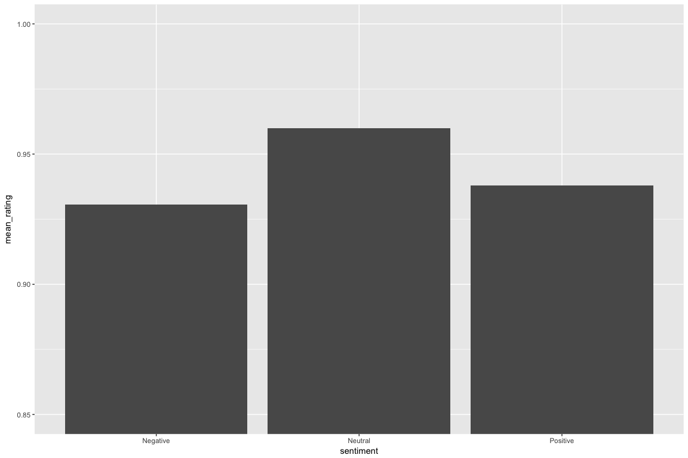
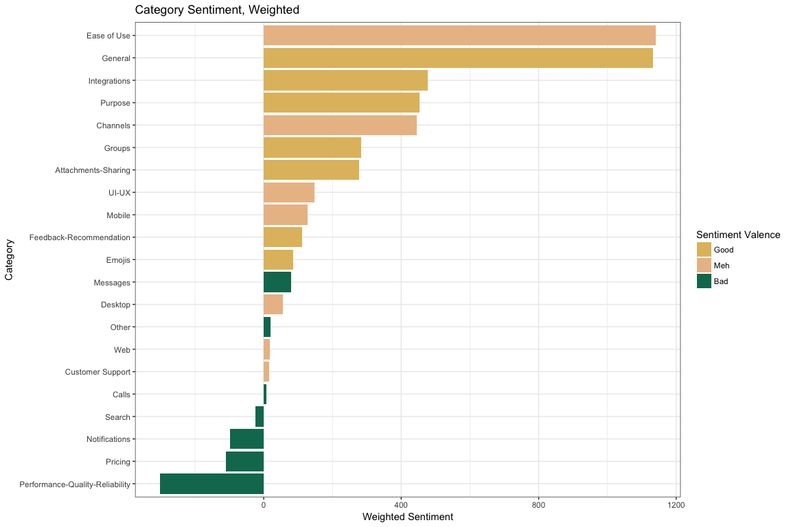

```r
library(here)
library(tidyverse)
library(rvest)
library(monkeylearn)
library(glue)
library(knitr)
library(dobtools)
library(tidytext)

pal <- wesanderson::wes_palette("Rushmore1")
```


## Analysis

We've got data! 🎉 Let's take a look at it. 


```r
dat %>%
  slice(1:20)
```

```
## # A tibble: 20 x 11
##    rating content           review_num page_num opinion_unit     sentiment
##    <chr>  <chr>                  <int>    <int> <chr>            <chr>    
##  1 5/5    Pros:  Ability t…          1        1 Ability to crea… Positive 
##  2 5/5    Pros:  Ability t…          1        1 It helps improv… Positive 
##  3 5/5    Pros:  Ability t…          1        1 It helps improv… Positive 
##  4 5/5    Pros:  Ability t…          1        1 Since it is int… Positive 
##  5 5/5    Pros:  Ability t…          1        1 Team collaborat… Positive 
##  6 5/5    Pros:  I work ac…          1        2 I work across s… Positive 
##  7 5/5    Pros:  I work ac…          1        2 I enjoy using S… Positive 
##  8 5/5    Pros:  I work ac…          1        2 The only issue … Negative 
##  9 5/5    Pros:  I work ac…          1        2 But for more st… Negative 
## 10 5/5    Pros:  I work ac…          1        2 No problem with… Neutral  
## 11 5/5    Pros:  I work ac…          1        2 though.          Negative 
## 12 5/5    Pros:  I work ac…          1        2 Flawless commun… Positive 
## 13 4/5    Pros:  The thing…          1        3 The thing I lik… Positive 
## 14 4/5    Pros:  The thing…          1        3 I wish there wa… Negative 
## 15 4/5    Pros:  The thing…          1        3 It seems as if … Negative 
## 16 5/5    Pros:  Slack is …          1        4 Slack is a grea… Positive 
## 17 5/5    Pros:  Slack is …          1        4 Slack allow us … Positive 
## 18 5/5    Pros:  Slack is …          1        4 I don't find to… Negative 
## 19 5/5    Pros:  Slack is …          1        4 I don't find to… Negative 
## 20 5/5    Pros:  Slack is …          1        4 The price might… Negative 
## # ... with 5 more variables: probability_sentiment <dbl>,
## #   rating_perc <chr>, sub_ratings_split <list>, category <chr>,
## #   probability_unit <chr>
```

Since there are multiple rows per review, we'll want a unique identifier for each review. Each `page_num, review_num` combination represents a unique review. We could hash these two values but since we have the benefit of knowing that the reviews happen in chronological order, it seems better to number them, starting with 1 for our oldest review.

For good measure I also created a `doc_identifier` by smushing together the page and review number.


```r
dat <- dat %>%
  mutate(
    doc_identifier = str_c("r", review_num, "p", page_num, sep = "_")
  )

uuids <- dat %>%
  arrange(page_num, review_num) %>%
  nest(-doc_identifier) %>%
  mutate(doc_uuid = nrow(.) - row_number() + 1) %>%
  select(-data)

dat <- dat %>%
  left_join(uuids)
```


There are only three possible sentiments for an opinion unit to have,


```r
dat$sentiment %>% factor() %>% levels()
```

```
## [1] "Negative" "Neutral"  "Positive"
```

so we can assign a number to each type of sentiment in order to be able to represent them on an ordinal scale. 


```r
dat <- dat %>%
  rowwise() %>%
  mutate(
    sentiment_num = switch(sentiment,
      "Negative" = -1,
      "Neutral" = 0,
      "Positive" = 1
    )
  ) %>%
  ungroup()
```


What about categories?


```r
dat$category %>% factor() %>% levels()
```

```
##  [1] "Attachments-Sharing"             "Calls"                          
##  [3] "Channels"                        "Customer Support"               
##  [5] "Desktop"                         "Ease of Use"                    
##  [7] "Emojis"                          "Feedback-Recommendation"        
##  [9] "General"                         "Groups"                         
## [11] "Integrations"                    "Messages"                       
## [13] "Mobile"                          "None"                           
## [15] "Notifications"                   "Other"                          
## [17] "Performance-Quality-Reliability" "Pricing"                        
## [19] "Purpose"                         "Search"                         
## [21] "UI-UX"                           "Web"
```

We can see there are some opinion units labeled with the category "None". It's tough to know how to interpret these, so we can filter out these rows in a new `dat_clean` dataframe. We'll also filter out low-probability sentiments and categories -- anything that the classifier is less than 55% sure is classified correctly.


```r
probability_cutoff <- 0.55

dat_clean <-
  dat %>%
  filter(!is.na(probability_unit) & !is.na(probability_unit) &
    category != "None" &
    probability_sentiment > probability_cutoff & probability_unit > probability_cutoff)
```

After cleaning, we've got 2314 unique opinion units to work with, each with a single sentiment and multiple classifications.


**Initial exploring**

Now let's get the lay of the land by seeing what the breakdown of sentiments is overall.


```r
sentiment_breakdown <-
  dat_clean %>%
  group_by(sentiment) %>%
  count() %>%
  rename(by_sentiment = n) %>%
  ungroup() %>%
  mutate(
    total = sum(by_sentiment),
    sentiment_prop = by_sentiment / total
  )
```


<!-- -->


We can see there are very few reviews that have a Neutral sentiment, which is useful for us. It's easier to draw conclusions about the strengths and weaknesses of a product when most of the feedback is either definitively positive or negative. (That could also be a reflection of the tendency of reviewers to feel more strongly about the product they're reviewing than the general user base. But whether or not these reviews are an unbiased reflection of most users' true feelings about the product is neither here nor there 😆.)


What is the interaction between the two main things of interest here, category and sentiment? Let's get a summary of the mean sentiment (based off of our numerical representation of sentiment) for opinion units that have been classified into each category.


```r
sentiment_by_category <-
  dat_clean %>%
  group_by(category) %>%
  summarise(
    mean_sentiment = mean(sentiment_num)
  ) %>%
  arrange(desc(mean_sentiment))
```

Performance-Quality-Reliability gets the lowest average sentiment, whereas General gets the highest.

Next I want to split these mean sentiment ratings into three equal parts and assign those parts valences that describe the mean sentiment for that category. We'll find the tertiles (a word I thought I made up but turns out it's a thing) of the mean sentiments so we can divid them three groups as they relate to each other.


```r
tertiles <- c(
    sentiment_by_category$mean_sentiment %>% quantile(1/3),
    sentiment_by_category$mean_sentiment %>% quantile(2/3)
    )

sentiment_by_category_summary <-
  tibble(name = names(tertiles), 
         value = tertiles) 

sentiment_by_category_summary %>% 
  kable()
```

<table>
 <thead>
  <tr>
   <th style="text-align:left;"> name </th>
   <th style="text-align:right;"> value </th>
  </tr>
 </thead>
<tbody>
  <tr>
   <td style="text-align:left;"> 33.33333% </td>
   <td style="text-align:right;"> 0.2512253 </td>
  </tr>
  <tr>
   <td style="text-align:left;"> 66.66667% </td>
   <td style="text-align:right;"> 0.7757711 </td>
  </tr>
</tbody>
</table>

We'll use these tertiles as the bounds for assigning valences.


```r
bad_sentiment_upper_bound <- 
  sentiment_by_category_summary %>% 
  filter(name == sentiment_by_category_summary$name[1]) %>% pull(value)
good_sentiment_lower_bound <- 
  sentiment_by_category_summary %>% 
  filter(name == sentiment_by_category_summary$name[2]) %>% pull(value)

sentiment_by_category <-
  sentiment_by_category %>% 
  mutate(
    sentiment_valence = case_when(
      mean_sentiment < bad_sentiment_upper_bound ~ "Bad",
      mean_sentiment >= bad_sentiment_upper_bound & 
        mean_sentiment <= good_sentiment_lower_bound ~ "Meh",
      mean_sentiment > good_sentiment_lower_bound ~ "Good"
    ) %>% factor()
  )

sentiment_by_category %>%
  kable()
```

<table>
 <thead>
  <tr>
   <th style="text-align:left;"> category </th>
   <th style="text-align:right;"> mean_sentiment </th>
   <th style="text-align:left;"> sentiment_valence </th>
  </tr>
 </thead>
<tbody>
  <tr>
   <td style="text-align:left;"> General </td>
   <td style="text-align:right;"> 0.9784111 </td>
   <td style="text-align:left;"> Good </td>
  </tr>
  <tr>
   <td style="text-align:left;"> Purpose </td>
   <td style="text-align:right;"> 0.9246436 </td>
   <td style="text-align:left;"> Good </td>
  </tr>
  <tr>
   <td style="text-align:left;"> Emojis </td>
   <td style="text-align:right;"> 0.8762887 </td>
   <td style="text-align:left;"> Good </td>
  </tr>
  <tr>
   <td style="text-align:left;"> Groups </td>
   <td style="text-align:right;"> 0.8761610 </td>
   <td style="text-align:left;"> Good </td>
  </tr>
  <tr>
   <td style="text-align:left;"> Integrations </td>
   <td style="text-align:right;"> 0.8487544 </td>
   <td style="text-align:left;"> Good </td>
  </tr>
  <tr>
   <td style="text-align:left;"> Feedback-Recommendation </td>
   <td style="text-align:right;"> 0.8484848 </td>
   <td style="text-align:left;"> Good </td>
  </tr>
  <tr>
   <td style="text-align:left;"> Attachments-Sharing </td>
   <td style="text-align:right;"> 0.8171091 </td>
   <td style="text-align:left;"> Good </td>
  </tr>
  <tr>
   <td style="text-align:left;"> UI-UX </td>
   <td style="text-align:right;"> 0.7551020 </td>
   <td style="text-align:left;"> Meh </td>
  </tr>
  <tr>
   <td style="text-align:left;"> Channels </td>
   <td style="text-align:right;"> 0.7458194 </td>
   <td style="text-align:left;"> Meh </td>
  </tr>
  <tr>
   <td style="text-align:left;"> Mobile </td>
   <td style="text-align:right;"> 0.7314286 </td>
   <td style="text-align:left;"> Meh </td>
  </tr>
  <tr>
   <td style="text-align:left;"> Ease of Use </td>
   <td style="text-align:right;"> 0.7100187 </td>
   <td style="text-align:left;"> Meh </td>
  </tr>
  <tr>
   <td style="text-align:left;"> Customer Support </td>
   <td style="text-align:right;"> 0.6666667 </td>
   <td style="text-align:left;"> Meh </td>
  </tr>
  <tr>
   <td style="text-align:left;"> Web </td>
   <td style="text-align:right;"> 0.5625000 </td>
   <td style="text-align:left;"> Meh </td>
  </tr>
  <tr>
   <td style="text-align:left;"> Desktop </td>
   <td style="text-align:right;"> 0.2820513 </td>
   <td style="text-align:left;"> Meh </td>
  </tr>
  <tr>
   <td style="text-align:left;"> Messages </td>
   <td style="text-align:right;"> 0.1895735 </td>
   <td style="text-align:left;"> Bad </td>
  </tr>
  <tr>
   <td style="text-align:left;"> Calls </td>
   <td style="text-align:right;"> 0.1126761 </td>
   <td style="text-align:left;"> Bad </td>
  </tr>
  <tr>
   <td style="text-align:left;"> Other </td>
   <td style="text-align:right;"> 0.1098266 </td>
   <td style="text-align:left;"> Bad </td>
  </tr>
  <tr>
   <td style="text-align:left;"> Search </td>
   <td style="text-align:right;"> -0.3246753 </td>
   <td style="text-align:left;"> Bad </td>
  </tr>
  <tr>
   <td style="text-align:left;"> Notifications </td>
   <td style="text-align:right;"> -0.4876847 </td>
   <td style="text-align:left;"> Bad </td>
  </tr>
  <tr>
   <td style="text-align:left;"> Pricing </td>
   <td style="text-align:right;"> -0.5555556 </td>
   <td style="text-align:left;"> Bad </td>
  </tr>
  <tr>
   <td style="text-align:left;"> Performance-Quality-Reliability </td>
   <td style="text-align:right;"> -0.8251366 </td>
   <td style="text-align:left;"> Bad </td>
  </tr>
</tbody>
</table>

```r
sentiment_valence_order <- c("Good", "Meh", "Bad")

sentiment_by_category$sentiment_valence <-
  sentiment_by_category$sentiment_valence %>% fct_relevel(sentiment_valence_order)
```

And now we can colo(u)r the bars of our plot with those valences. This will be useful when we shake up the order of the categories by arranging them by different variables.

<!-- -->

This plot is useful, but it doesn't tell us anything about how often people complain about the aspects of the product that tend to get low sentiment ratings. We might ask, are the categories that often have a negative sentiment categories that people tend to mention often in their reviews, or are they less frequent?

Let's see the frequency with which opinion units are categorized into different topics.


```r
category_freq <-
  dat_clean %>%
  group_by(category) %>%
  count(sort = TRUE) %>%
  rename(
    n_opinion_units = n
  ) %>% 
  left_join(sentiment_by_category) 
```

<!-- -->


Now we can weight the category sentiment by the number of times it occurs in an opinion unit.


```r
sentiment_by_category_weighted <-
  category_freq %>%
  mutate(
    weighted_sentiment = mean_sentiment * n_opinion_units
  ) %>%
  arrange(desc(weighted_sentiment))

sentiment_by_category_weighted %>%
  head() %>%
  kable()
```

<table>
 <thead>
  <tr>
   <th style="text-align:left;"> category </th>
   <th style="text-align:right;"> n_opinion_units </th>
   <th style="text-align:right;"> mean_sentiment </th>
   <th style="text-align:left;"> sentiment_valence </th>
   <th style="text-align:right;"> weighted_sentiment </th>
  </tr>
 </thead>
<tbody>
  <tr>
   <td style="text-align:left;"> Ease of Use </td>
   <td style="text-align:right;"> 1607 </td>
   <td style="text-align:right;"> 0.7100187 </td>
   <td style="text-align:left;"> Meh </td>
   <td style="text-align:right;"> 1141 </td>
  </tr>
  <tr>
   <td style="text-align:left;"> General </td>
   <td style="text-align:right;"> 1158 </td>
   <td style="text-align:right;"> 0.9784111 </td>
   <td style="text-align:left;"> Good </td>
   <td style="text-align:right;"> 1133 </td>
  </tr>
  <tr>
   <td style="text-align:left;"> Integrations </td>
   <td style="text-align:right;"> 562 </td>
   <td style="text-align:right;"> 0.8487544 </td>
   <td style="text-align:left;"> Good </td>
   <td style="text-align:right;"> 477 </td>
  </tr>
  <tr>
   <td style="text-align:left;"> Purpose </td>
   <td style="text-align:right;"> 491 </td>
   <td style="text-align:right;"> 0.9246436 </td>
   <td style="text-align:left;"> Good </td>
   <td style="text-align:right;"> 454 </td>
  </tr>
  <tr>
   <td style="text-align:left;"> Channels </td>
   <td style="text-align:right;"> 598 </td>
   <td style="text-align:right;"> 0.7458194 </td>
   <td style="text-align:left;"> Meh </td>
   <td style="text-align:right;"> 446 </td>
  </tr>
  <tr>
   <td style="text-align:left;"> Groups </td>
   <td style="text-align:right;"> 323 </td>
   <td style="text-align:right;"> 0.8761610 </td>
   <td style="text-align:left;"> Good </td>
   <td style="text-align:right;"> 283 </td>
  </tr>
</tbody>
</table>


<!-- -->

**Overall ratings**

What about overall ratings of the product? How do those line up with sentiments assigned to each opinion unit by MonkeyLearn?


```r
ratings_by_sentiment <-
  dat_clean %>%
  distinct(doc_uuid, .keep_all = TRUE) %>% 
  group_by(sentiment) %>%
  summarise(
    mean_rating = mean(rating_perc %>% as.numeric(), na.rm = TRUE)
  )

ratings_by_sentiment %>% 
  kable()
```

<table>
 <thead>
  <tr>
   <th style="text-align:left;"> sentiment </th>
   <th style="text-align:right;"> mean_rating </th>
  </tr>
 </thead>
<tbody>
  <tr>
   <td style="text-align:left;"> Negative </td>
   <td style="text-align:right;"> 0.9305263 </td>
  </tr>
  <tr>
   <td style="text-align:left;"> Neutral </td>
   <td style="text-align:right;"> 0.9600000 </td>
  </tr>
  <tr>
   <td style="text-align:left;"> Positive </td>
   <td style="text-align:right;"> 0.9380255 </td>
  </tr>
</tbody>
</table>

There is very little difference in overall ratings of the product. (It's important to remember that there is a one:many relationship between ratings and opinion units here; each review gets a at most single rating, but reviews are later parceled into multiple opinions.)

This indicates that despite critiques and a good chunk of negative opinion units, most overall reviews remain positive.


**Sub-Ratings**

We can dig into the explicit ratings of different aspects of the platform and compare them to categories assigned by MonkeyLearn.

First we have to unnest our subratings which until now we've calmly shunted along in their own list column.


We'll want to parse these "4/5", "5/5", etc. strings into numbers we can work with, in the same way we did the overall ratings.


```r
parsed_subratings <-
  reviews_with_subratings_unnested %>%
  rowwise() %>%
  mutate(
    subrating_num =
      ifelse(is.na(sub_rating_rating), NA,
        parse(text = sub_rating_rating) %>% eval()
      )
  )
```

What are the overall mean ratings of each aspect of the platform?


```r
parsed_subratings_summary <-
  parsed_subratings %>%
  drop_na(subrating_num, sub_rating_category) %>%
  group_by(sub_rating_category) %>%
  summarise(
    mean_subrating = mean(subrating_num)
  )

parsed_subratings_summary %>%
  dobtools::cap_df() %>%
  kable()
```

<table>
 <thead>
  <tr>
   <th style="text-align:left;"> Sub Rating Category </th>
   <th style="text-align:right;"> Mean Subrating </th>
  </tr>
 </thead>
<tbody>
  <tr>
   <td style="text-align:left;"> Customer Support </td>
   <td style="text-align:right;"> 0.8882126 </td>
  </tr>
  <tr>
   <td style="text-align:left;"> Ease of Use </td>
   <td style="text-align:right;"> 0.9280695 </td>
  </tr>
  <tr>
   <td style="text-align:left;"> Features &amp; Functionality </td>
   <td style="text-align:right;"> 0.9125914 </td>
  </tr>
  <tr>
   <td style="text-align:left;"> Value for Money </td>
   <td style="text-align:right;"> 0.9064195 </td>
  </tr>
</tbody>
</table>


How do these sub-ratings match up with category ratings we calculated earlier? Some of the subrating names match perfectly with MonkeyLearn categories like "Customer Support" and "Ease of Use", but the other two we'll need to assign an alias to be able to join it up with the mean MonkeyLearn sentiment for that category and compare the two.


```r
parsed_subratings_summary$alias <- c("Customer Support", "Ease of Use", "General", "Pricing")

parsed_subratings_summary %>%
  left_join(sentiment_by_category,
    by = c("alias" = "category")
  )
```

```
## # A tibble: 4 x 5
##   sub_rating_catego… mean_subrating alias  mean_sentiment sentiment_valen…
##   <chr>                       <dbl> <chr>           <dbl> <fct>           
## 1 Customer Support            0.888 Custo…          0.667 Meh             
## 2 Ease of Use                 0.928 Ease …          0.710 Meh             
## 3 Features & Functi…          0.913 Gener…          0.978 Good            
## 4 Value for Money             0.906 Prici…         -0.556 Bad
```


<br>


### Down to the word level

Now that we have classifications for each opinion units, we can see how the individual words in opinion units map to the sentiment and category classification they were assigned, and maybe gain some more granular insight about what people like and dislike about the product.

The [`tidytext`](https://github.com/juliasilge/tidytext) package is fantastic for this purpose. We'll use its `unnest_tokens` function to get a long dataframe of all words and then clean them up a bit by filtering out `stop_words` (a dataset included in the package) like "and" and "the". My helper [`dobtools::find_nums()`](https://github.com/aedobbyn/dobtools/blob/master/R/find_nums.R) mutates on a couple columns: one for whether the word in question is a number (i.e. can be converted to type numeric) and one for whether the word contains a number. If `is_num` is TRUE, then `contains_num` is also always TRUE.


```r
dat_tokenized <-
  dat_clean %>%
  nest(-content, -doc_uuid) %>%
  unnest_tokens(word, content) %>%
  anti_join(stop_words, "word") %>%
  dobtools::find_nums() %>%
  filter(contains_num == FALSE)
```

The `tidytext` package also includes a `sentiments` dataset which we can join on our words to get a classification of the words' sentiment in three different lexicons as well as its score on a scale of -5 (negative) to 5 (positive). (`?tidytext::sentiments` for a full explanation of the dataset.) For example:


```r
sentiments %>% filter(word == "yucky")
```

```
## # A tibble: 1 x 4
##   word  sentiment lexicon score
##   <chr> <chr>     <chr>   <int>
## 1 yucky <NA>      AFINN      -2
```

and 


```r
sentiments %>% filter(word == "yummy")
```

```
## # A tibble: 1 x 4
##   word  sentiment lexicon score
##   <chr> <chr>     <chr>   <int>
## 1 yummy <NA>      AFINN       3
```

(Don't ask me why yummy is more positive than yucky is negative 😆.) Anyway, let's join this on our data set by "word".


```r
dat_tokenized <-
  dat_tokenized %>%
  select(-is_num, -contains_num) %>%
  left_join(tidytext::sentiments %>%
    rename(
      word_sentiment = sentiment,
      score_sentiment = score
    ),
  by = "word"
  )
```


If we're interested in doing an analysis of words that belong to opinion units that were tagged with certain categories or sentiments, we're going to need back our measure of each of those, which were labeled at the opinion unit level. Luckily we can unnest our `dat_tokenized_tfidf` dataframe in place of doing any joining.


```r
dat_tokenized_unnested <-
  dat_tokenized %>%
  unnest()
```


Do the words that make up an opinion unit have a significant effect on the sentiment it's assigned by MonkeyLearn?


```r
lm(
  data = dat_tokenized_unnested %>% drop_na(sentiment_num, score_sentiment),
  sentiment_num ~ score_sentiment
) %>%
  summary() %>%
  tidy() %>% 
  kable()
```

<table>
 <thead>
  <tr>
   <th style="text-align:left;"> term </th>
   <th style="text-align:right;"> estimate </th>
   <th style="text-align:right;"> std.error </th>
   <th style="text-align:right;"> statistic </th>
   <th style="text-align:right;"> p.value </th>
  </tr>
 </thead>
<tbody>
  <tr>
   <td style="text-align:left;"> (Intercept) </td>
   <td style="text-align:right;"> 0.5444099 </td>
   <td style="text-align:right;"> 0.0055940 </td>
   <td style="text-align:right;"> 97.31968 </td>
   <td style="text-align:right;"> 0 </td>
  </tr>
  <tr>
   <td style="text-align:left;"> score_sentiment </td>
   <td style="text-align:right;"> 0.0289103 </td>
   <td style="text-align:right;"> 0.0027209 </td>
   <td style="text-align:right;"> 10.62545 </td>
   <td style="text-align:right;"> 0 </td>
  </tr>
</tbody>
</table>

Yes -- words with more positive sentiments tend to occur in more positive opinion units.


As a control, we can check whether words that appear at the beginning of the alphabet tend to get higher sentiment scores. (I don't know of a reason to suspect this might be the case which is why I'm treating it as a control but maybe there is a psycholinguist out there who can set me straight?)

We'll extract just the first letter of the word and assign it the number of the alphabet from 1 to 24.


```r
assign_number <- function(l) {
  if (length(l) == 0 || !l %in% letters) {
    n <- NA_integer_
  } else {
    n <- which(letters == l)
  }
  n
}

try_assign_number <- possibly(assign_number, otherwise = NA_integer_)
```


```r
dat_tokenized_first_letter <-
  dat_tokenized %>%
  rowwise() %>%
  mutate(
    first_letter = substr(word, 1, 1),
    first_letter_num = try_assign_number(first_letter)
  )
```

And then plot the word's sentiment as scored on the `AFINN` scale. The dashed horizontal line represents the mean sentiment score for words in our data set.

<!-- -->


What about the statistical relationship?


```r
lm(
  data = dat_tokenized_first_letter %>% drop_na(first_letter_num, score_sentiment),
  first_letter_num ~ score_sentiment
) %>%
  summary() %>%
  tidy() %>% 
  kable()
```

<table>
 <thead>
  <tr>
   <th style="text-align:left;"> term </th>
   <th style="text-align:right;"> estimate </th>
   <th style="text-align:right;"> std.error </th>
   <th style="text-align:right;"> statistic </th>
   <th style="text-align:right;"> p.value </th>
  </tr>
 </thead>
<tbody>
  <tr>
   <td style="text-align:left;"> (Intercept) </td>
   <td style="text-align:right;"> 8.9360363 </td>
   <td style="text-align:right;"> 0.0781396 </td>
   <td style="text-align:right;"> 114.359934 </td>
   <td style="text-align:right;"> 0.00000 </td>
  </tr>
  <tr>
   <td style="text-align:left;"> score_sentiment </td>
   <td style="text-align:right;"> 0.0363593 </td>
   <td style="text-align:right;"> 0.0379731 </td>
   <td style="text-align:right;"> 0.957503 </td>
   <td style="text-align:right;"> 0.33834 </td>
  </tr>
</tbody>
</table>

Not significant, as we might expect.


<br>


We might be interested in phrases that follow specific words like "use" or "don't use". Here we ask for everything after `word` and up until the first period.

We might also want to pull out a category or categories if they exist in the phrase. To that end we'll make a regex for all of the categories MonkeyLearn has identified (except Other which seems uninteresting):
 

```r
category_reg <-
  dat_clean$category[-which(dat_clean$category == "Other")] %>%
  tolower() %>%
  unique() %>%
  str_c(collapse = "|")
```


We can make something reusable like:


```r
search_for <- function(df = dat_clean, col = content, word = "love", append_the = FALSE) {
  word_capped <-
    dobtools::simple_cap(word)

  q_col <- enquo(col)

  look_for <- ifelse(append_the == TRUE,
    glue("{word} the |{word_capped} the "),
    glue("{word} |{word_capped} ")
  )

  out <-
    df %>%
    filter(
      str_detect(!!q_col, look_for)
    ) %>%
    distinct(!!q_col) %>%
    rowwise() %>%
    mutate(
      phrase = str_extract(!!q_col, glue("(?<={look_for}).+$")) %>%
        str_replace_all("(?<=\\.).*", ""),
      phrase_categories = str_extract_all(phrase, category_reg) %>%
        replace_y() %>%
        as_vector() %>%
        unique() %>%
        str_c(collapse = ", ")
    )

  return(out)
}
```


We can ask for our word always followed by a "the" so that we know our `phrase` will start with a noun that our `word` is referring to.


```r
search_for(word = "love", append_the = TRUE) %>%
  dobtools::replace_na_df() %>%
  head() %>%
  kable()
```

<table>
 <thead>
  <tr>
   <th style="text-align:left;"> content </th>
   <th style="text-align:left;"> phrase </th>
   <th style="text-align:left;"> phrase_categories </th>
  </tr>
 </thead>
<tbody>
  <tr>
   <td style="text-align:left;"> Pros:  This platform completely changed our company for the better! It's made communicating so seamless, easy and quick. We are easily able to organize everything into specific channels/departments and it makes it so easy to quickly talk to co-works throughout the day without picking up the phone, leaving the desk, calling a meeting, etc. Love love love the video calls to, very quick and easy to use. Also easy to upload files/photos to the team without having to send an email. Would highly recommend for efficient communication and streamlined project portal.   Cons:  Three-way video conferencing only an option with the premium upgraded account, which is worth the additional cost to have.   Overall:  Communication with team, video conferencing with team, organized channels without having to use a million email threads. Favorite software our company uses. </td>
   <td style="text-align:left;"> video calls to, very quick and easy to use. </td>
   <td style="text-align:left;"> calls </td>
  </tr>
  <tr>
   <td style="text-align:left;"> Pros:  I constantly have Slack open on my laptop, and it's become an indispensable tool for me. I love the ability to create channels for individual projects and keep all our files and communication in a central location.  Cons:  I wish Slack had better search functionality. While it's great most of the time, sometimes the search returns a lot of results that are super old or irrelevant.   Overall:  I use Slack every single day - it has served as a replacement for email and kept our team much more organized. </td>
   <td style="text-align:left;"> ability to create channels for individual projects and keep all our files and communication in a central location. </td>
   <td style="text-align:left;"> channels </td>
  </tr>
  <tr>
   <td style="text-align:left;"> Pros:  I love that all of the people with whom I communicate as part of an organization are available within seconds, without the need to find email addresses or other contact info.  Love the direct messages and within-channel communication.  Love the document saving and sharing.  Cons:  Notifications (both push and within-app) can be unreliable.  The login procedure is non-intuitive, making it difficult to convert new users from email. </td>
   <td style="text-align:left;"> direct messages and within-channel communication. </td>
   <td style="text-align:left;"> messages </td>
  </tr>
  <tr>
   <td style="text-align:left;"> Pros:  Integrations Ability to share all kinds of content  Cons:  Navigating channels and keeping track of them can be overwhelming   Overall:  I use Slack on a daily basis to communicate with my peers and stay up to date with what's happening in the workplace. I love the variety in integrations and how often Slack updates their app. The user interface is extremely easy to use and shortcuts are straightforward. </td>
   <td style="text-align:left;"> variety in integrations and how often Slack updates their app. </td>
   <td style="text-align:left;"> integrations </td>
  </tr>
  <tr>
   <td style="text-align:left;"> Pros: Easy to set up, easy to use, easy to admin. Love the UX of this app. It's modern and intuitive. I mainly use it to communicate with channel partners regarding customer cases.             Cons: I would like to get the whole company to use it but it's hard to get everyone to see the benefits. If not all use it we lose the benefits. It would be nice if there could be a way get the help to convince more in my company. </td>
   <td style="text-align:left;"> UX of this app. </td>
   <td style="text-align:left;">  </td>
  </tr>
  <tr>
   <td style="text-align:left;"> Pros:  SO EASY to contact colleagues. Fun way to communicate as well - love the GIFs, lunch polls, the ability to 'react' to messages. Love it all. We have so much fun on Slack and it definitely unites the office.   Overall:  Quick contact with my colleagues, and the ability to have fun at work!:) </td>
   <td style="text-align:left;"> GIFs, lunch polls, the ability to 'react' to messages. </td>
   <td style="text-align:left;"> messages </td>
  </tr>
</tbody>
</table>

By default we won't append "the" after `word`. We can filter to just opinion units that contain our word and then the name of one of our categories following it.


```r
search_for(word = "use") %>%
  drop_na(phrase_categories) %>%
  dobtools::replace_na_df() %>%
  head() %>%
  kable()
```

<table>
 <thead>
  <tr>
   <th style="text-align:left;"> content </th>
   <th style="text-align:left;"> phrase </th>
   <th style="text-align:left;"> phrase_categories </th>
  </tr>
 </thead>
<tbody>
  <tr>
   <td style="text-align:left;"> Pros:  Very clean and nice interface. The screen sharing software is great. It does a nice job of combining a few tools into one: chat, polls, calls, screenshare, etc.   Overall:  Makes team communication &quot;fun&quot; and seamlessly combines a few tools we use for communication into one: chat, video calls, audio calls, screen sharing, polling, etc. </td>
   <td style="text-align:left;"> for communication into one: chat, video calls, audio calls, screen sharing, polling, etc. </td>
   <td style="text-align:left;"> calls </td>
  </tr>
  <tr>
   <td style="text-align:left;"> Pros: integrations and bots, intuitive user interface, it's set up so you can do the majority of your teamwork right in the program             Cons: the mobile apps are large and sometimes slow, and generally less intuitive and harder to use than the desktop and web apps. some of the integrations are hard to use </td>
   <td style="text-align:left;"> than the desktop and web apps. </td>
   <td style="text-align:left;"> desktop, web </td>
  </tr>
  <tr>
   <td style="text-align:left;"> Comments:  Very easy-to-use software to streamline internal company messages. Very scalable with a start-up-like feel to the features (ability to add-in hilarious gifs, etc) to conversations. Also connects to Salesforce, Google Apps, and is a great tool to help me be more efficient. </td>
   <td style="text-align:left;"> software to streamline internal company messages. </td>
   <td style="text-align:left;"> messages </td>
  </tr>
  <tr>
   <td style="text-align:left;"> Pros:  The interface is really  good, user-friendly and easy to navigate. Also you don't have to be in front of computer to see if someone texted something,  as you can use it on mobile application. Really good app.   Cons:  They are no bad sides really. I used it for group university project and enjoyed for the features it offers. </td>
   <td style="text-align:left;"> it on mobile application. </td>
   <td style="text-align:left;"> mobile </td>
  </tr>
  <tr>
   <td style="text-align:left;"> Comments:  A company we work with uses Slack and has added me to one of their channels. It is easy to use that channel but I dont really understand how to join or create other channels. I wish it had the same functionality as other project mgmt platforms like a calendar. </td>
   <td style="text-align:left;"> that channel but I dont really understand how to join or create other channels. </td>
   <td style="text-align:left;"> channels </td>
  </tr>
  <tr>
   <td style="text-align:left;"> Pros:  - Ease of use on both desktop and handheld devices. - Ease of setting up project teams for fluid team environments.  Cons:  - Lack of copy-paste funcitonality. - Intrusiveness, another app dinging away on your electronic devices and distracting from work!  Overall:  Easy team sharing. </td>
   <td style="text-align:left;"> on both desktop and handheld devices. </td>
   <td style="text-align:left;"> desktop </td>
  </tr>
</tbody>
</table>


```r
search_for(word = "want") %>%
  drop_na(phrase_categories) %>%
  dobtools::replace_na_df() %>%
  head() %>%
  kable()
```

<table>
 <thead>
  <tr>
   <th style="text-align:left;"> content </th>
   <th style="text-align:left;"> phrase </th>
   <th style="text-align:left;"> phrase_categories </th>
  </tr>
 </thead>
<tbody>
  <tr>
   <td style="text-align:left;"> Pros: Easy to use, great for business purposes, we using to use skype and email before slack and now wouldn't think of going anywhere else for our internal business updates.              Cons: The ONLY con I've encountered is if you want to message multiple people the same message you either have to message each directly or create a new group which can sometimes make your channels cluttered if its a one off. Other than that, for me, this product is perfect </td>
   <td style="text-align:left;"> to message multiple people the same message you either have to message each directly or create a new group which can sometimes make your channels cluttered if its a one off. </td>
   <td style="text-align:left;"> channels </td>
  </tr>
  <tr>
   <td style="text-align:left;"> Pros:  Third party integrations &amp; bots are what makes this software great. From automated notification for different apps to gif sharing fun bots everything is so awesome.  Cons:  I wish that I had a choice to mute a certain bot/user inside a channel. Sometimes, users want to focus on something and want to mute some specific bot instead of disabling all notifications. </td>
   <td style="text-align:left;"> to focus on something and want to mute some specific bot instead of disabling all notifications. </td>
   <td style="text-align:left;"> notifications </td>
  </tr>
  <tr>
   <td style="text-align:left;"> Pros:  I like that I can communicate all different topics and have different discussions with multiple people at a time. It saves time from having meetings and creates more direct communication.  Cons:  I don't like that I can't pause notifications for some channels but not others. There is time when I want to be envolved and other times where I don't need to be and I just would like to temporarily quite the notifications. </td>
   <td style="text-align:left;"> to be envolved and other times where I don't need to be and I just would like to temporarily quite the notifications. </td>
   <td style="text-align:left;"> notifications </td>
  </tr>
  <tr>
   <td style="text-align:left;"> Pros:  1) The search feature on this software searches for the keyword in the message body,  message sender, and also in the message board. So if you want to find a password that you shared in the app a while back, you can search the keywords of the credentials and find them instantly. 2) Flexible integrations. Currently on our teams slack account, we have automated messages coming from Calendly, Asana, and Trello any time there are changes on a task or a new client signs up for a meeting on our calendar.  Cons:  After you go over a limit of certain messages on each board, you are greeted with a message saying that you cannot access your previous messages unless you upgrade your account to the premium package. This is a HUGE issue mainly because our team has extremely valuable information in our old messages that we can no longer view because we didnt upgrade.  Overall:  This tool is essentially our all-in-one C-level communication app. We get ALL of our companies updates through this tool </td>
   <td style="text-align:left;"> to find a password that you shared in the app a while back, you can search the keywords of the credentials and find them instantly. </td>
   <td style="text-align:left;"> search </td>
  </tr>
  <tr>
   <td style="text-align:left;"> Pros:  Slack is so easy to use and so much more fun than other similar products. With the option to integrate apps like Giphy, Slack makes communication with your teams fun. I also love the channels feature - if you want to open a discussion outside of a direct message or direct group message, create a channel with a purpose and allow people to grow the conversation in a thread dedicated to that topic.  Cons:  The free version only stores your most recent 10,000 messages and files, which can be a problem if you need to keep track of those conversations. The paid version eliminates that problem though, so it really isn't that big of a deal.  Overall:  It's fun, it's easy, it helps me stay on task and in the loop. </td>
   <td style="text-align:left;"> to open a discussion outside of a direct message or direct group message, create a channel with a purpose and allow people to grow the conversation in a thread dedicated to that topic. </td>
   <td style="text-align:left;"> purpose </td>
  </tr>
  <tr>
   <td style="text-align:left;"> Pros:  I love the ease of use and the ability to access it wherever and whenever I need it.  I can access it on my phone, computer, or tablet. I also love that I can snooze notifications. Whether I am in a meeting or do not want to be reached, I can set notifications to silent.   Cons:  I wish it had more when it came to scheduling appointments.  I do like that is syncs with my calendars, but there are times where it has caused a few problems with scheduling meetings.   Overall:  As a company who has multiple offices and people who often telecommute it is very nice that we can access them no matter where they are or what time zone they may be in. It is great for quick questions that do not warrant a phone call or email. An all around great tool. </td>
   <td style="text-align:left;"> to be reached, I can set notifications to silent. </td>
   <td style="text-align:left;"> notifications </td>
  </tr>
</tbody>
</table>


#### TF-IDF

[Term frequency inverse document frequency](https://en.wikipedia.org/wiki/Tf%E2%80%93idf) is a measure of how often a word appears in a given document (here, a review) as opposed to overall, in all of the documents. That can give us a sense of how important it is to a given document as compared to a baseline of all words used in the entire corpus.

What we can learn from TF-IDF is, for instance, what words do people often use in reviews when they're talking about a specific aspect of the product that they tend to use less frequently when talking about other aspects of the product?
 
 To get every word's TF-IDF, we need to get within-document counts of each word. We'll also count how often the word is used in all reviews.

<!-- ```{r} -->
<!-- dat_tokenized_counts <-  -->
<!--  dat_tokenized %>%  -->
<!--  add_count(word) %>%  -->
<!--  rename( -->
<!--    n_words_total = n -->
<!--  ) %>%  -->
<!--  group_by(doc_uuid) %>%  -->
<!--  add_count(word) %>%  -->
<!--  rename( -->
<!--    n_words_this_doc = n -->
<!--  )  %>%  -->
<!--  ungroup()  -->
<!-- ``` -->


<!-- Now we can ask `tidytext` to do a mutate and attach the `tf_idf` of each word to our dataframe. -->

<!-- ```{r} -->
<!-- dat_tokenized_tfidf <-  -->
<!--  dat_tokenized_counts %>%  -->
<!--  bind_tf_idf(word, doc_uuid, n_words_this_doc) -->
<!-- ``` -->

A question we might be interested in is: which words are most distinctive to opinion units tagged with each category? For this purpose we can treat each category as its own document (rather than each review as its own document).

We count up the number of words used in each category and then ask `tidytext` to do a mutate and attach the `tf_idf` of each word to our dataframe.


```r
category_tfidf <-
  dat_tokenized_unnested %>%
  group_by(category) %>%
  add_count(word) %>%
  rename(
    n_words_this_category = n
  ) %>%
  ungroup() %>%
  bind_tf_idf(word, category, n_words_this_category) %>%
  select(word, category, tf_idf, opinion_unit, sentiment)
```


What are the words in each category that have the maximum TF-IDF?


```r
category_tfidf_maxes <-
  category_tfidf %>%
  unnest() %>%
  group_by(category) %>%
  filter(tf_idf == max(tf_idf)) %>%
  select(word, sentiment, category, tf_idf) %>%
  distinct(word, category, tf_idf) %>%
  arrange(category, word)

category_tfidf_maxes %>%
  dobtools::cap_df() %>%
  kable()
```

<table>
 <thead>
  <tr>
   <th style="text-align:left;"> Word </th>
   <th style="text-align:left;"> Category </th>
   <th style="text-align:right;"> Tf Idf </th>
  </tr>
 </thead>
<tbody>
  <tr>
   <td style="text-align:left;"> failure </td>
   <td style="text-align:left;"> Attachments-Sharing </td>
   <td style="text-align:right;"> 0.0000022 </td>
  </tr>
  <tr>
   <td style="text-align:left;"> bridges </td>
   <td style="text-align:left;"> Calls </td>
   <td style="text-align:right;"> 0.0000252 </td>
  </tr>
  <tr>
   <td style="text-align:left;"> exciting </td>
   <td style="text-align:left;"> Channels </td>
   <td style="text-align:right;"> 0.0000009 </td>
  </tr>
  <tr>
   <td style="text-align:left;"> promised </td>
   <td style="text-align:left;"> Customer Support </td>
   <td style="text-align:right;"> 0.0002984 </td>
  </tr>
  <tr>
   <td style="text-align:left;"> impresses </td>
   <td style="text-align:left;"> Desktop </td>
   <td style="text-align:right;"> 0.0000075 </td>
  </tr>
  <tr>
   <td style="text-align:left;"> patience </td>
   <td style="text-align:left;"> Ease of Use </td>
   <td style="text-align:right;"> 0.0000001 </td>
  </tr>
  <tr>
   <td style="text-align:left;"> incomplete </td>
   <td style="text-align:left;"> Emojis </td>
   <td style="text-align:right;"> 0.0000155 </td>
  </tr>
  <tr>
   <td style="text-align:left;"> keyboards </td>
   <td style="text-align:left;"> Emojis </td>
   <td style="text-align:right;"> 0.0000155 </td>
  </tr>
  <tr>
   <td style="text-align:left;"> amazed </td>
   <td style="text-align:left;"> Feedback-Recommendation </td>
   <td style="text-align:right;"> 0.0000108 </td>
  </tr>
  <tr>
   <td style="text-align:left;"> revolutionized </td>
   <td style="text-align:left;"> Feedback-Recommendation </td>
   <td style="text-align:right;"> 0.0000108 </td>
  </tr>
  <tr>
   <td style="text-align:left;"> enjoying </td>
   <td style="text-align:left;"> General </td>
   <td style="text-align:right;"> 0.0000003 </td>
  </tr>
  <tr>
   <td style="text-align:left;"> war </td>
   <td style="text-align:left;"> Groups </td>
   <td style="text-align:right;"> 0.0000033 </td>
  </tr>
  <tr>
   <td style="text-align:left;"> obstacle </td>
   <td style="text-align:left;"> Integrations </td>
   <td style="text-align:right;"> 0.0000010 </td>
  </tr>
  <tr>
   <td style="text-align:left;"> immortal </td>
   <td style="text-align:left;"> Messages </td>
   <td style="text-align:right;"> 0.0000018 </td>
  </tr>
  <tr>
   <td style="text-align:left;"> billed </td>
   <td style="text-align:left;"> Mobile </td>
   <td style="text-align:right;"> 0.0000044 </td>
  </tr>
  <tr>
   <td style="text-align:left;"> deploys </td>
   <td style="text-align:left;"> Mobile </td>
   <td style="text-align:right;"> 0.0000044 </td>
  </tr>
  <tr>
   <td style="text-align:left;"> integrable </td>
   <td style="text-align:left;"> Mobile </td>
   <td style="text-align:right;"> 0.0000044 </td>
  </tr>
  <tr>
   <td style="text-align:left;"> notifies </td>
   <td style="text-align:left;"> Mobile </td>
   <td style="text-align:right;"> 0.0000044 </td>
  </tr>
  <tr>
   <td style="text-align:left;"> buzz </td>
   <td style="text-align:left;"> Notifications </td>
   <td style="text-align:right;"> 0.0000075 </td>
  </tr>
  <tr>
   <td style="text-align:left;"> vibrant </td>
   <td style="text-align:left;"> Other </td>
   <td style="text-align:right;"> 0.0000063 </td>
  </tr>
  <tr>
   <td style="text-align:left;"> disturbs </td>
   <td style="text-align:left;"> Performance-Quality-Reliability </td>
   <td style="text-align:right;"> 0.0000031 </td>
  </tr>
  <tr>
   <td style="text-align:left;"> imposes </td>
   <td style="text-align:left;"> Pricing </td>
   <td style="text-align:right;"> 0.0000049 </td>
  </tr>
  <tr>
   <td style="text-align:left;"> blame </td>
   <td style="text-align:left;"> Purpose </td>
   <td style="text-align:right;"> 0.0000016 </td>
  </tr>
  <tr>
   <td style="text-align:left;"> granted </td>
   <td style="text-align:left;"> Search </td>
   <td style="text-align:right;"> 0.0000257 </td>
  </tr>
  <tr>
   <td style="text-align:left;"> usefulness </td>
   <td style="text-align:left;"> Search </td>
   <td style="text-align:right;"> 0.0000257 </td>
  </tr>
  <tr>
   <td style="text-align:left;"> disappointment </td>
   <td style="text-align:left;"> UI-UX </td>
   <td style="text-align:right;"> 0.0000089 </td>
  </tr>
  <tr>
   <td style="text-align:left;"> fitting </td>
   <td style="text-align:left;"> Web </td>
   <td style="text-align:right;"> 0.0002207 </td>
  </tr>
</tbody>
</table>


#### Going Negative

Let's focus on the places where Slack might want to improve. Pricing is more self-explanatory, so I'll focus on Performance-Quality-Reliability and Notifications.


```r
problem_categories <-
  dat_clean %>%
  filter(category %in% c("Performance-Quality-Reliability", "Notifications") &
    sentiment == "Negative")
```


```r
pqr_complaints <-
  problem_categories %>%
  mutate(review_num = row_number()) %>%
  unnest_tokens(word, content) %>%
  filter(category == "Performance-Quality-Reliability") %>%
  anti_join(stop_words, by = "word") %>%
  count(word, sort = TRUE)
```

Is the desktop app or mobile app mentioned more in P-Q-R complaints?
 

```r
pqr_complaints %>%
  filter(word %in% c("desktop", "mobile"))
```

```
## # A tibble: 2 x 2
##   word        n
##   <chr>   <int>
## 1 mobile     59
## 2 desktop    43
```


How does that compare to the base rate of the mentions of desktop and mobile?


```r
dat_tokenized %>%
  filter(word %in% c("desktop", "mobile")) %>%
  group_by(word) %>%
  count()
```

```
## # A tibble: 2 x 2
## # Groups:   word [2]
##   word        n
##   <chr>   <int>
## 1 desktop   231
## 2 mobile    345
```

So interestingly, even though mobile is mentioned more often than desktop in reviews, most of the P-Q-R complaints seem to be about the desktop app. 


This is an area where companies can compare their own metrics to the same data scraped from reviews of other companies and trained using the same or very similar modules.


## Wrap-Up

Here we've built a relatively straightforward pipeline for an analysis of web data. We grab and clean our raw data, feed it to MonkeyLearn for extraction and classification, and then analyze the results. MonkeyLearn allows us to abstract out the machine learning and plug into a simple and reliable API. 

Thanks and happy coding!


[^1]: Shoutout to some co-detective work with [Josh](https://www.fieldmuseum.org/blog/open-tree-life-toward-global-synthesis-phylogenetic-knowledge) [Stevens-Stein](https://github.com/jstevensstein)

[^2]: What I mean by that is: this particular topic classifier has a tree-like structure where each leaf belong to a single parent. MonkeyLearn first classifies each text into a top-level supercategory, one of: App-Software, Service, or Other. Once a text is classified at this first level, it then gets classified into one or more children in that supercategory. For instance, the children of App-Software are: Characteristics, Devices-Web, and Features. Finally, each of these has its own children. Take Characteristics: its children, which are leaf categories or terminal nodes for the classifier are Ease of Use, Integrations, Performance-Quality-Reliability, and UI-UX. This means that if a text doesn't appear to reference App-Software, the grandparent of UI-UX, it won't have a chance of being classified as UI-UX. This scheme of course doesn't preclude a text from being classified under multiple terminal nodes.

