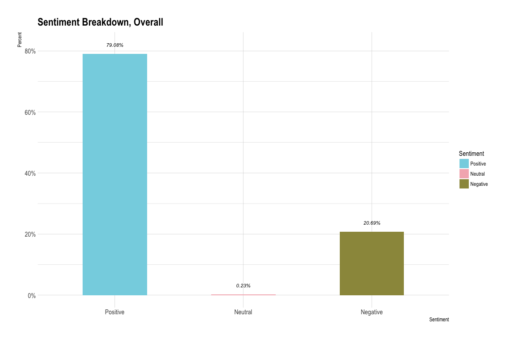
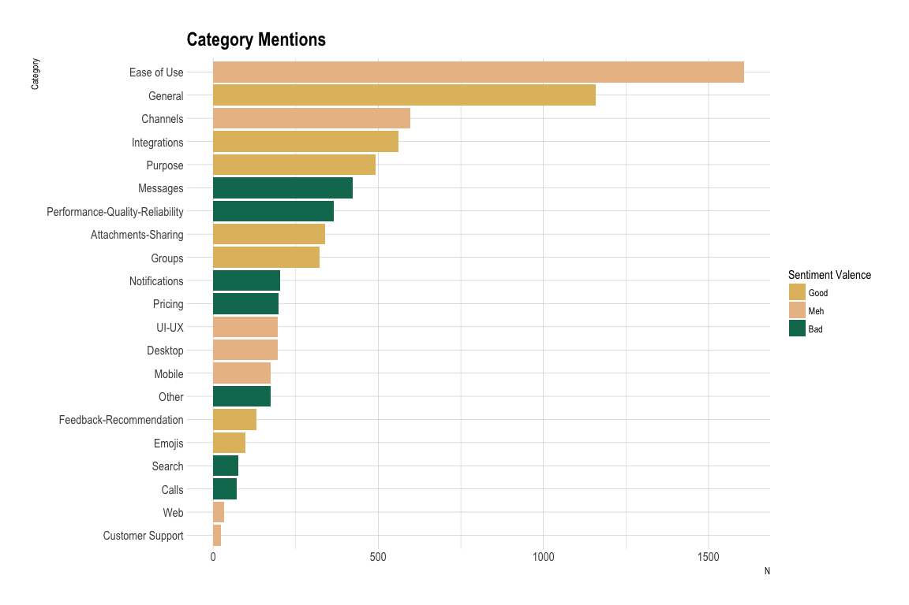

```r
library(here)
library(tidyverse)
library(rvest)
library(monkeylearn)
library(glue)
library(knitr)
library(dobtools)
library(tidytext)
library(kableExtra)
library(hrbrthemes)
```


```r
pal <- wesanderson::wes_palette("Rushmore1")
pal2 <- wesanderson::wes_palette("Moonrise3")

round_dec <- function(x, n_dec = 3) {
  if (is.numeric(x)) {
    x <- x %>% round(digits = 2)
  } 
  x
}

add_kable <- function(df, round_decimals = TRUE, 
                      replace_na = FALSE, capitalize = TRUE,
                      add_scrollbox = FALSE, ...) {
  
  if (round_decimals == TRUE) {
    df <- df %>% 
      map_dfc(round_dec)
  }
  
  if (replace_na == TRUE) {
    df <- 
      df %>% dobtools::replace_na_df()
  }
  
  if (capitalize == TRUE) {
    df <- 
      df %>% dobtools::cap_df()
  }
  
  df <- df %>% 
    kable() %>% 
    kable_styling(full_width = F)
  
  if (add_scrollbox == TRUE) {
    df <- df %>% 
      scroll_box(height = "500px")
  }
  
  df
}
```


## Analysis

We've got data! 🎉 Let's take a look at it. 


```r
dat %>%
  slice(1:50) %>% 
  add_kable(capitalize = FALSE, add_scrollbox = TRUE) 
```

<div style="border: 1px solid #ddd; padding: 5px; overflow-y: scroll; height:500px; "><table class="table" style="width: auto !important; margin-left: auto; margin-right: auto;">
 <thead>
  <tr>
   <th style="text-align:left;"> rating </th>
   <th style="text-align:left;"> content </th>
   <th style="text-align:right;"> review_num </th>
   <th style="text-align:right;"> page_num </th>
   <th style="text-align:left;"> opinion_unit </th>
   <th style="text-align:left;"> sentiment </th>
   <th style="text-align:right;"> probability_sentiment </th>
   <th style="text-align:right;"> rating_perc </th>
   <th style="text-align:left;"> sub_ratings_split </th>
   <th style="text-align:left;"> category </th>
   <th style="text-align:left;"> probability_unit </th>
  </tr>
 </thead>
<tbody>
  <tr>
   <td style="text-align:left;"> 5/5 </td>
   <td style="text-align:left;"> Pros:  Ability to create groups, project rooms and add/assign people to these groups. It helps improve coordination among team members  Cons:  Since it is intended to be used by professionals, most of the professionals are using outlook and they already receive reminders for tasks and meetings, additional notifications from Meekan are unnecessary  Overall:  Team collaboration, internal correspondence, documents sharing </td>
   <td style="text-align:right;"> 1 </td>
   <td style="text-align:right;"> 1 </td>
   <td style="text-align:left;"> Ability to create groups, project rooms and add/assign people to these groups. </td>
   <td style="text-align:left;"> Positive </td>
   <td style="text-align:right;"> 0.64 </td>
   <td style="text-align:right;"> 1.0 </td>
   <td style="text-align:left;"> list(subrating_title = c("Ease of Use", "Features &amp; Functionality", "Customer Support", "Value for Money"), subrating_rating = c("5/5", "5/5", "5/5", "5/5")) </td>
   <td style="text-align:left;"> Groups </td>
   <td style="text-align:left;"> 0.874 </td>
  </tr>
  <tr>
   <td style="text-align:left;"> 5/5 </td>
   <td style="text-align:left;"> Pros:  Ability to create groups, project rooms and add/assign people to these groups. It helps improve coordination among team members  Cons:  Since it is intended to be used by professionals, most of the professionals are using outlook and they already receive reminders for tasks and meetings, additional notifications from Meekan are unnecessary  Overall:  Team collaboration, internal correspondence, documents sharing </td>
   <td style="text-align:right;"> 1 </td>
   <td style="text-align:right;"> 1 </td>
   <td style="text-align:left;"> It helps improve coordination among team members </td>
   <td style="text-align:left;"> Positive </td>
   <td style="text-align:right;"> 0.49 </td>
   <td style="text-align:right;"> 1.0 </td>
   <td style="text-align:left;"> list(subrating_title = c("Ease of Use", "Features &amp; Functionality", "Customer Support", "Value for Money"), subrating_rating = c("5/5", "5/5", "5/5", "5/5")) </td>
   <td style="text-align:left;"> Ease of Use </td>
   <td style="text-align:left;"> 0.602 </td>
  </tr>
  <tr>
   <td style="text-align:left;"> 5/5 </td>
   <td style="text-align:left;"> Pros:  Ability to create groups, project rooms and add/assign people to these groups. It helps improve coordination among team members  Cons:  Since it is intended to be used by professionals, most of the professionals are using outlook and they already receive reminders for tasks and meetings, additional notifications from Meekan are unnecessary  Overall:  Team collaboration, internal correspondence, documents sharing </td>
   <td style="text-align:right;"> 1 </td>
   <td style="text-align:right;"> 1 </td>
   <td style="text-align:left;"> It helps improve coordination among team members </td>
   <td style="text-align:left;"> Positive </td>
   <td style="text-align:right;"> 0.49 </td>
   <td style="text-align:right;"> 1.0 </td>
   <td style="text-align:left;"> list(subrating_title = c("Ease of Use", "Features &amp; Functionality", "Customer Support", "Value for Money"), subrating_rating = c("5/5", "5/5", "5/5", "5/5")) </td>
   <td style="text-align:left;"> Purpose </td>
   <td style="text-align:left;"> 0.535 </td>
  </tr>
  <tr>
   <td style="text-align:left;"> 5/5 </td>
   <td style="text-align:left;"> Pros:  Ability to create groups, project rooms and add/assign people to these groups. It helps improve coordination among team members  Cons:  Since it is intended to be used by professionals, most of the professionals are using outlook and they already receive reminders for tasks and meetings, additional notifications from Meekan are unnecessary  Overall:  Team collaboration, internal correspondence, documents sharing </td>
   <td style="text-align:right;"> 1 </td>
   <td style="text-align:right;"> 1 </td>
   <td style="text-align:left;"> Since it is intended to be used by professionals, most of the professionals are using outlook and they already receive reminders for tasks and meetings, additional notifications from Meekan are unnecessary </td>
   <td style="text-align:left;"> Positive </td>
   <td style="text-align:right;"> 0.49 </td>
   <td style="text-align:right;"> 1.0 </td>
   <td style="text-align:left;"> list(subrating_title = c("Ease of Use", "Features &amp; Functionality", "Customer Support", "Value for Money"), subrating_rating = c("5/5", "5/5", "5/5", "5/5")) </td>
   <td style="text-align:left;"> Notifications </td>
   <td style="text-align:left;"> 0.57 </td>
  </tr>
  <tr>
   <td style="text-align:left;"> 5/5 </td>
   <td style="text-align:left;"> Pros:  Ability to create groups, project rooms and add/assign people to these groups. It helps improve coordination among team members  Cons:  Since it is intended to be used by professionals, most of the professionals are using outlook and they already receive reminders for tasks and meetings, additional notifications from Meekan are unnecessary  Overall:  Team collaboration, internal correspondence, documents sharing </td>
   <td style="text-align:right;"> 1 </td>
   <td style="text-align:right;"> 1 </td>
   <td style="text-align:left;"> Team collaboration, internal correspondence, documents sharing </td>
   <td style="text-align:left;"> Positive </td>
   <td style="text-align:right;"> 0.83 </td>
   <td style="text-align:right;"> 1.0 </td>
   <td style="text-align:left;"> list(subrating_title = c("Ease of Use", "Features &amp; Functionality", "Customer Support", "Value for Money"), subrating_rating = c("5/5", "5/5", "5/5", "5/5")) </td>
   <td style="text-align:left;"> Attachments-Sharing </td>
   <td style="text-align:left;"> 0.788 </td>
  </tr>
  <tr>
   <td style="text-align:left;"> 5/5 </td>
   <td style="text-align:left;"> Pros:  I work across several workspaces and switching is super easy. I enjoy using Slack also because of how much work you can get done instead of constantly calling.  Cons:  The only issue I have is that the software limits your storage and sometimes it's really hard to send files over as you have a limit. But for more storage you need to pay up. No problem with it though.  Overall:  Flawless communications. </td>
   <td style="text-align:right;"> 1 </td>
   <td style="text-align:right;"> 2 </td>
   <td style="text-align:left;"> I work across several workspaces and switching is super easy. </td>
   <td style="text-align:left;"> Positive </td>
   <td style="text-align:right;"> 0.56 </td>
   <td style="text-align:right;"> 1.0 </td>
   <td style="text-align:left;"> list(subrating_title = c("Ease of Use", "Features &amp; Functionality"), subrating_rating = c("5/5", "5/5")) </td>
   <td style="text-align:left;"> Ease of Use </td>
   <td style="text-align:left;"> 0.715 </td>
  </tr>
  <tr>
   <td style="text-align:left;"> 5/5 </td>
   <td style="text-align:left;"> Pros:  I work across several workspaces and switching is super easy. I enjoy using Slack also because of how much work you can get done instead of constantly calling.  Cons:  The only issue I have is that the software limits your storage and sometimes it's really hard to send files over as you have a limit. But for more storage you need to pay up. No problem with it though.  Overall:  Flawless communications. </td>
   <td style="text-align:right;"> 1 </td>
   <td style="text-align:right;"> 2 </td>
   <td style="text-align:left;"> I enjoy using Slack also because of how much work you can get done instead of constantly calling. </td>
   <td style="text-align:left;"> Positive </td>
   <td style="text-align:right;"> 0.43 </td>
   <td style="text-align:right;"> 1.0 </td>
   <td style="text-align:left;"> list(subrating_title = c("Ease of Use", "Features &amp; Functionality"), subrating_rating = c("5/5", "5/5")) </td>
   <td style="text-align:left;"> None </td>
   <td style="text-align:left;"> NA </td>
  </tr>
  <tr>
   <td style="text-align:left;"> 5/5 </td>
   <td style="text-align:left;"> Pros:  I work across several workspaces and switching is super easy. I enjoy using Slack also because of how much work you can get done instead of constantly calling.  Cons:  The only issue I have is that the software limits your storage and sometimes it's really hard to send files over as you have a limit. But for more storage you need to pay up. No problem with it though.  Overall:  Flawless communications. </td>
   <td style="text-align:right;"> 1 </td>
   <td style="text-align:right;"> 2 </td>
   <td style="text-align:left;"> The only issue I have is that the software limits your storage and sometimes it's really hard to send files over as you have a limit. </td>
   <td style="text-align:left;"> Negative </td>
   <td style="text-align:right;"> 0.89 </td>
   <td style="text-align:right;"> 1.0 </td>
   <td style="text-align:left;"> list(subrating_title = c("Ease of Use", "Features &amp; Functionality"), subrating_rating = c("5/5", "5/5")) </td>
   <td style="text-align:left;"> Performance-Quality-Reliability </td>
   <td style="text-align:left;"> 0.673 </td>
  </tr>
  <tr>
   <td style="text-align:left;"> 5/5 </td>
   <td style="text-align:left;"> Pros:  I work across several workspaces and switching is super easy. I enjoy using Slack also because of how much work you can get done instead of constantly calling.  Cons:  The only issue I have is that the software limits your storage and sometimes it's really hard to send files over as you have a limit. But for more storage you need to pay up. No problem with it though.  Overall:  Flawless communications. </td>
   <td style="text-align:right;"> 1 </td>
   <td style="text-align:right;"> 2 </td>
   <td style="text-align:left;"> But for more storage you need to pay up. </td>
   <td style="text-align:left;"> Negative </td>
   <td style="text-align:right;"> 0.72 </td>
   <td style="text-align:right;"> 1.0 </td>
   <td style="text-align:left;"> list(subrating_title = c("Ease of Use", "Features &amp; Functionality"), subrating_rating = c("5/5", "5/5")) </td>
   <td style="text-align:left;"> Pricing </td>
   <td style="text-align:left;"> 0.689 </td>
  </tr>
  <tr>
   <td style="text-align:left;"> 5/5 </td>
   <td style="text-align:left;"> Pros:  I work across several workspaces and switching is super easy. I enjoy using Slack also because of how much work you can get done instead of constantly calling.  Cons:  The only issue I have is that the software limits your storage and sometimes it's really hard to send files over as you have a limit. But for more storage you need to pay up. No problem with it though.  Overall:  Flawless communications. </td>
   <td style="text-align:right;"> 1 </td>
   <td style="text-align:right;"> 2 </td>
   <td style="text-align:left;"> No problem with it </td>
   <td style="text-align:left;"> Neutral </td>
   <td style="text-align:right;"> 0.46 </td>
   <td style="text-align:right;"> 1.0 </td>
   <td style="text-align:left;"> list(subrating_title = c("Ease of Use", "Features &amp; Functionality"), subrating_rating = c("5/5", "5/5")) </td>
   <td style="text-align:left;"> Performance-Quality-Reliability </td>
   <td style="text-align:left;"> 0.634 </td>
  </tr>
  <tr>
   <td style="text-align:left;"> 5/5 </td>
   <td style="text-align:left;"> Pros:  I work across several workspaces and switching is super easy. I enjoy using Slack also because of how much work you can get done instead of constantly calling.  Cons:  The only issue I have is that the software limits your storage and sometimes it's really hard to send files over as you have a limit. But for more storage you need to pay up. No problem with it though.  Overall:  Flawless communications. </td>
   <td style="text-align:right;"> 1 </td>
   <td style="text-align:right;"> 2 </td>
   <td style="text-align:left;"> though. </td>
   <td style="text-align:left;"> Negative </td>
   <td style="text-align:right;"> 0.71 </td>
   <td style="text-align:right;"> 1.0 </td>
   <td style="text-align:left;"> list(subrating_title = c("Ease of Use", "Features &amp; Functionality"), subrating_rating = c("5/5", "5/5")) </td>
   <td style="text-align:left;"> None </td>
   <td style="text-align:left;"> NA </td>
  </tr>
  <tr>
   <td style="text-align:left;"> 5/5 </td>
   <td style="text-align:left;"> Pros:  I work across several workspaces and switching is super easy. I enjoy using Slack also because of how much work you can get done instead of constantly calling.  Cons:  The only issue I have is that the software limits your storage and sometimes it's really hard to send files over as you have a limit. But for more storage you need to pay up. No problem with it though.  Overall:  Flawless communications. </td>
   <td style="text-align:right;"> 1 </td>
   <td style="text-align:right;"> 2 </td>
   <td style="text-align:left;"> Flawless communications. </td>
   <td style="text-align:left;"> Positive </td>
   <td style="text-align:right;"> 0.69 </td>
   <td style="text-align:right;"> 1.0 </td>
   <td style="text-align:left;"> list(subrating_title = c("Ease of Use", "Features &amp; Functionality"), subrating_rating = c("5/5", "5/5")) </td>
   <td style="text-align:left;"> General </td>
   <td style="text-align:left;"> 0.999 </td>
  </tr>
  <tr>
   <td style="text-align:left;"> 4/5 </td>
   <td style="text-align:left;"> Pros:  The thing I like most about this software, is the ability to include numerous people on the communication between projects.   Cons:  I wish there was an easier way to print documents out of slack. It seems as if you have to download the pdf before being able to print. </td>
   <td style="text-align:right;"> 1 </td>
   <td style="text-align:right;"> 3 </td>
   <td style="text-align:left;"> The thing I like most about this software, is the ability to include numerous people on the communication between projects. </td>
   <td style="text-align:left;"> Positive </td>
   <td style="text-align:right;"> 0.58 </td>
   <td style="text-align:right;"> 0.8 </td>
   <td style="text-align:left;"> list(subrating_title = c("Ease of Use", "Features &amp; Functionality", "Customer Support", "Value for Money"), subrating_rating = c("5/5", "5/5", "4/5", "5/5")) </td>
   <td style="text-align:left;"> General </td>
   <td style="text-align:left;"> 0.55 </td>
  </tr>
  <tr>
   <td style="text-align:left;"> 4/5 </td>
   <td style="text-align:left;"> Pros:  The thing I like most about this software, is the ability to include numerous people on the communication between projects.   Cons:  I wish there was an easier way to print documents out of slack. It seems as if you have to download the pdf before being able to print. </td>
   <td style="text-align:right;"> 1 </td>
   <td style="text-align:right;"> 3 </td>
   <td style="text-align:left;"> I wish there was an easier way to print documents out of slack. </td>
   <td style="text-align:left;"> Negative </td>
   <td style="text-align:right;"> 0.71 </td>
   <td style="text-align:right;"> 0.8 </td>
   <td style="text-align:left;"> list(subrating_title = c("Ease of Use", "Features &amp; Functionality", "Customer Support", "Value for Money"), subrating_rating = c("5/5", "5/5", "4/5", "5/5")) </td>
   <td style="text-align:left;"> None </td>
   <td style="text-align:left;"> NA </td>
  </tr>
  <tr>
   <td style="text-align:left;"> 4/5 </td>
   <td style="text-align:left;"> Pros:  The thing I like most about this software, is the ability to include numerous people on the communication between projects.   Cons:  I wish there was an easier way to print documents out of slack. It seems as if you have to download the pdf before being able to print. </td>
   <td style="text-align:right;"> 1 </td>
   <td style="text-align:right;"> 3 </td>
   <td style="text-align:left;"> It seems as if you have to download the pdf before being able to print. </td>
   <td style="text-align:left;"> Negative </td>
   <td style="text-align:right;"> 0.60 </td>
   <td style="text-align:right;"> 0.8 </td>
   <td style="text-align:left;"> list(subrating_title = c("Ease of Use", "Features &amp; Functionality", "Customer Support", "Value for Money"), subrating_rating = c("5/5", "5/5", "4/5", "5/5")) </td>
   <td style="text-align:left;"> Other </td>
   <td style="text-align:left;"> 0.514 </td>
  </tr>
  <tr>
   <td style="text-align:left;"> 5/5 </td>
   <td style="text-align:left;"> Pros:  Slack is a great tool for my team and I. Slack allow us to communicate effortlessly throughout the day.  Cons:  I don't find too many cons with Slack. The price might seem a little steep for premium, but that's pretty much expected. </td>
   <td style="text-align:right;"> 1 </td>
   <td style="text-align:right;"> 4 </td>
   <td style="text-align:left;"> Slack is a great tool for my team and I. </td>
   <td style="text-align:left;"> Positive </td>
   <td style="text-align:right;"> 0.61 </td>
   <td style="text-align:right;"> 1.0 </td>
   <td style="text-align:left;"> list(subrating_title = c("Ease of Use", "Features &amp; Functionality", "Customer Support", "Value for Money"), subrating_rating = c("5/5", "5/5", "5/5", "5/5")) </td>
   <td style="text-align:left;"> Purpose </td>
   <td style="text-align:left;"> 0.754 </td>
  </tr>
  <tr>
   <td style="text-align:left;"> 5/5 </td>
   <td style="text-align:left;"> Pros:  Slack is a great tool for my team and I. Slack allow us to communicate effortlessly throughout the day.  Cons:  I don't find too many cons with Slack. The price might seem a little steep for premium, but that's pretty much expected. </td>
   <td style="text-align:right;"> 1 </td>
   <td style="text-align:right;"> 4 </td>
   <td style="text-align:left;"> Slack allow us to communicate effortlessly throughout the day. </td>
   <td style="text-align:left;"> Positive </td>
   <td style="text-align:right;"> 0.72 </td>
   <td style="text-align:right;"> 1.0 </td>
   <td style="text-align:left;"> list(subrating_title = c("Ease of Use", "Features &amp; Functionality", "Customer Support", "Value for Money"), subrating_rating = c("5/5", "5/5", "5/5", "5/5")) </td>
   <td style="text-align:left;"> General </td>
   <td style="text-align:left;"> 0.673 </td>
  </tr>
  <tr>
   <td style="text-align:left;"> 5/5 </td>
   <td style="text-align:left;"> Pros:  Slack is a great tool for my team and I. Slack allow us to communicate effortlessly throughout the day.  Cons:  I don't find too many cons with Slack. The price might seem a little steep for premium, but that's pretty much expected. </td>
   <td style="text-align:right;"> 1 </td>
   <td style="text-align:right;"> 4 </td>
   <td style="text-align:left;"> I don't find too many cons with Slack. </td>
   <td style="text-align:left;"> Negative </td>
   <td style="text-align:right;"> 0.78 </td>
   <td style="text-align:right;"> 1.0 </td>
   <td style="text-align:left;"> list(subrating_title = c("Ease of Use", "Features &amp; Functionality", "Customer Support", "Value for Money"), subrating_rating = c("5/5", "5/5", "5/5", "5/5")) </td>
   <td style="text-align:left;"> Other </td>
   <td style="text-align:left;"> 0.575 </td>
  </tr>
  <tr>
   <td style="text-align:left;"> 5/5 </td>
   <td style="text-align:left;"> Pros:  Slack is a great tool for my team and I. Slack allow us to communicate effortlessly throughout the day.  Cons:  I don't find too many cons with Slack. The price might seem a little steep for premium, but that's pretty much expected. </td>
   <td style="text-align:right;"> 1 </td>
   <td style="text-align:right;"> 4 </td>
   <td style="text-align:left;"> I don't find too many cons with Slack. </td>
   <td style="text-align:left;"> Negative </td>
   <td style="text-align:right;"> 0.78 </td>
   <td style="text-align:right;"> 1.0 </td>
   <td style="text-align:left;"> list(subrating_title = c("Ease of Use", "Features &amp; Functionality", "Customer Support", "Value for Money"), subrating_rating = c("5/5", "5/5", "5/5", "5/5")) </td>
   <td style="text-align:left;"> Integrations </td>
   <td style="text-align:left;"> 0.526 </td>
  </tr>
  <tr>
   <td style="text-align:left;"> 5/5 </td>
   <td style="text-align:left;"> Pros:  Slack is a great tool for my team and I. Slack allow us to communicate effortlessly throughout the day.  Cons:  I don't find too many cons with Slack. The price might seem a little steep for premium, but that's pretty much expected. </td>
   <td style="text-align:right;"> 1 </td>
   <td style="text-align:right;"> 4 </td>
   <td style="text-align:left;"> The price might seem a little steep for premium, </td>
   <td style="text-align:left;"> Negative </td>
   <td style="text-align:right;"> 0.78 </td>
   <td style="text-align:right;"> 1.0 </td>
   <td style="text-align:left;"> list(subrating_title = c("Ease of Use", "Features &amp; Functionality", "Customer Support", "Value for Money"), subrating_rating = c("5/5", "5/5", "5/5", "5/5")) </td>
   <td style="text-align:left;"> Pricing </td>
   <td style="text-align:left;"> 0.838 </td>
  </tr>
  <tr>
   <td style="text-align:left;"> 5/5 </td>
   <td style="text-align:left;"> Pros:  Slack is a great tool for my team and I. Slack allow us to communicate effortlessly throughout the day.  Cons:  I don't find too many cons with Slack. The price might seem a little steep for premium, but that's pretty much expected. </td>
   <td style="text-align:right;"> 1 </td>
   <td style="text-align:right;"> 4 </td>
   <td style="text-align:left;"> but that's pretty much expected. </td>
   <td style="text-align:left;"> Negative </td>
   <td style="text-align:right;"> 0.42 </td>
   <td style="text-align:right;"> 1.0 </td>
   <td style="text-align:left;"> list(subrating_title = c("Ease of Use", "Features &amp; Functionality", "Customer Support", "Value for Money"), subrating_rating = c("5/5", "5/5", "5/5", "5/5")) </td>
   <td style="text-align:left;"> Performance-Quality-Reliability </td>
   <td style="text-align:left;"> 0.516 </td>
  </tr>
  <tr>
   <td style="text-align:left;"> 5/5 </td>
   <td style="text-align:left;"> Pros:  It's simple and it works. We're able to have conversations focused on the overall team, smaller teams, and 1:1 conversations. Either by text or media.   Cons:  Not much. This software does everything that I need it to do. My biggest problem is training people to auto-launch Slack when they start up their computers. </td>
   <td style="text-align:right;"> 1 </td>
   <td style="text-align:right;"> 5 </td>
   <td style="text-align:left;"> It's simple and it works. </td>
   <td style="text-align:left;"> Positive </td>
   <td style="text-align:right;"> 0.62 </td>
   <td style="text-align:right;"> 1.0 </td>
   <td style="text-align:left;"> list(subrating_title = c("Ease of Use", "Features &amp; Functionality", "Customer Support", "Value for Money"), subrating_rating = c("5/5", "5/5", "5/5", "5/5")) </td>
   <td style="text-align:left;"> Ease of Use </td>
   <td style="text-align:left;"> 0.692 </td>
  </tr>
  <tr>
   <td style="text-align:left;"> 5/5 </td>
   <td style="text-align:left;"> Pros:  It's simple and it works. We're able to have conversations focused on the overall team, smaller teams, and 1:1 conversations. Either by text or media.   Cons:  Not much. This software does everything that I need it to do. My biggest problem is training people to auto-launch Slack when they start up their computers. </td>
   <td style="text-align:right;"> 1 </td>
   <td style="text-align:right;"> 5 </td>
   <td style="text-align:left;"> We're able to have conversations focused on the overall team, smaller teams, and 1:1 conversations. </td>
   <td style="text-align:left;"> Positive </td>
   <td style="text-align:right;"> 0.42 </td>
   <td style="text-align:right;"> 1.0 </td>
   <td style="text-align:left;"> list(subrating_title = c("Ease of Use", "Features &amp; Functionality", "Customer Support", "Value for Money"), subrating_rating = c("5/5", "5/5", "5/5", "5/5")) </td>
   <td style="text-align:left;"> None </td>
   <td style="text-align:left;"> NA </td>
  </tr>
  <tr>
   <td style="text-align:left;"> 5/5 </td>
   <td style="text-align:left;"> Pros:  It's simple and it works. We're able to have conversations focused on the overall team, smaller teams, and 1:1 conversations. Either by text or media.   Cons:  Not much. This software does everything that I need it to do. My biggest problem is training people to auto-launch Slack when they start up their computers. </td>
   <td style="text-align:right;"> 1 </td>
   <td style="text-align:right;"> 5 </td>
   <td style="text-align:left;"> Either by text or media. </td>
   <td style="text-align:left;"> Positive </td>
   <td style="text-align:right;"> 0.55 </td>
   <td style="text-align:right;"> 1.0 </td>
   <td style="text-align:left;"> list(subrating_title = c("Ease of Use", "Features &amp; Functionality", "Customer Support", "Value for Money"), subrating_rating = c("5/5", "5/5", "5/5", "5/5")) </td>
   <td style="text-align:left;"> None </td>
   <td style="text-align:left;"> NA </td>
  </tr>
  <tr>
   <td style="text-align:left;"> 5/5 </td>
   <td style="text-align:left;"> Pros:  It's simple and it works. We're able to have conversations focused on the overall team, smaller teams, and 1:1 conversations. Either by text or media.   Cons:  Not much. This software does everything that I need it to do. My biggest problem is training people to auto-launch Slack when they start up their computers. </td>
   <td style="text-align:right;"> 1 </td>
   <td style="text-align:right;"> 5 </td>
   <td style="text-align:left;"> Not much. </td>
   <td style="text-align:left;"> Negative </td>
   <td style="text-align:right;"> 0.48 </td>
   <td style="text-align:right;"> 1.0 </td>
   <td style="text-align:left;"> list(subrating_title = c("Ease of Use", "Features &amp; Functionality", "Customer Support", "Value for Money"), subrating_rating = c("5/5", "5/5", "5/5", "5/5")) </td>
   <td style="text-align:left;"> None </td>
   <td style="text-align:left;"> NA </td>
  </tr>
  <tr>
   <td style="text-align:left;"> 5/5 </td>
   <td style="text-align:left;"> Pros:  It's simple and it works. We're able to have conversations focused on the overall team, smaller teams, and 1:1 conversations. Either by text or media.   Cons:  Not much. This software does everything that I need it to do. My biggest problem is training people to auto-launch Slack when they start up their computers. </td>
   <td style="text-align:right;"> 1 </td>
   <td style="text-align:right;"> 5 </td>
   <td style="text-align:left;"> This software does everything that I need it to do. </td>
   <td style="text-align:left;"> Positive </td>
   <td style="text-align:right;"> 0.42 </td>
   <td style="text-align:right;"> 1.0 </td>
   <td style="text-align:left;"> list(subrating_title = c("Ease of Use", "Features &amp; Functionality", "Customer Support", "Value for Money"), subrating_rating = c("5/5", "5/5", "5/5", "5/5")) </td>
   <td style="text-align:left;"> None </td>
   <td style="text-align:left;"> NA </td>
  </tr>
  <tr>
   <td style="text-align:left;"> 5/5 </td>
   <td style="text-align:left;"> Pros:  It's simple and it works. We're able to have conversations focused on the overall team, smaller teams, and 1:1 conversations. Either by text or media.   Cons:  Not much. This software does everything that I need it to do. My biggest problem is training people to auto-launch Slack when they start up their computers. </td>
   <td style="text-align:right;"> 1 </td>
   <td style="text-align:right;"> 5 </td>
   <td style="text-align:left;"> My biggest problem is training people to auto-launch Slack when they start up their computers. </td>
   <td style="text-align:left;"> Negative </td>
   <td style="text-align:right;"> 0.40 </td>
   <td style="text-align:right;"> 1.0 </td>
   <td style="text-align:left;"> list(subrating_title = c("Ease of Use", "Features &amp; Functionality", "Customer Support", "Value for Money"), subrating_rating = c("5/5", "5/5", "5/5", "5/5")) </td>
   <td style="text-align:left;"> None </td>
   <td style="text-align:left;"> NA </td>
  </tr>
  <tr>
   <td style="text-align:left;"> 4/5 </td>
   <td style="text-align:left;"> Pros:  I like the ability to communicate with people on multiple levels. It reminds me of the old style chat rooms and you can search for specific topics. </td>
   <td style="text-align:right;"> 1 </td>
   <td style="text-align:right;"> 6 </td>
   <td style="text-align:left;"> I like the ability to communicate with people on multiple levels. </td>
   <td style="text-align:left;"> Positive </td>
   <td style="text-align:right;"> 0.66 </td>
   <td style="text-align:right;"> 0.8 </td>
   <td style="text-align:left;"> list(subrating_title = c("Ease of Use", "Features &amp; Functionality", "Customer Support", "Value for Money"), subrating_rating = c("5/5", "4/5", "5/5", "5/5")) </td>
   <td style="text-align:left;"> General </td>
   <td style="text-align:left;"> 0.559 </td>
  </tr>
  <tr>
   <td style="text-align:left;"> 4/5 </td>
   <td style="text-align:left;"> Pros:  I like the ability to communicate with people on multiple levels. It reminds me of the old style chat rooms and you can search for specific topics. </td>
   <td style="text-align:right;"> 1 </td>
   <td style="text-align:right;"> 6 </td>
   <td style="text-align:left;"> It reminds me of the old style chat rooms and you can search for specific topics. </td>
   <td style="text-align:left;"> Positive </td>
   <td style="text-align:right;"> 0.47 </td>
   <td style="text-align:right;"> 0.8 </td>
   <td style="text-align:left;"> list(subrating_title = c("Ease of Use", "Features &amp; Functionality", "Customer Support", "Value for Money"), subrating_rating = c("5/5", "4/5", "5/5", "5/5")) </td>
   <td style="text-align:left;"> None </td>
   <td style="text-align:left;"> NA </td>
  </tr>
  <tr>
   <td style="text-align:left;"> 5/5 </td>
   <td style="text-align:left;"> Pros:  Very clean and nice interface. The screen sharing software is great. It does a nice job of combining a few tools into one: chat, polls, calls, screenshare, etc.   Overall:  Makes team communication "fun" and seamlessly combines a few tools we use for communication into one: chat, video calls, audio calls, screen sharing, polling, etc. </td>
   <td style="text-align:right;"> 1 </td>
   <td style="text-align:right;"> 7 </td>
   <td style="text-align:left;"> Very clean and nice interface. </td>
   <td style="text-align:left;"> Positive </td>
   <td style="text-align:right;"> 0.66 </td>
   <td style="text-align:right;"> 1.0 </td>
   <td style="text-align:left;"> list(subrating_title = c("Ease of Use", "Features &amp; Functionality", "Customer Support", "Value for Money"), subrating_rating = c("5/5", "5/5", "3/5", "5/5")) </td>
   <td style="text-align:left;"> UI-UX </td>
   <td style="text-align:left;"> 0.801 </td>
  </tr>
  <tr>
   <td style="text-align:left;"> 5/5 </td>
   <td style="text-align:left;"> Pros:  Very clean and nice interface. The screen sharing software is great. It does a nice job of combining a few tools into one: chat, polls, calls, screenshare, etc.   Overall:  Makes team communication "fun" and seamlessly combines a few tools we use for communication into one: chat, video calls, audio calls, screen sharing, polling, etc. </td>
   <td style="text-align:right;"> 1 </td>
   <td style="text-align:right;"> 7 </td>
   <td style="text-align:left;"> The screen sharing software is great. </td>
   <td style="text-align:left;"> Positive </td>
   <td style="text-align:right;"> 0.36 </td>
   <td style="text-align:right;"> 1.0 </td>
   <td style="text-align:left;"> list(subrating_title = c("Ease of Use", "Features &amp; Functionality", "Customer Support", "Value for Money"), subrating_rating = c("5/5", "5/5", "3/5", "5/5")) </td>
   <td style="text-align:left;"> None </td>
   <td style="text-align:left;"> NA </td>
  </tr>
  <tr>
   <td style="text-align:left;"> 5/5 </td>
   <td style="text-align:left;"> Pros:  Very clean and nice interface. The screen sharing software is great. It does a nice job of combining a few tools into one: chat, polls, calls, screenshare, etc.   Overall:  Makes team communication "fun" and seamlessly combines a few tools we use for communication into one: chat, video calls, audio calls, screen sharing, polling, etc. </td>
   <td style="text-align:right;"> 1 </td>
   <td style="text-align:right;"> 7 </td>
   <td style="text-align:left;"> It does a nice job of combining a few tools into one: chat, polls, calls, screenshare, etc. </td>
   <td style="text-align:left;"> Positive </td>
   <td style="text-align:right;"> 0.48 </td>
   <td style="text-align:right;"> 1.0 </td>
   <td style="text-align:left;"> list(subrating_title = c("Ease of Use", "Features &amp; Functionality", "Customer Support", "Value for Money"), subrating_rating = c("5/5", "5/5", "3/5", "5/5")) </td>
   <td style="text-align:left;"> Calls </td>
   <td style="text-align:left;"> 0.689 </td>
  </tr>
  <tr>
   <td style="text-align:left;"> 5/5 </td>
   <td style="text-align:left;"> Pros:  Very clean and nice interface. The screen sharing software is great. It does a nice job of combining a few tools into one: chat, polls, calls, screenshare, etc.   Overall:  Makes team communication "fun" and seamlessly combines a few tools we use for communication into one: chat, video calls, audio calls, screen sharing, polling, etc. </td>
   <td style="text-align:right;"> 1 </td>
   <td style="text-align:right;"> 7 </td>
   <td style="text-align:left;"> Makes team communication "fun" and seamlessly combines a few tools we use for communication into one: chat, video calls, audio calls, screen sharing, polling, etc. </td>
   <td style="text-align:left;"> Positive </td>
   <td style="text-align:right;"> 0.81 </td>
   <td style="text-align:right;"> 1.0 </td>
   <td style="text-align:left;"> list(subrating_title = c("Ease of Use", "Features &amp; Functionality", "Customer Support", "Value for Money"), subrating_rating = c("5/5", "5/5", "3/5", "5/5")) </td>
   <td style="text-align:left;"> Calls </td>
   <td style="text-align:left;"> 0.856 </td>
  </tr>
  <tr>
   <td style="text-align:left;"> 5/5 </td>
   <td style="text-align:left;"> Pros:  Very clean and nice interface. The screen sharing software is great. It does a nice job of combining a few tools into one: chat, polls, calls, screenshare, etc.   Overall:  Makes team communication "fun" and seamlessly combines a few tools we use for communication into one: chat, video calls, audio calls, screen sharing, polling, etc. </td>
   <td style="text-align:right;"> 1 </td>
   <td style="text-align:right;"> 7 </td>
   <td style="text-align:left;"> Makes team communication "fun" and seamlessly combines a few tools we use for communication into one: chat, video calls, audio calls, screen sharing, polling, etc. </td>
   <td style="text-align:left;"> Positive </td>
   <td style="text-align:right;"> 0.81 </td>
   <td style="text-align:right;"> 1.0 </td>
   <td style="text-align:left;"> list(subrating_title = c("Ease of Use", "Features &amp; Functionality", "Customer Support", "Value for Money"), subrating_rating = c("5/5", "5/5", "3/5", "5/5")) </td>
   <td style="text-align:left;"> General </td>
   <td style="text-align:left;"> 0.575 </td>
  </tr>
  <tr>
   <td style="text-align:left;"> 4/5 </td>
   <td style="text-align:left;"> Comments: We've eliminated so much email with slack. It also allows us to be more personal and collaborative. We can share personal and work-related highlights and photos.             Pros: It's super easy to use for the tech-savvy and the not-so-tech-savvy. It has tons of integrations and channels help keep teams more organized. It makes teams much more efficient and helps build a collaborative culture at any size organization. Also, if you use slack for other organizations, you can access those accounts with a quick click. We also use the profiles to make sure everyone has the contact info for other team members.             Cons: Sometimes the notifications between the mobile and desktop app can get a little clunky. Not a big deal though. </td>
   <td style="text-align:right;"> 1 </td>
   <td style="text-align:right;"> 8 </td>
   <td style="text-align:left;"> We've eliminated so much email with slack. </td>
   <td style="text-align:left;"> Positive </td>
   <td style="text-align:right;"> 0.73 </td>
   <td style="text-align:right;"> 0.8 </td>
   <td style="text-align:left;"> list(subrating_title = c("Ease of Use", "Features &amp; Functionality", "Customer Support", "Value for Money"), subrating_rating = c("3/5", "5/5", "3/5", "4/5")) </td>
   <td style="text-align:left;"> Other </td>
   <td style="text-align:left;"> 0.573 </td>
  </tr>
  <tr>
   <td style="text-align:left;"> 4/5 </td>
   <td style="text-align:left;"> Comments: We've eliminated so much email with slack. It also allows us to be more personal and collaborative. We can share personal and work-related highlights and photos.             Pros: It's super easy to use for the tech-savvy and the not-so-tech-savvy. It has tons of integrations and channels help keep teams more organized. It makes teams much more efficient and helps build a collaborative culture at any size organization. Also, if you use slack for other organizations, you can access those accounts with a quick click. We also use the profiles to make sure everyone has the contact info for other team members.             Cons: Sometimes the notifications between the mobile and desktop app can get a little clunky. Not a big deal though. </td>
   <td style="text-align:right;"> 1 </td>
   <td style="text-align:right;"> 8 </td>
   <td style="text-align:left;"> It also allows us to be more personal and collaborative. </td>
   <td style="text-align:left;"> Positive </td>
   <td style="text-align:right;"> 0.87 </td>
   <td style="text-align:right;"> 0.8 </td>
   <td style="text-align:left;"> list(subrating_title = c("Ease of Use", "Features &amp; Functionality", "Customer Support", "Value for Money"), subrating_rating = c("3/5", "5/5", "3/5", "4/5")) </td>
   <td style="text-align:left;"> None </td>
   <td style="text-align:left;"> NA </td>
  </tr>
  <tr>
   <td style="text-align:left;"> 4/5 </td>
   <td style="text-align:left;"> Comments: We've eliminated so much email with slack. It also allows us to be more personal and collaborative. We can share personal and work-related highlights and photos.             Pros: It's super easy to use for the tech-savvy and the not-so-tech-savvy. It has tons of integrations and channels help keep teams more organized. It makes teams much more efficient and helps build a collaborative culture at any size organization. Also, if you use slack for other organizations, you can access those accounts with a quick click. We also use the profiles to make sure everyone has the contact info for other team members.             Cons: Sometimes the notifications between the mobile and desktop app can get a little clunky. Not a big deal though. </td>
   <td style="text-align:right;"> 1 </td>
   <td style="text-align:right;"> 8 </td>
   <td style="text-align:left;"> We can share personal and work-related highlights and photos. </td>
   <td style="text-align:left;"> Positive </td>
   <td style="text-align:right;"> 0.54 </td>
   <td style="text-align:right;"> 0.8 </td>
   <td style="text-align:left;"> list(subrating_title = c("Ease of Use", "Features &amp; Functionality", "Customer Support", "Value for Money"), subrating_rating = c("3/5", "5/5", "3/5", "4/5")) </td>
   <td style="text-align:left;"> Attachments-Sharing </td>
   <td style="text-align:left;"> 0.662 </td>
  </tr>
  <tr>
   <td style="text-align:left;"> 4/5 </td>
   <td style="text-align:left;"> Comments: We've eliminated so much email with slack. It also allows us to be more personal and collaborative. We can share personal and work-related highlights and photos.             Pros: It's super easy to use for the tech-savvy and the not-so-tech-savvy. It has tons of integrations and channels help keep teams more organized. It makes teams much more efficient and helps build a collaborative culture at any size organization. Also, if you use slack for other organizations, you can access those accounts with a quick click. We also use the profiles to make sure everyone has the contact info for other team members.             Cons: Sometimes the notifications between the mobile and desktop app can get a little clunky. Not a big deal though. </td>
   <td style="text-align:right;"> 1 </td>
   <td style="text-align:right;"> 8 </td>
   <td style="text-align:left;"> It's super easy to use for the tech-savvy and the not-so-tech-savvy. </td>
   <td style="text-align:left;"> Positive </td>
   <td style="text-align:right;"> 0.62 </td>
   <td style="text-align:right;"> 0.8 </td>
   <td style="text-align:left;"> list(subrating_title = c("Ease of Use", "Features &amp; Functionality", "Customer Support", "Value for Money"), subrating_rating = c("3/5", "5/5", "3/5", "4/5")) </td>
   <td style="text-align:left;"> Ease of Use </td>
   <td style="text-align:left;"> 0.673 </td>
  </tr>
  <tr>
   <td style="text-align:left;"> 4/5 </td>
   <td style="text-align:left;"> Comments: We've eliminated so much email with slack. It also allows us to be more personal and collaborative. We can share personal and work-related highlights and photos.             Pros: It's super easy to use for the tech-savvy and the not-so-tech-savvy. It has tons of integrations and channels help keep teams more organized. It makes teams much more efficient and helps build a collaborative culture at any size organization. Also, if you use slack for other organizations, you can access those accounts with a quick click. We also use the profiles to make sure everyone has the contact info for other team members.             Cons: Sometimes the notifications between the mobile and desktop app can get a little clunky. Not a big deal though. </td>
   <td style="text-align:right;"> 1 </td>
   <td style="text-align:right;"> 8 </td>
   <td style="text-align:left;"> It has tons of integrations and channels help keep teams more organized. </td>
   <td style="text-align:left;"> Positive </td>
   <td style="text-align:right;"> 0.86 </td>
   <td style="text-align:right;"> 0.8 </td>
   <td style="text-align:left;"> list(subrating_title = c("Ease of Use", "Features &amp; Functionality", "Customer Support", "Value for Money"), subrating_rating = c("3/5", "5/5", "3/5", "4/5")) </td>
   <td style="text-align:left;"> Channels </td>
   <td style="text-align:left;"> 0.771 </td>
  </tr>
  <tr>
   <td style="text-align:left;"> 4/5 </td>
   <td style="text-align:left;"> Comments: We've eliminated so much email with slack. It also allows us to be more personal and collaborative. We can share personal and work-related highlights and photos.             Pros: It's super easy to use for the tech-savvy and the not-so-tech-savvy. It has tons of integrations and channels help keep teams more organized. It makes teams much more efficient and helps build a collaborative culture at any size organization. Also, if you use slack for other organizations, you can access those accounts with a quick click. We also use the profiles to make sure everyone has the contact info for other team members.             Cons: Sometimes the notifications between the mobile and desktop app can get a little clunky. Not a big deal though. </td>
   <td style="text-align:right;"> 1 </td>
   <td style="text-align:right;"> 8 </td>
   <td style="text-align:left;"> It has tons of integrations and channels help keep teams more organized. </td>
   <td style="text-align:left;"> Positive </td>
   <td style="text-align:right;"> 0.86 </td>
   <td style="text-align:right;"> 0.8 </td>
   <td style="text-align:left;"> list(subrating_title = c("Ease of Use", "Features &amp; Functionality", "Customer Support", "Value for Money"), subrating_rating = c("3/5", "5/5", "3/5", "4/5")) </td>
   <td style="text-align:left;"> Integrations </td>
   <td style="text-align:left;"> 0.756 </td>
  </tr>
  <tr>
   <td style="text-align:left;"> 4/5 </td>
   <td style="text-align:left;"> Comments: We've eliminated so much email with slack. It also allows us to be more personal and collaborative. We can share personal and work-related highlights and photos.             Pros: It's super easy to use for the tech-savvy and the not-so-tech-savvy. It has tons of integrations and channels help keep teams more organized. It makes teams much more efficient and helps build a collaborative culture at any size organization. Also, if you use slack for other organizations, you can access those accounts with a quick click. We also use the profiles to make sure everyone has the contact info for other team members.             Cons: Sometimes the notifications between the mobile and desktop app can get a little clunky. Not a big deal though. </td>
   <td style="text-align:right;"> 1 </td>
   <td style="text-align:right;"> 8 </td>
   <td style="text-align:left;"> It has tons of integrations and channels help keep teams more organized. </td>
   <td style="text-align:left;"> Positive </td>
   <td style="text-align:right;"> 0.86 </td>
   <td style="text-align:right;"> 0.8 </td>
   <td style="text-align:left;"> list(subrating_title = c("Ease of Use", "Features &amp; Functionality", "Customer Support", "Value for Money"), subrating_rating = c("3/5", "5/5", "3/5", "4/5")) </td>
   <td style="text-align:left;"> Ease of Use </td>
   <td style="text-align:left;"> 0.524 </td>
  </tr>
  <tr>
   <td style="text-align:left;"> 4/5 </td>
   <td style="text-align:left;"> Comments: We've eliminated so much email with slack. It also allows us to be more personal and collaborative. We can share personal and work-related highlights and photos.             Pros: It's super easy to use for the tech-savvy and the not-so-tech-savvy. It has tons of integrations and channels help keep teams more organized. It makes teams much more efficient and helps build a collaborative culture at any size organization. Also, if you use slack for other organizations, you can access those accounts with a quick click. We also use the profiles to make sure everyone has the contact info for other team members.             Cons: Sometimes the notifications between the mobile and desktop app can get a little clunky. Not a big deal though. </td>
   <td style="text-align:right;"> 1 </td>
   <td style="text-align:right;"> 8 </td>
   <td style="text-align:left;"> It makes teams much more efficient and helps build a collaborative culture at any size organization. </td>
   <td style="text-align:left;"> Positive </td>
   <td style="text-align:right;"> 0.69 </td>
   <td style="text-align:right;"> 0.8 </td>
   <td style="text-align:left;"> list(subrating_title = c("Ease of Use", "Features &amp; Functionality", "Customer Support", "Value for Money"), subrating_rating = c("3/5", "5/5", "3/5", "4/5")) </td>
   <td style="text-align:left;"> Ease of Use </td>
   <td style="text-align:left;"> 0.67 </td>
  </tr>
  <tr>
   <td style="text-align:left;"> 4/5 </td>
   <td style="text-align:left;"> Comments: We've eliminated so much email with slack. It also allows us to be more personal and collaborative. We can share personal and work-related highlights and photos.             Pros: It's super easy to use for the tech-savvy and the not-so-tech-savvy. It has tons of integrations and channels help keep teams more organized. It makes teams much more efficient and helps build a collaborative culture at any size organization. Also, if you use slack for other organizations, you can access those accounts with a quick click. We also use the profiles to make sure everyone has the contact info for other team members.             Cons: Sometimes the notifications between the mobile and desktop app can get a little clunky. Not a big deal though. </td>
   <td style="text-align:right;"> 1 </td>
   <td style="text-align:right;"> 8 </td>
   <td style="text-align:left;"> It makes teams much more efficient and helps build a collaborative culture at any size organization. </td>
   <td style="text-align:left;"> Positive </td>
   <td style="text-align:right;"> 0.69 </td>
   <td style="text-align:right;"> 0.8 </td>
   <td style="text-align:left;"> list(subrating_title = c("Ease of Use", "Features &amp; Functionality", "Customer Support", "Value for Money"), subrating_rating = c("3/5", "5/5", "3/5", "4/5")) </td>
   <td style="text-align:left;"> Purpose </td>
   <td style="text-align:left;"> 0.506 </td>
  </tr>
  <tr>
   <td style="text-align:left;"> 4/5 </td>
   <td style="text-align:left;"> Comments: We've eliminated so much email with slack. It also allows us to be more personal and collaborative. We can share personal and work-related highlights and photos.             Pros: It's super easy to use for the tech-savvy and the not-so-tech-savvy. It has tons of integrations and channels help keep teams more organized. It makes teams much more efficient and helps build a collaborative culture at any size organization. Also, if you use slack for other organizations, you can access those accounts with a quick click. We also use the profiles to make sure everyone has the contact info for other team members.             Cons: Sometimes the notifications between the mobile and desktop app can get a little clunky. Not a big deal though. </td>
   <td style="text-align:right;"> 1 </td>
   <td style="text-align:right;"> 8 </td>
   <td style="text-align:left;"> Also, if you use slack for other organizations, you can access those accounts with a quick click. </td>
   <td style="text-align:left;"> Positive </td>
   <td style="text-align:right;"> 0.48 </td>
   <td style="text-align:right;"> 0.8 </td>
   <td style="text-align:left;"> list(subrating_title = c("Ease of Use", "Features &amp; Functionality", "Customer Support", "Value for Money"), subrating_rating = c("3/5", "5/5", "3/5", "4/5")) </td>
   <td style="text-align:left;"> Ease of Use </td>
   <td style="text-align:left;"> 0.735 </td>
  </tr>
  <tr>
   <td style="text-align:left;"> 4/5 </td>
   <td style="text-align:left;"> Comments: We've eliminated so much email with slack. It also allows us to be more personal and collaborative. We can share personal and work-related highlights and photos.             Pros: It's super easy to use for the tech-savvy and the not-so-tech-savvy. It has tons of integrations and channels help keep teams more organized. It makes teams much more efficient and helps build a collaborative culture at any size organization. Also, if you use slack for other organizations, you can access those accounts with a quick click. We also use the profiles to make sure everyone has the contact info for other team members.             Cons: Sometimes the notifications between the mobile and desktop app can get a little clunky. Not a big deal though. </td>
   <td style="text-align:right;"> 1 </td>
   <td style="text-align:right;"> 8 </td>
   <td style="text-align:left;"> Also, if you use slack for other organizations, you can access those accounts with a quick click. </td>
   <td style="text-align:left;"> Positive </td>
   <td style="text-align:right;"> 0.48 </td>
   <td style="text-align:right;"> 0.8 </td>
   <td style="text-align:left;"> list(subrating_title = c("Ease of Use", "Features &amp; Functionality", "Customer Support", "Value for Money"), subrating_rating = c("3/5", "5/5", "3/5", "4/5")) </td>
   <td style="text-align:left;"> Purpose </td>
   <td style="text-align:left;"> 0.612 </td>
  </tr>
  <tr>
   <td style="text-align:left;"> 4/5 </td>
   <td style="text-align:left;"> Comments: We've eliminated so much email with slack. It also allows us to be more personal and collaborative. We can share personal and work-related highlights and photos.             Pros: It's super easy to use for the tech-savvy and the not-so-tech-savvy. It has tons of integrations and channels help keep teams more organized. It makes teams much more efficient and helps build a collaborative culture at any size organization. Also, if you use slack for other organizations, you can access those accounts with a quick click. We also use the profiles to make sure everyone has the contact info for other team members.             Cons: Sometimes the notifications between the mobile and desktop app can get a little clunky. Not a big deal though. </td>
   <td style="text-align:right;"> 1 </td>
   <td style="text-align:right;"> 8 </td>
   <td style="text-align:left;"> We also use the profiles to make sure everyone has the contact info for other team members. </td>
   <td style="text-align:left;"> Positive </td>
   <td style="text-align:right;"> 0.45 </td>
   <td style="text-align:right;"> 0.8 </td>
   <td style="text-align:left;"> list(subrating_title = c("Ease of Use", "Features &amp; Functionality", "Customer Support", "Value for Money"), subrating_rating = c("3/5", "5/5", "3/5", "4/5")) </td>
   <td style="text-align:left;"> Ease of Use </td>
   <td style="text-align:left;"> 0.628 </td>
  </tr>
  <tr>
   <td style="text-align:left;"> 4/5 </td>
   <td style="text-align:left;"> Comments: We've eliminated so much email with slack. It also allows us to be more personal and collaborative. We can share personal and work-related highlights and photos.             Pros: It's super easy to use for the tech-savvy and the not-so-tech-savvy. It has tons of integrations and channels help keep teams more organized. It makes teams much more efficient and helps build a collaborative culture at any size organization. Also, if you use slack for other organizations, you can access those accounts with a quick click. We also use the profiles to make sure everyone has the contact info for other team members.             Cons: Sometimes the notifications between the mobile and desktop app can get a little clunky. Not a big deal though. </td>
   <td style="text-align:right;"> 1 </td>
   <td style="text-align:right;"> 8 </td>
   <td style="text-align:left;"> We also use the profiles to make sure everyone has the contact info for other team members. </td>
   <td style="text-align:left;"> Positive </td>
   <td style="text-align:right;"> 0.45 </td>
   <td style="text-align:right;"> 0.8 </td>
   <td style="text-align:left;"> list(subrating_title = c("Ease of Use", "Features &amp; Functionality", "Customer Support", "Value for Money"), subrating_rating = c("3/5", "5/5", "3/5", "4/5")) </td>
   <td style="text-align:left;"> Purpose </td>
   <td style="text-align:left;"> 0.609 </td>
  </tr>
  <tr>
   <td style="text-align:left;"> 4/5 </td>
   <td style="text-align:left;"> Comments: We've eliminated so much email with slack. It also allows us to be more personal and collaborative. We can share personal and work-related highlights and photos.             Pros: It's super easy to use for the tech-savvy and the not-so-tech-savvy. It has tons of integrations and channels help keep teams more organized. It makes teams much more efficient and helps build a collaborative culture at any size organization. Also, if you use slack for other organizations, you can access those accounts with a quick click. We also use the profiles to make sure everyone has the contact info for other team members.             Cons: Sometimes the notifications between the mobile and desktop app can get a little clunky. Not a big deal though. </td>
   <td style="text-align:right;"> 1 </td>
   <td style="text-align:right;"> 8 </td>
   <td style="text-align:left;"> Sometimes the notifications between the mobile and desktop app can get a little clunky. </td>
   <td style="text-align:left;"> Negative </td>
   <td style="text-align:right;"> 0.84 </td>
   <td style="text-align:right;"> 0.8 </td>
   <td style="text-align:left;"> list(subrating_title = c("Ease of Use", "Features &amp; Functionality", "Customer Support", "Value for Money"), subrating_rating = c("3/5", "5/5", "3/5", "4/5")) </td>
   <td style="text-align:left;"> Desktop </td>
   <td style="text-align:left;"> 0.86 </td>
  </tr>
  <tr>
   <td style="text-align:left;"> 4/5 </td>
   <td style="text-align:left;"> Comments: We've eliminated so much email with slack. It also allows us to be more personal and collaborative. We can share personal and work-related highlights and photos.             Pros: It's super easy to use for the tech-savvy and the not-so-tech-savvy. It has tons of integrations and channels help keep teams more organized. It makes teams much more efficient and helps build a collaborative culture at any size organization. Also, if you use slack for other organizations, you can access those accounts with a quick click. We also use the profiles to make sure everyone has the contact info for other team members.             Cons: Sometimes the notifications between the mobile and desktop app can get a little clunky. Not a big deal though. </td>
   <td style="text-align:right;"> 1 </td>
   <td style="text-align:right;"> 8 </td>
   <td style="text-align:left;"> Not a big deal </td>
   <td style="text-align:left;"> Negative </td>
   <td style="text-align:right;"> 0.63 </td>
   <td style="text-align:right;"> 0.8 </td>
   <td style="text-align:left;"> list(subrating_title = c("Ease of Use", "Features &amp; Functionality", "Customer Support", "Value for Money"), subrating_rating = c("3/5", "5/5", "3/5", "4/5")) </td>
   <td style="text-align:left;"> None </td>
   <td style="text-align:left;"> NA </td>
  </tr>
  <tr>
   <td style="text-align:left;"> 4/5 </td>
   <td style="text-align:left;"> Comments: We've eliminated so much email with slack. It also allows us to be more personal and collaborative. We can share personal and work-related highlights and photos.             Pros: It's super easy to use for the tech-savvy and the not-so-tech-savvy. It has tons of integrations and channels help keep teams more organized. It makes teams much more efficient and helps build a collaborative culture at any size organization. Also, if you use slack for other organizations, you can access those accounts with a quick click. We also use the profiles to make sure everyone has the contact info for other team members.             Cons: Sometimes the notifications between the mobile and desktop app can get a little clunky. Not a big deal though. </td>
   <td style="text-align:right;"> 1 </td>
   <td style="text-align:right;"> 8 </td>
   <td style="text-align:left;"> though. </td>
   <td style="text-align:left;"> Negative </td>
   <td style="text-align:right;"> 0.71 </td>
   <td style="text-align:right;"> 0.8 </td>
   <td style="text-align:left;"> list(subrating_title = c("Ease of Use", "Features &amp; Functionality", "Customer Support", "Value for Money"), subrating_rating = c("3/5", "5/5", "3/5", "4/5")) </td>
   <td style="text-align:left;"> None </td>
   <td style="text-align:left;"> NA </td>
  </tr>
</tbody>
</table></div>

<br>

Since there are multiple rows per review, we'll want a unique identifier for each review. Each `page_num, review_num` combination represents a unique review. We could hash these two values but since we have the benefit of knowing that the reviews happen in chronological order, it seems better to number them, starting with 1 for our oldest review.

For good measure I also created a `doc_identifier` by smushing together the page and review number.


```r
dat <- dat %>%
  mutate(
    doc_identifier = str_c("r", review_num, "p", page_num, sep = "_")
  )

uuids <- dat %>%
  arrange(page_num, review_num) %>%
  nest(-doc_identifier) %>%
  mutate(doc_uuid = nrow(.) - row_number() + 1) %>%
  select(-data)

dat <- dat %>%
  left_join(uuids)
```


There are only three possible sentiments for an opinion unit to have,


```r
dat$sentiment %>% factor() %>% levels()
```

```
## [1] "Negative" "Neutral"  "Positive"
```

so we can assign a number to each type of sentiment in order to be able to represent them on an ordinal scale. 


```r
dat <- dat %>%
  rowwise() %>%
  mutate(
    sentiment_num = switch(sentiment,
      "Negative" = -1,
      "Neutral" = 0,
      "Positive" = 1
    )
  ) %>%
  ungroup()
```


What about categories?


```r
dat$category %>% factor() %>% levels()
```

```
##  [1] "Attachments-Sharing"             "Calls"                          
##  [3] "Channels"                        "Customer Support"               
##  [5] "Desktop"                         "Ease of Use"                    
##  [7] "Emojis"                          "Feedback-Recommendation"        
##  [9] "General"                         "Groups"                         
## [11] "Integrations"                    "Messages"                       
## [13] "Mobile"                          "None"                           
## [15] "Notifications"                   "Other"                          
## [17] "Performance-Quality-Reliability" "Pricing"                        
## [19] "Purpose"                         "Search"                         
## [21] "UI-UX"                           "Web"
```

We can see there are some opinion units labeled with the category "None". It's tough to know how to interpret these, so we can filter out these rows in a new `dat_clean` dataframe. We'll also filter out low-probability sentiments and categories -- anything that the classifier is less than 55% sure is classified correctly. 


```r
probability_cutoff <- 0.55

dat_clean <-
  dat %>%
  filter(!is.na(probability_unit) & !is.na(probability_unit) &
    category != "None" &
    probability_sentiment > probability_cutoff & probability_unit > probability_cutoff)
```

After cleaning, we've got 2314 unique opinion units to work with, each with a single sentiment and multiple classifications.

<br>

#### Initial exploring

Now let's get the lay of the land by seeing what the breakdown of sentiments is overall.


```r
sentiment_breakdown <-
  dat_clean %>%
  group_by(sentiment) %>%
  count() %>%
  rename(by_sentiment = n) %>%
  ungroup() %>%
  mutate(
    total = sum(by_sentiment),
    sentiment_prop = by_sentiment / total
  )
```

<br>

<!-- -->

<br>

We can see there are very few reviews that have a Neutral sentiment, which is useful for us. It's easier to draw conclusions about the strengths and weaknesses of a product when most of the feedback is either definitively positive or negative. (That could also be a reflection of the tendency of reviewers to feel more strongly about the product they're reviewing than the general user base. But whether or not these reviews are an unbiased reflection of most users' true feelings about the product is neither here nor there 😆.)

<br>

#### Overall ratings

We might ask how users' overall ratings of the product line up with sentiments assigned to each opinion unit by MonkeyLearn. 

It's important to remember that there is a one:many relationship between ratings and opinion units here; each review gets a at most single rating, but reviews are later parceled into multiple opinions.


```r
ratings_by_sentiment <-
  dat_clean %>%
  distinct(doc_uuid, .keep_all = TRUE) %>% 
  group_by(sentiment) %>%
  summarise(
    mean_rating = mean(rating_perc, na.rm = TRUE)
  )

ratings_by_sentiment %>% 
  add_kable()
```

<table class="table" style="width: auto !important; margin-left: auto; margin-right: auto;">
 <thead>
  <tr>
   <th style="text-align:left;"> Sentiment </th>
   <th style="text-align:right;"> Mean Rating </th>
  </tr>
 </thead>
<tbody>
  <tr>
   <td style="text-align:left;"> Positive </td>
   <td style="text-align:right;"> 0.94 </td>
  </tr>
  <tr>
   <td style="text-align:left;"> Neutral </td>
   <td style="text-align:right;"> 0.96 </td>
  </tr>
  <tr>
   <td style="text-align:left;"> Negative </td>
   <td style="text-align:right;"> 0.93 </td>
  </tr>
</tbody>
</table>

There is very little difference in overall ratings of the product across opinion unit sentiments. This indicates that despite critiques (which people are encouraged to think of and express in the Cons section), most overall reviews remain positive.

<br>

#### Sentiment and Category

What is the interaction between the two main things of interest here, category and sentiment? Let's get a summary of the mean sentiment (based off of our numerical representation of sentiment) for opinion units that have been classified into each category.


```r
sentiment_by_category <-
  dat_clean %>%
  group_by(category) %>%
  summarise(
    mean_sentiment = mean(sentiment_num)
  ) %>%
  arrange(desc(mean_sentiment))
```

Performance-Quality-Reliability gets the lowest average sentiment, whereas General gets the highest.

Next I want to split these mean sentiment ratings into three equal parts and assign those parts valences that describe the mean sentiment for that category. We'll find the tertiles (a word I thought I made up but turns out it's a thing) of the mean sentiments so we can divide them three groups as they relate to each other.


```r
tertiles <- c(
    sentiment_by_category$mean_sentiment %>% quantile(1/3),
    sentiment_by_category$mean_sentiment %>% quantile(2/3)
    )

sentiment_by_category_summary <-
  tibble(name = names(tertiles), 
         value = tertiles) 

sentiment_by_category_summary %>% 
  add_kable() 
```

<table class="table" style="width: auto !important; margin-left: auto; margin-right: auto;">
 <thead>
  <tr>
   <th style="text-align:left;"> Name </th>
   <th style="text-align:right;"> Value </th>
  </tr>
 </thead>
<tbody>
  <tr>
   <td style="text-align:left;"> 33.33333% </td>
   <td style="text-align:right;"> 0.25 </td>
  </tr>
  <tr>
   <td style="text-align:left;"> 66.66667% </td>
   <td style="text-align:right;"> 0.78 </td>
  </tr>
</tbody>
</table>


We'll use these tertiles as the bounds for assigning valences. 


```r
bad_sentiment_upper_bound <- 
  sentiment_by_category_summary %>% 
  filter(name == sentiment_by_category_summary$name[1]) %>% pull(value)
good_sentiment_lower_bound <- 
  sentiment_by_category_summary %>% 
  filter(name == sentiment_by_category_summary$name[2]) %>% pull(value)

sentiment_by_category <-
  sentiment_by_category %>% 
  mutate(
    sentiment_valence = case_when(
      mean_sentiment < bad_sentiment_upper_bound ~ "Bad",
      mean_sentiment >= bad_sentiment_upper_bound & 
        mean_sentiment <= good_sentiment_lower_bound ~ "Meh",
      mean_sentiment > good_sentiment_lower_bound ~ "Good"
    ) %>% factor()
  )

sentiment_by_category %>%
  add_kable(add_scrollbox = TRUE)
```

<div style="border: 1px solid #ddd; padding: 5px; overflow-y: scroll; height:500px; "><table class="table" style="width: auto !important; margin-left: auto; margin-right: auto;">
 <thead>
  <tr>
   <th style="text-align:left;"> Category </th>
   <th style="text-align:right;"> Mean Sentiment </th>
   <th style="text-align:left;"> Sentiment Valence </th>
  </tr>
 </thead>
<tbody>
  <tr>
   <td style="text-align:left;"> General </td>
   <td style="text-align:right;"> 0.98 </td>
   <td style="text-align:left;"> Good </td>
  </tr>
  <tr>
   <td style="text-align:left;"> Purpose </td>
   <td style="text-align:right;"> 0.92 </td>
   <td style="text-align:left;"> Good </td>
  </tr>
  <tr>
   <td style="text-align:left;"> Emojis </td>
   <td style="text-align:right;"> 0.88 </td>
   <td style="text-align:left;"> Good </td>
  </tr>
  <tr>
   <td style="text-align:left;"> Groups </td>
   <td style="text-align:right;"> 0.88 </td>
   <td style="text-align:left;"> Good </td>
  </tr>
  <tr>
   <td style="text-align:left;"> Integrations </td>
   <td style="text-align:right;"> 0.85 </td>
   <td style="text-align:left;"> Good </td>
  </tr>
  <tr>
   <td style="text-align:left;"> Feedback-Recommendation </td>
   <td style="text-align:right;"> 0.85 </td>
   <td style="text-align:left;"> Good </td>
  </tr>
  <tr>
   <td style="text-align:left;"> Attachments-Sharing </td>
   <td style="text-align:right;"> 0.82 </td>
   <td style="text-align:left;"> Good </td>
  </tr>
  <tr>
   <td style="text-align:left;"> UI-UX </td>
   <td style="text-align:right;"> 0.76 </td>
   <td style="text-align:left;"> Meh </td>
  </tr>
  <tr>
   <td style="text-align:left;"> Channels </td>
   <td style="text-align:right;"> 0.75 </td>
   <td style="text-align:left;"> Meh </td>
  </tr>
  <tr>
   <td style="text-align:left;"> Mobile </td>
   <td style="text-align:right;"> 0.73 </td>
   <td style="text-align:left;"> Meh </td>
  </tr>
  <tr>
   <td style="text-align:left;"> Ease of Use </td>
   <td style="text-align:right;"> 0.71 </td>
   <td style="text-align:left;"> Meh </td>
  </tr>
  <tr>
   <td style="text-align:left;"> Customer Support </td>
   <td style="text-align:right;"> 0.67 </td>
   <td style="text-align:left;"> Meh </td>
  </tr>
  <tr>
   <td style="text-align:left;"> Web </td>
   <td style="text-align:right;"> 0.56 </td>
   <td style="text-align:left;"> Meh </td>
  </tr>
  <tr>
   <td style="text-align:left;"> Desktop </td>
   <td style="text-align:right;"> 0.28 </td>
   <td style="text-align:left;"> Meh </td>
  </tr>
  <tr>
   <td style="text-align:left;"> Messages </td>
   <td style="text-align:right;"> 0.19 </td>
   <td style="text-align:left;"> Bad </td>
  </tr>
  <tr>
   <td style="text-align:left;"> Calls </td>
   <td style="text-align:right;"> 0.11 </td>
   <td style="text-align:left;"> Bad </td>
  </tr>
  <tr>
   <td style="text-align:left;"> Other </td>
   <td style="text-align:right;"> 0.11 </td>
   <td style="text-align:left;"> Bad </td>
  </tr>
  <tr>
   <td style="text-align:left;"> Search </td>
   <td style="text-align:right;"> -0.32 </td>
   <td style="text-align:left;"> Bad </td>
  </tr>
  <tr>
   <td style="text-align:left;"> Notifications </td>
   <td style="text-align:right;"> -0.49 </td>
   <td style="text-align:left;"> Bad </td>
  </tr>
  <tr>
   <td style="text-align:left;"> Pricing </td>
   <td style="text-align:right;"> -0.56 </td>
   <td style="text-align:left;"> Bad </td>
  </tr>
  <tr>
   <td style="text-align:left;"> Performance-Quality-Reliability </td>
   <td style="text-align:right;"> -0.83 </td>
   <td style="text-align:left;"> Bad </td>
  </tr>
</tbody>
</table></div>

```r
sentiment_valence_order <- c("Good", "Meh", "Bad")

sentiment_by_category$sentiment_valence <-
  sentiment_by_category$sentiment_valence %>% fct_relevel(sentiment_valence_order)
```


NB that "Meh" != "Neutral". These category valences are only meaningful relative to one another because categories tend to be rated positively on the whole (0.42) on average. That means that even the lower bound of "Meh", 0.25 exceeds Neutral, which we've coded as 0.

Now we can colo(u)r the bars of our plot with those valences. This will be useful when we shake up the order of the categories as we arrange them by different variables while retaining the measure of sentiment per category.

<br> 

<!-- -->

<br>

This plot is useful, but it doesn't tell us anything about how *often* people complain about the aspects of the product that tend to get low sentiment ratings. We might ask, are the categories that often have a negative sentiment categories that people tend to mention often in their reviews, or are they less frequent?

Let's plot the frequency with which opinion units are categorized into different topics.


```r
category_freq <-
  dat_clean %>%
  group_by(category) %>%
  count(sort = TRUE) %>%
  rename(
    n_opinion_units = n
  ) %>% 
  left_join(sentiment_by_category) 
```

<br>

<!-- -->

<br>

There doesn't seem to be a clear relationship between sentiment and number of mentions. That suggests that people aren't systematically disparaging the low-sentiment categories more than they are praising the high-sentiment categories or vice versa.


Now we can weight the category sentiment by the number of times it occurs in an opinion unit. This can give us a better idea of the sentiment in the context of how often it's mentioned. This is important because if a category has very low sentiment but its almost never mentioned, it may be less critical to focus on improving than an only mildly badly rated category with a lot of mentions.


```r
sentiment_by_category_weighted <-
  category_freq %>%
  mutate(
    weighted_sentiment = mean_sentiment * n_opinion_units
  ) %>%
  arrange(desc(weighted_sentiment))

sentiment_by_category_weighted %>%
  add_kable(add_scrollbox = TRUE)
```

<div style="border: 1px solid #ddd; padding: 5px; overflow-y: scroll; height:500px; "><table class="table" style="width: auto !important; margin-left: auto; margin-right: auto;">
 <thead>
  <tr>
   <th style="text-align:left;"> Category </th>
   <th style="text-align:right;"> N Opinion Units </th>
   <th style="text-align:right;"> Mean Sentiment </th>
   <th style="text-align:left;"> Sentiment Valence </th>
   <th style="text-align:right;"> Weighted Sentiment </th>
  </tr>
 </thead>
<tbody>
  <tr>
   <td style="text-align:left;"> Ease of Use </td>
   <td style="text-align:right;"> 1607 </td>
   <td style="text-align:right;"> 0.71 </td>
   <td style="text-align:left;"> Meh </td>
   <td style="text-align:right;"> 1141 </td>
  </tr>
  <tr>
   <td style="text-align:left;"> General </td>
   <td style="text-align:right;"> 1158 </td>
   <td style="text-align:right;"> 0.98 </td>
   <td style="text-align:left;"> Good </td>
   <td style="text-align:right;"> 1133 </td>
  </tr>
  <tr>
   <td style="text-align:left;"> Integrations </td>
   <td style="text-align:right;"> 562 </td>
   <td style="text-align:right;"> 0.85 </td>
   <td style="text-align:left;"> Good </td>
   <td style="text-align:right;"> 477 </td>
  </tr>
  <tr>
   <td style="text-align:left;"> Purpose </td>
   <td style="text-align:right;"> 491 </td>
   <td style="text-align:right;"> 0.92 </td>
   <td style="text-align:left;"> Good </td>
   <td style="text-align:right;"> 454 </td>
  </tr>
  <tr>
   <td style="text-align:left;"> Channels </td>
   <td style="text-align:right;"> 598 </td>
   <td style="text-align:right;"> 0.75 </td>
   <td style="text-align:left;"> Meh </td>
   <td style="text-align:right;"> 446 </td>
  </tr>
  <tr>
   <td style="text-align:left;"> Groups </td>
   <td style="text-align:right;"> 323 </td>
   <td style="text-align:right;"> 0.88 </td>
   <td style="text-align:left;"> Good </td>
   <td style="text-align:right;"> 283 </td>
  </tr>
  <tr>
   <td style="text-align:left;"> Attachments-Sharing </td>
   <td style="text-align:right;"> 339 </td>
   <td style="text-align:right;"> 0.82 </td>
   <td style="text-align:left;"> Good </td>
   <td style="text-align:right;"> 277 </td>
  </tr>
  <tr>
   <td style="text-align:left;"> UI-UX </td>
   <td style="text-align:right;"> 196 </td>
   <td style="text-align:right;"> 0.76 </td>
   <td style="text-align:left;"> Meh </td>
   <td style="text-align:right;"> 148 </td>
  </tr>
  <tr>
   <td style="text-align:left;"> Mobile </td>
   <td style="text-align:right;"> 175 </td>
   <td style="text-align:right;"> 0.73 </td>
   <td style="text-align:left;"> Meh </td>
   <td style="text-align:right;"> 128 </td>
  </tr>
  <tr>
   <td style="text-align:left;"> Feedback-Recommendation </td>
   <td style="text-align:right;"> 132 </td>
   <td style="text-align:right;"> 0.85 </td>
   <td style="text-align:left;"> Good </td>
   <td style="text-align:right;"> 112 </td>
  </tr>
  <tr>
   <td style="text-align:left;"> Emojis </td>
   <td style="text-align:right;"> 97 </td>
   <td style="text-align:right;"> 0.88 </td>
   <td style="text-align:left;"> Good </td>
   <td style="text-align:right;"> 85 </td>
  </tr>
  <tr>
   <td style="text-align:left;"> Messages </td>
   <td style="text-align:right;"> 422 </td>
   <td style="text-align:right;"> 0.19 </td>
   <td style="text-align:left;"> Bad </td>
   <td style="text-align:right;"> 80 </td>
  </tr>
  <tr>
   <td style="text-align:left;"> Desktop </td>
   <td style="text-align:right;"> 195 </td>
   <td style="text-align:right;"> 0.28 </td>
   <td style="text-align:left;"> Meh </td>
   <td style="text-align:right;"> 55 </td>
  </tr>
  <tr>
   <td style="text-align:left;"> Other </td>
   <td style="text-align:right;"> 173 </td>
   <td style="text-align:right;"> 0.11 </td>
   <td style="text-align:left;"> Bad </td>
   <td style="text-align:right;"> 19 </td>
  </tr>
  <tr>
   <td style="text-align:left;"> Web </td>
   <td style="text-align:right;"> 32 </td>
   <td style="text-align:right;"> 0.56 </td>
   <td style="text-align:left;"> Meh </td>
   <td style="text-align:right;"> 18 </td>
  </tr>
  <tr>
   <td style="text-align:left;"> Customer Support </td>
   <td style="text-align:right;"> 24 </td>
   <td style="text-align:right;"> 0.67 </td>
   <td style="text-align:left;"> Meh </td>
   <td style="text-align:right;"> 16 </td>
  </tr>
  <tr>
   <td style="text-align:left;"> Calls </td>
   <td style="text-align:right;"> 71 </td>
   <td style="text-align:right;"> 0.11 </td>
   <td style="text-align:left;"> Bad </td>
   <td style="text-align:right;"> 8 </td>
  </tr>
  <tr>
   <td style="text-align:left;"> Search </td>
   <td style="text-align:right;"> 77 </td>
   <td style="text-align:right;"> -0.32 </td>
   <td style="text-align:left;"> Bad </td>
   <td style="text-align:right;"> -25 </td>
  </tr>
  <tr>
   <td style="text-align:left;"> Notifications </td>
   <td style="text-align:right;"> 203 </td>
   <td style="text-align:right;"> -0.49 </td>
   <td style="text-align:left;"> Bad </td>
   <td style="text-align:right;"> -99 </td>
  </tr>
  <tr>
   <td style="text-align:left;"> Pricing </td>
   <td style="text-align:right;"> 198 </td>
   <td style="text-align:right;"> -0.56 </td>
   <td style="text-align:left;"> Bad </td>
   <td style="text-align:right;"> -110 </td>
  </tr>
  <tr>
   <td style="text-align:left;"> Performance-Quality-Reliability </td>
   <td style="text-align:right;"> 366 </td>
   <td style="text-align:right;"> -0.83 </td>
   <td style="text-align:left;"> Bad </td>
   <td style="text-align:right;"> -302 </td>
  </tr>
</tbody>
</table></div>


<br>

<!-- -->

<br>

Even when weighting sentiment by frequency, it seems that Slack is generally doing well overall. Medium or high sentiment categories dominate the reviews in general.

<br>

#### Subratings

We can dig into the explicit ratings of different aspects of the platform and compare them to categories assigned by MonkeyLearn. If you'll recall, subratings are these things:

<br>


<br>

First we have to unnest our subratings which until now we've calmly shunted along in the list column we created from the blob of text we got them in, e.g.,


```r
all_reviews_slack$sub_ratings %>% sample(2)
```

```
## [1] "5       /       5                                                        Ease of Use                                                                                                                                                 3       /       5                                                        Customer Support                                                                                                   3       /       5                                                    Value for Money"                                                                                                                                                                                                                              
## [2] "5       /       5                                                        Ease of Use                                                                                                                             5       /       5                                                        Features & Functionality                                                                                                                                                 5       /       5                                                        Customer Support                                                                                                   5       /       5                                                    Value for Money"
```

We transformed that into a nested list column:


```r
dat$sub_ratings_split %>% sample(2)
```

```
## [[1]]
## # A tibble: 4 x 2
##   subrating_title          subrating_rating
##   <chr>                    <chr>           
## 1 Ease of Use              5/5             
## 2 Features & Functionality 5/5             
## 3 Customer Support         5/5             
## 4 Value for Money          4/5             
## 
## [[2]]
## # A tibble: 2 x 2
##   subrating_title          subrating_rating
##   <chr>                    <chr>           
## 1 Ease of Use              5/5             
## 2 Features & Functionality 4/5
```


We'll now want to parse these "4/5", "5/5", etc. strings of `subrating_rating`s into numbers we can work with, in the same way we did the overall ratings.


```r
parsed_subratings <-
  reviews_with_subratings_unnested %>%
  rowwise() %>%
  mutate(
    subrating_num =
      ifelse(is.na(sub_rating_rating), NA,
        parse(text = sub_rating_rating) %>% eval()
      )
  )

parsed_subratings %>% 
  select(sub_rating_category, sub_rating_rating, subrating_num) %>% 
  sample_n(5) 
```

```
## # A tibble: 5 x 3
##   sub_rating_category      sub_rating_rating subrating_num
##   <chr>                    <chr>                     <dbl>
## 1 Features & Functionality 5/5                       1.00 
## 2 Value for Money          4/5                       0.800
## 3 Value for Money          4/5                       0.800
## 4 Features & Functionality 4/5                       0.800
## 5 Ease of Use              5/5                       1.00
```

What are the overall mean ratings of each aspect of the platform?


```r
parsed_subratings_summary <-
  parsed_subratings %>%
  drop_na(subrating_num, sub_rating_category) %>%
  group_by(sub_rating_category) %>%
  summarise(
    mean_subrating = mean(subrating_num)
  )

parsed_subratings_summary %>%
  add_kable()
```

<table class="table" style="width: auto !important; margin-left: auto; margin-right: auto;">
 <thead>
  <tr>
   <th style="text-align:left;"> Sub Rating Category </th>
   <th style="text-align:right;"> Mean Subrating </th>
  </tr>
 </thead>
<tbody>
  <tr>
   <td style="text-align:left;"> Customer Support </td>
   <td style="text-align:right;"> 0.89 </td>
  </tr>
  <tr>
   <td style="text-align:left;"> Ease of Use </td>
   <td style="text-align:right;"> 0.93 </td>
  </tr>
  <tr>
   <td style="text-align:left;"> Features &amp; Functionality </td>
   <td style="text-align:right;"> 0.91 </td>
  </tr>
  <tr>
   <td style="text-align:left;"> Value for Money </td>
   <td style="text-align:right;"> 0.91 </td>
  </tr>
</tbody>
</table>


How do these subratings match up with category ratings we calculated earlier? Some of the subrating names match perfectly with MonkeyLearn categories like "Customer Support" and "Ease of Use", but the other two we'll need to assign an alias to be able to join it up with the mean MonkeyLearn sentiment for that category and compare the two.


```r
parsed_subratings_summary$alias <- c("Customer Support", "Ease of Use", "General", "Pricing")

parsed_subratings_summary %>%
  left_join(sentiment_by_category,
    by = c("alias" = "category")
  ) %>% 
  add_kable()
```

<table class="table" style="width: auto !important; margin-left: auto; margin-right: auto;">
 <thead>
  <tr>
   <th style="text-align:left;"> Sub Rating Category </th>
   <th style="text-align:right;"> Mean Subrating </th>
   <th style="text-align:left;"> Alias </th>
   <th style="text-align:right;"> Mean Sentiment </th>
   <th style="text-align:left;"> Sentiment Valence </th>
  </tr>
 </thead>
<tbody>
  <tr>
   <td style="text-align:left;"> Customer Support </td>
   <td style="text-align:right;"> 0.89 </td>
   <td style="text-align:left;"> Customer Support </td>
   <td style="text-align:right;"> 0.67 </td>
   <td style="text-align:left;"> Meh </td>
  </tr>
  <tr>
   <td style="text-align:left;"> Ease of Use </td>
   <td style="text-align:right;"> 0.93 </td>
   <td style="text-align:left;"> Ease of Use </td>
   <td style="text-align:right;"> 0.71 </td>
   <td style="text-align:left;"> Meh </td>
  </tr>
  <tr>
   <td style="text-align:left;"> Features &amp; Functionality </td>
   <td style="text-align:right;"> 0.91 </td>
   <td style="text-align:left;"> General </td>
   <td style="text-align:right;"> 0.98 </td>
   <td style="text-align:left;"> Good </td>
  </tr>
  <tr>
   <td style="text-align:left;"> Value for Money </td>
   <td style="text-align:right;"> 0.91 </td>
   <td style="text-align:left;"> Pricing </td>
   <td style="text-align:right;"> -0.56 </td>
   <td style="text-align:left;"> Bad </td>
  </tr>
</tbody>
</table>


What's interesting here is that people on average rate each of the four aspects very high. However, when they mention them in reviews the sentiment they attach to them can be much lower. If we take Pricing / Value for Money, for example (which may not actually be analogous concepts but let's roll with it for a minute), the sentiment attached to explicit mentions of the price of the service tend to be negative, though its Value for Money is rated well. I can see two explanations for this. The uninteresting interpretation is that most people use the free version of Slack and so they're getting something for nothing, which is a pretty good value for your money. A slightly more interesting interpretation would be that the "silent majority" on the aspect of pricing actually thinks they're getting a pretty good deal but a vocal minority disagree and that minority are the only ones voicing their dissatisfaction with the pricing model.

In any case, you could see this as evidence that it's important to take both the explicit numbers as well as sentiments into account when considering a certain aspect of a product, and as always, the base rates of users' contributions to both.


<br>


## Down to the word level

Now that we have classifications for each opinion units, we can see how the individual words in opinion units map to the sentiment and category classification they were assigned, and maybe gain some more granular insight about what people like and dislike about the product.

The [`tidytext`](https://github.com/juliasilge/tidytext) package is fantastic for this purpose. We'll use its `unnest_tokens` function to get a long dataframe of all words and then clean them up a bit by filtering out `stop_words` (a dataset included in the package) like "and" and "the". 

I add a few of our own stopwords that come up so often they're also essentially meaningless for most of our purposes.


```r
stop_words <- 
  stop_words %>% 
  bind_rows(
    tibble(
      word = c("slack", "pros", "cons", "overall", "comments"),
      lexicon = rep("ours", length(word))
    )
  )
```


A helper, [`dobtools::find_nums()`](https://github.com/aedobbyn/dobtools/blob/master/R/find_nums.R), mutates on a couple columns: one for whether the word in question is a number (i.e. can be converted to type numeric) and one for whether the word contains a number. If `is_num` is TRUE, then `contains_num` is also always TRUE.


```r
dat_tokenized <-
  dat_clean %>%
  nest(-content, -doc_uuid) %>%
  unnest_tokens(word, content) %>%
  anti_join(stop_words, "word") %>%
  dobtools::find_nums() %>%
  filter(contains_num == FALSE)
```

The `tidytext` package also includes a `sentiments` dataset which we can join on our words to get a classification of the words' sentiment in three different lexicons as well as its score on a scale of -5 (negative) to 5 (positive). (`?tidytext::sentiments` for a full explanation of the dataset.) For example:


```r
sentiments %>% filter(word == "yucky")
```

```
## # A tibble: 1 x 4
##   word  sentiment lexicon score
##   <chr> <chr>     <chr>   <int>
## 1 yucky <NA>      AFINN      -2
```

and 


```r
sentiments %>% filter(word == "yummy")
```

```
## # A tibble: 1 x 4
##   word  sentiment lexicon score
##   <chr> <chr>     <chr>   <int>
## 1 yummy <NA>      AFINN       3
```

(Don't ask me why yummy is more positive than yucky is negative 😆.) Anyway, let's join this on our data set by "word".


```r
dat_tokenized <-
  dat_tokenized %>%
  select(-is_num, -contains_num) %>%
  left_join(tidytext::sentiments %>%
    rename(
      word_sentiment = sentiment,
      score_sentiment = score
    ),
  by = "word"
  )
```


If we're interested in doing an analysis of words that belong to opinion units that were tagged with certain categories or sentiments, we're going to need back our measure of each of those, which were labeled at the opinion unit level. Luckily we can unnest our `dat_tokenized_tfidf` dataframe in place of doing any joining.


```r
dat_tokenized_unnested <-
  dat_tokenized %>%
  unnest()
```


Do the words that make up an opinion unit have a significant effect on the sentiment it's assigned by MonkeyLearn?


```r
lm(
  data = dat_tokenized_unnested %>% drop_na(sentiment_num, score_sentiment),
  sentiment_num ~ score_sentiment
) %>%
  summary() %>%
  tidy() %>% 
  add_kable(round_decimals = FALSE)
```

<table class="table" style="width: auto !important; margin-left: auto; margin-right: auto;">
 <thead>
  <tr>
   <th style="text-align:left;"> Term </th>
   <th style="text-align:right;"> Estimate </th>
   <th style="text-align:right;"> Std Error </th>
   <th style="text-align:right;"> Statistic </th>
   <th style="text-align:right;"> P Value </th>
  </tr>
 </thead>
<tbody>
  <tr>
   <td style="text-align:left;"> (Intercept) </td>
   <td style="text-align:right;"> 0.5444099 </td>
   <td style="text-align:right;"> 0.0055940 </td>
   <td style="text-align:right;"> 97.31968 </td>
   <td style="text-align:right;"> 0 </td>
  </tr>
  <tr>
   <td style="text-align:left;"> score_sentiment </td>
   <td style="text-align:right;"> 0.0289103 </td>
   <td style="text-align:right;"> 0.0027209 </td>
   <td style="text-align:right;"> 10.62545 </td>
   <td style="text-align:right;"> 0 </td>
  </tr>
</tbody>
</table>

Words with more positive sentiments tend to occur in more positive opinion units but as we can see from the effect size and the density plot below, the difference is not dramatic. (I use a density plot instead of a histogram to account for the difference in the number of total words in Negative and Positive opinion units, since there are about 3 times as many Positive opinion units as negative ones.)

<br>

<!-- -->

<br>

Indeed on inspection it looks like the Negative distribution is heavier on the lower word sentiment side of the spectrum.

As a control, we can check whether words that appear at the beginning of the alphabet tend to get higher sentiment scores. (I don't know of a reason to suspect this might be the case which is why I'm treating it as a control but maybe there is a psycholinguist out there who can set me straight?)

We'll extract just the first letter of the word and assign it the number of the alphabet from 1 to 24.


```r
assign_number <- function(l) {
  if (length(l) == 0 || !l %in% letters) {
    n <- NA_integer_
  } else {
    n <- which(letters == l)
  }
  n
}

try_assign_number <- possibly(assign_number, otherwise = NA_integer_)
```


```r
dat_tokenized_first_letter <-
  dat_tokenized %>%
  rowwise() %>%
  mutate(
    first_letter = substr(word, 1, 1),
    first_letter_num = try_assign_number(first_letter)
  )
```

And then plot the word's sentiment as scored on the `AFINN` scale. The black dashed horizontal line represents the mean sentiment score for words in our data set and dashed blue is the linear trendline.

<br>

<!-- -->

<br>


(In case you're curious, the statistical relationship isn't significant either in a linear model, as we'd expect (*b = 0.04, p = 0.34*).)


<br>

#### Searching for certain phrases


If we're going to dive into text data let's really dive into text data and let the users complete our sentences for us. To get super granular, we can comb through reviews for specific words that might be part of a telling sentence and pluck out the phrases that follow those words. This affords us almost a question and answer session between us and the reviewers. We ask what they <blank> and they tell us, in their own words.

In our `search_for` function below, we ask for the all text of a review's content after `word` and up until the first period.

We might also want to pull out a category or categories if they exist in the phrase. To that end we'll make a regex for all of the categories MonkeyLearn has identified (except Other which seems uninteresting):
 

```r
category_reg <-
  dat_clean$category[-which(dat_clean$category == "Other")] %>%
  tolower() %>%
  unique() %>%
  str_c(collapse = "|")
```


We can make something reusable like this. 


```r
search_for <- function(df = dat_clean, col = content, word, 
                       append_the = FALSE, keep_col = FALSE) {
  word_capped <-
    dobtools::simple_cap(word)

  q_col <- enquo(col)

  look_for <- ifelse(append_the == TRUE,
    glue("{word} the |{word_capped} the "),
    glue("{word} |{word_capped} ")
  )

  out <-
    df %>%
    filter(
      str_detect(!!q_col, look_for)
    ) %>%
    distinct(!!q_col) %>%
    rowwise() %>%
    mutate(
      phrase = str_extract(!!q_col, glue("(?<={look_for}).+$")) %>%
        str_replace_all("(?<=\\.).*", ""),   # Grab everything from word until following period
      phrase_categories = str_extract_all(phrase, category_reg) %>%
        replace_y() %>%
        as_vector() %>%
        unique() %>%
        str_c(collapse = ", ")
    )
  
  if (keep_col == FALSE) {
    out <- out %>% 
      select(-!!q_col)
  }

  return(out)
}
```


We can ask for our word always followed by a "the" so that we know our `phrase` will start with a noun that our `word` is referring to. By default we won't keep the original opinion unit (when `keep_col = FALSE`) to save space but I'll put it in the first one so we can see how `search_for` works.


```r
search_for(word = "love", append_the = TRUE, keep_col = TRUE) %>%
  dobtools::replace_na_df() %>%
  sample_n(20) %>%
  add_kable(add_scrollbox = FALSE) %>% 
  add_header_above(c("love" = 3), italic = TRUE) %>% 
  scroll_box(height = "500px")
```

<div style="border: 1px solid #ddd; padding: 5px; overflow-y: scroll; height:500px; "><table class="table" style="width: auto !important; margin-left: auto; margin-right: auto;">
 <thead>
<tr><th style="border-bottom:hidden; padding-bottom:0; padding-left:3px;padding-right:3px;text-align: center; font-style: italic; " colspan="3"><div style="border-bottom: 1px solid #ddd; padding-bottom: 5px;">love</div></th></tr>
  <tr>
   <th style="text-align:left;"> Content </th>
   <th style="text-align:left;"> Phrase </th>
   <th style="text-align:left;"> Phrase Categories </th>
  </tr>
 </thead>
<tbody>
  <tr>
   <td style="text-align:left;"> Pros:  I love the simplicity and cross-platform compatibility of slack. Almost seems native on every device with ease of communication.  Cons:  I wish it integrated more with systems like Google. It seems like one more thing to manage or just one more tab to have open on my screen </td>
   <td style="text-align:left;"> simplicity and cross-platform compatibility of slack. </td>
   <td style="text-align:left;">  </td>
  </tr>
  <tr>
   <td style="text-align:left;"> Pros:  I love the ability to break up my conversations via topics and private messages. You can easily go back to that hashtag or keyword to revisit. I also love the gifs. The gifs never disappoint.   Cons:  I don't like that each team has it's own login. I have too many teams, and it would be great to see them from one simple login.   Overall:  This software is great for breaking up conversations into project type. It's easy to include photos. For us, it's a great 'cover your butt' method for working with our remodeling projects. </td>
   <td style="text-align:left;"> ability to break up my conversations via topics and private messages. </td>
   <td style="text-align:left;"> messages </td>
  </tr>
  <tr>
   <td style="text-align:left;"> Pros:  I love the integrations (mostly use Google Drive) and the ability to react to messages with emojis. I also enjoy using the status feature to let my co-workers know when it's a good time to chat and when I'm busy.    Cons:  Sometimes my secondary workspaces (i.e client workspaces, not my company's) timeout on desktop and I'm forced to restart the application.   Overall:  With Slack, I actually enjoy communicating with my co-workers! </td>
   <td style="text-align:left;"> integrations (mostly use Google Drive) and the ability to react to messages with emojis. </td>
   <td style="text-align:left;"> integrations, messages, emojis </td>
  </tr>
  <tr>
   <td style="text-align:left;"> Pros:  Slack has been fantastic for the online community that I am a part of.  With multiple channels available, we are able to focus our conversations or send personal messages to each other.  I love the search and the star features which are great for highlighting information.  Cons:  Slack is a very encompassing software and I feel that the community setup is never "finished".  However, it is great to have the flexibility to expand and edit. </td>
   <td style="text-align:left;"> search and the star features which are great for highlighting information. </td>
   <td style="text-align:left;"> search </td>
  </tr>
  <tr>
   <td style="text-align:left;"> Pros:  I love the Instant Messenger feel of the software. It is very user friendly and can be used on multiple devices.   Cons:  The software is hard to personalize. It takes some effort in finding out how to change the sounds, personal preferences.   Overall:  This software stops me from having to get up from my desk to as a question. I can ask a question while still working on a project, paper, etc. </td>
   <td style="text-align:left;"> Instant Messenger feel of the software. </td>
   <td style="text-align:left;">  </td>
  </tr>
  <tr>
   <td style="text-align:left;"> Pros:  This is a great replacement for email. Everything is searchable, accessible from every device, and its easy to manage groups of people and permissions. Love the easy and flexibility of uploading assets, and the ability to modify and delete posts after the fact make this tool invaluable.  Cons:  I believe the payment plans for full licenses can get pricey, especially if you want to see a lot of history and have everything searchable. </td>
   <td style="text-align:left;"> easy and flexibility of uploading assets, and the ability to modify and delete posts after the fact make this tool invaluable. </td>
   <td style="text-align:left;">  </td>
  </tr>
  <tr>
   <td style="text-align:left;"> Pros:  I love the quirkiness and personality of the messaging within the Slack app and the number of integrations available. My team and I use channels really effectively between departments and I love being able to search for a particular phrase in a past conversation. I also really appreciate the file sharing experience and the collaboration functionality.  Cons:  Nothing to report! All my experiences with Slack have been positive so far and their integrations and capabilities are improving all the time. </td>
   <td style="text-align:left;"> quirkiness and personality of the messaging within the Slack app and the number of integrations available. </td>
   <td style="text-align:left;"> integrations </td>
  </tr>
  <tr>
   <td style="text-align:left;"> Pros:  Slack is so easy to use and so much more fun than other similar products. With the option to integrate apps like Giphy, Slack makes communication with your teams fun. I also love the channels feature - if you want to open a discussion outside of a direct message or direct group message, create a channel with a purpose and allow people to grow the conversation in a thread dedicated to that topic.  Cons:  The free version only stores your most recent 10,000 messages and files, which can be a problem if you need to keep track of those conversations. The paid version eliminates that problem though, so it really isn't that big of a deal.  Overall:  It's fun, it's easy, it helps me stay on task and in the loop. </td>
   <td style="text-align:left;"> channels feature - if you want to open a discussion outside of a direct message or direct group message, create a channel with a purpose and allow people to grow the conversation in a thread dedicated to that topic. </td>
   <td style="text-align:left;"> channels, purpose </td>
  </tr>
  <tr>
   <td style="text-align:left;"> Comments:  I met with the Slack team at Dreamforce and they were aboslutely amazing! They were so helpful and willing to answer all my questions. I'm happy to say that our team has been experiencing incredible growth since we've adopted Slack and we really love the way it integrates with Trello! Keep it up Slack Team! </td>
   <td style="text-align:left;"> way it integrates with Trello! Keep it up Slack Team! </td>
   <td style="text-align:left;">  </td>
  </tr>
  <tr>
   <td style="text-align:left;"> Comments: Will be using this for years to come!              Pros: I have used a lot of chat tools in my life and slack is easily the best and easiest to use. It allows you to chat with many "Teams" or groups you setup between friend groups or networking partners and switch between them seamlessly. I love the giphy tool to keep things light and fun in chat. I also really enjoy the ability to create public or private channels to isolate communication to one thread.              Cons: I don't really have many cons for Slack, it is truly a great product. If I had to nit-pick perhaps I would call to question the ability to turn a public channel private and a private channel public. I feel you should be free to switch between types and for now, this is a limitation. </td>
   <td style="text-align:left;"> giphy tool to keep things light and fun in chat. </td>
   <td style="text-align:left;">  </td>
  </tr>
  <tr>
   <td style="text-align:left;"> Pros:  Ease of use. Interactivit among users  Cons:  More capabilities should be easily implemented.  Overall:  Slack does everything I want and is super easy to use and navigate. Now give me more....PLEASE! I love the channels. I love the ease of use. I love what you can do within the space like marking files and docs and easily finding them again. But where is live video? Where is audio chats?         Recommendations to other buyers: N/a </td>
   <td style="text-align:left;"> channels. </td>
   <td style="text-align:left;"> channels </td>
  </tr>
  <tr>
   <td style="text-align:left;"> Pros:  I'm in love with the quirkiness it brings to team conversations! It's not just smart with all the integrations and the bots, it also manages to keep it simple. I personally love the JIRA integration with Slack as it keeps me up-to-date with everything going on!  Cons:  Notifications on the Android app don't reach me successfully. That would partially be the fault of Android OS but also the app. On the Mac, it's a beautifully sturdy app. Fire-up time could be reduced. </td>
   <td style="text-align:left;"> JIRA integration with Slack as it keeps me up-to-date with everything going on!  Cons:  Notifications on the Android app don't reach me successfully. </td>
   <td style="text-align:left;">  </td>
  </tr>
  <tr>
   <td style="text-align:left;"> Pros: Love slack; it really lets you experience the value of the product for free and that's its biggest pro. It can cost you nothing, but you get to use all of the features.. Makes communicating with your team seem fun with its color scheme, emojis, gifs, and plenty of other add-ons. Also love the long list of integrations; from google docs to setting meetings and reminders, it makes it easy to do everything without leaving slack             Cons: Does have some connectivity issues more often than i would like; also wish there were more notification options on the app. </td>
   <td style="text-align:left;"> long list of integrations; from google docs to setting meetings and reminders, it makes it easy to do everything without leaving slack             Cons: Does have some connectivity issues more often than i would like; also wish there were more notification options on the app. </td>
   <td style="text-align:left;"> integrations </td>
  </tr>
  <tr>
   <td style="text-align:left;"> Pros:  This allows remote teams to connect and makes it easy. I love the add-ons and features that you can integrate into Slack.  Cons:  I wish that you could view historical information easier and that it archived your conversations to look back on. </td>
   <td style="text-align:left;"> add-ons and features that you can integrate into Slack. </td>
   <td style="text-align:left;">  </td>
  </tr>
  <tr>
   <td style="text-align:left;"> Pros:  I love the ease of use. Slack is accessible on all my devices and is easy to use instead of sending a long email.  Cons:  I guess if I could make one change, it would be that I would like more people to be using the Slack software so I could more easily connect with more of my connections. </td>
   <td style="text-align:left;"> ease of use. </td>
   <td style="text-align:left;"> ease of use </td>
  </tr>
  <tr>
   <td style="text-align:left;"> Pros:  I love the interface and ease of use for Slack. It's fun, it's reliable, there is zero learning curve for a new team member to get involved in the conversation. It helps people stay organized and on task.   There are always new features coming out that make the service and mobile app even better. I love the ability to send files, store contact info, and share ideas.   The single channel option is affordable.   Cons:  The app is sometimes slow to run and quits, but those are usually bugs that are quickly fixed in new updates. </td>
   <td style="text-align:left;"> interface and ease of use for Slack. </td>
   <td style="text-align:left;"> ease of use </td>
  </tr>
  <tr>
   <td style="text-align:left;"> Pros:  I love the ability to easily send messages, share documents, and keep track of a specific thread of thoughts/conversations all in one place.   Cons:  In the unpaid versions, conversations are capped at a particular number of messages and you loose older conversation data. </td>
   <td style="text-align:left;"> ability to easily send messages, share documents, and keep track of a specific thread of thoughts/conversations all in one place. </td>
   <td style="text-align:left;"> messages </td>
  </tr>
  <tr>
   <td style="text-align:left;"> Comments:  It's been good. Love the features and ease of use. It has made it very convenient to talk to each member of the company I work for and having groups are nice as well. </td>
   <td style="text-align:left;"> features and ease of use. </td>
   <td style="text-align:left;"> ease of use </td>
  </tr>
  <tr>
   <td style="text-align:left;"> Pros:  I love the vast number of integrations, and also the ease of integration with anythings else, slack brings in addition to a very well thought-out business communication suite.  Plus the free tier is so expansive, many small businesses can run their entire operation on it!  Cons:  Slack "nails it" on so many things that this is a very small nit-pick.  It performs quite well inside an organization, but it would be great to bridge the next gap of emailing with clients (which they might have some ability with gmail or other integration- I haven't explored it much).  Overall:  This software provided a very clear and concise path to review lots of different software products.  I hadn't heard of it before I was referred, but I can see myself coming here to look at reviews of business software before I buy. </td>
   <td style="text-align:left;"> vast number of integrations, and also the ease of integration with anythings else, slack brings in addition to a very well thought-out business communication suite. </td>
   <td style="text-align:left;"> integrations </td>
  </tr>
  <tr>
   <td style="text-align:left;"> Pros:  We love the fact that you can now screenshare and video conference with a simple click.  I also love that you can have slack notify you on key words and the notifications are so very easy to use!  Cons:  Often times we rely too heavily on the software and things can often times get missed.  An important conversation with a colleague can be looked over if you simply click away from the conversation.  I wish there was a way to better remind yourself of important communication or a quick way to create a task list based on a conversation.    Overall:  A fantastic way for companies to communicate more efficiently and more effectively with each other.  It's also a great tool for uploading files quickly to your colleagues and peers. </td>
   <td style="text-align:left;"> fact that you can now screenshare and video conference with a simple click. </td>
   <td style="text-align:left;">  </td>
  </tr>
</tbody>
</table></div>

<br>

By default we won't append "the" after `word`. We can filter to just opinion units that contain our word and then the name of one of our categories following it.


```r
search_for(word = "use") %>%
  drop_na(phrase_categories) %>%
  dobtools::replace_na_df() %>%
  sample_n(20) %>%
  add_kable(add_scrollbox = FALSE) %>% 
  add_header_above(c("use" = 2), italic = TRUE) %>% 
  scroll_box(height = "500px")
```

<div style="border: 1px solid #ddd; padding: 5px; overflow-y: scroll; height:500px; "><table class="table" style="width: auto !important; margin-left: auto; margin-right: auto;">
 <thead>
<tr><th style="border-bottom:hidden; padding-bottom:0; padding-left:3px;padding-right:3px;text-align: center; font-style: italic; " colspan="2"><div style="border-bottom: 1px solid #ddd; padding-bottom: 5px;">use</div></th></tr>
  <tr>
   <th style="text-align:left;"> Phrase </th>
   <th style="text-align:left;"> Phrase Categories </th>
  </tr>
 </thead>
<tbody>
  <tr>
   <td style="text-align:left;"> emojis, and communicate in a modern style, as well as search for old messages. </td>
   <td style="text-align:left;"> emojis, search, messages </td>
  </tr>
  <tr>
   <td style="text-align:left;"> the desktop app - the notifications sometimes switch from the left or right side of my monitor. </td>
   <td style="text-align:left;"> desktop, notifications </td>
  </tr>
  <tr>
   <td style="text-align:left;"> hashtags and emojis. </td>
   <td style="text-align:left;"> emojis </td>
  </tr>
  <tr>
   <td style="text-align:left;"> it for free without subscribing  - The fact that you can silence the details of notifications while still getting a notification that 'X' sent you a message  Cons:  - The fact that pinned posts get deleted when you reach your message limit. </td>
   <td style="text-align:left;"> notifications </td>
  </tr>
  <tr>
   <td style="text-align:left;"> it for individual or conference calls (both audio and video) The slackbots are really fun to work with, helping you to improve your organisational culture by personalising messages. </td>
   <td style="text-align:left;"> calls, messages </td>
  </tr>
  <tr>
   <td style="text-align:left;"> of channels for group chats is extremely likable for its effectiveness of making communication more efficient. </td>
   <td style="text-align:left;"> channels </td>
  </tr>
  <tr>
   <td style="text-align:left;"> API and zapier to automate information into our Slack channels. </td>
   <td style="text-align:left;"> channels </td>
  </tr>
  <tr>
   <td style="text-align:left;"> of this software because the notifications of incoming messages are not always reliable. </td>
   <td style="text-align:left;"> notifications, messages </td>
  </tr>
  <tr>
   <td style="text-align:left;"> and I love having the ability to send gifs and emojis in my chats, with attachments of photos and files. </td>
   <td style="text-align:left;"> emojis </td>
  </tr>
  <tr>
   <td style="text-align:left;"> it in your web browser, desktop app and mobile device -Bot Integration: you can either customize the preexisting Slack Bot to do whatever you like or find one. </td>
   <td style="text-align:left;"> web, desktop, mobile </td>
  </tr>
  <tr>
   <td style="text-align:left;"> and channels             Cons: Integrations could be better and easier to implement. </td>
   <td style="text-align:left;"> channels </td>
  </tr>
  <tr>
   <td style="text-align:left;"> for some users  Overall:  I first came across Slack through my own research but didn't discover the beauty of it until I was finally able to implement it within my own team. </td>
   <td style="text-align:left;"> search </td>
  </tr>
  <tr>
   <td style="text-align:left;"> it's cross-platform, with apps for mobile and desktop, you and your team are never out-of-touch (unless you want to be). </td>
   <td style="text-align:left;"> mobile, desktop </td>
  </tr>
  <tr>
   <td style="text-align:left;"> it on my desktop and my portable device, not all team members have embraced it. </td>
   <td style="text-align:left;"> desktop </td>
  </tr>
  <tr>
   <td style="text-align:left;"> some add-ons and get the information that I want to have access from another system, I can use my mobile and be connected with the company personnel to receive files, it is quite fast, and It allows me to organize my work groups. </td>
   <td style="text-align:left;"> mobile, groups </td>
  </tr>
  <tr>
   <td style="text-align:left;"> the dashboard, this application have asome integrations with another companies, Contain notifications for desktop mobile, mail is for android or IOS. </td>
   <td style="text-align:left;"> integrations, notifications, desktop, mobile </td>
  </tr>
  <tr>
   <td style="text-align:left;"> slack without having to go to a web site every time. </td>
   <td style="text-align:left;"> web </td>
  </tr>
  <tr>
   <td style="text-align:left;"> - and fun! The inclusion of multiple channels makes it easy to organize conversations, and small additions like the /giphy feature keep it from feeling too "wok-like. </td>
   <td style="text-align:left;"> channels </td>
  </tr>
  <tr>
   <td style="text-align:left;"> it, second thing that i like is the responsivnes and insta chatting without any bugs, and third is the ease of use everything is descriptive and well organized. </td>
   <td style="text-align:left;"> ease of use </td>
  </tr>
  <tr>
   <td style="text-align:left;"> makes it easy for everyone in the office to pick up and use Slack! It saves your convos, files, and more!  We love creating group chats for big projects and always knowing where the status is!   Cons:  We did have a few issues with notifications and downloading the windows app. </td>
   <td style="text-align:left;"> notifications </td>
  </tr>
</tbody>
</table></div>

<br>


```r
search_for(word = "want") %>%
  drop_na(phrase_categories) %>%
  dobtools::replace_na_df() %>%
  sample_n(20) %>%
  add_kable(add_scrollbox = FALSE) %>% 
  add_header_above(c("want" = 2), italic = TRUE) %>% 
  scroll_box(height = "500px")
```

<div style="border: 1px solid #ddd; padding: 5px; overflow-y: scroll; height:500px; "><table class="table" style="width: auto !important; margin-left: auto; margin-right: auto;">
 <thead>
<tr><th style="border-bottom:hidden; padding-bottom:0; padding-left:3px;padding-right:3px;text-align: center; font-style: italic; " colspan="2"><div style="border-bottom: 1px solid #ddd; padding-bottom: 5px;">want</div></th></tr>
  <tr>
   <th style="text-align:left;"> Phrase </th>
   <th style="text-align:left;"> Phrase Categories </th>
  </tr>
 </thead>
<tbody>
  <tr>
   <td style="text-align:left;"> and people can interact between them using direct messages             Cons: Communication can get messy if all the people doesn't use it correctly. </td>
   <td style="text-align:left;"> messages </td>
  </tr>
  <tr>
   <td style="text-align:left;"> to mute certain groups but not others, and it can be confused. </td>
   <td style="text-align:left;"> groups </td>
  </tr>
  <tr>
   <td style="text-align:left;"> to refer to previous messages. </td>
   <td style="text-align:left;"> messages </td>
  </tr>
  <tr>
   <td style="text-align:left;"> to have access from another system, I can use my mobile and be connected with the company personnel to receive files, it is quite fast, and It allows me to organize my work groups. </td>
   <td style="text-align:left;"> mobile, groups </td>
  </tr>
  <tr>
   <td style="text-align:left;"> I want without the search engine. </td>
   <td style="text-align:left;"> search </td>
  </tr>
  <tr>
   <td style="text-align:left;"> to do this, you want that person to join the channel in order to actually see what was just discussed, so this defeats the purpose. </td>
   <td style="text-align:left;"> purpose </td>
  </tr>
  <tr>
   <td style="text-align:left;"> to message multiple people the same message you either have to message each directly or create a new group which can sometimes make your channels cluttered if its a one off. </td>
   <td style="text-align:left;"> channels </td>
  </tr>
  <tr>
   <td style="text-align:left;"> to recover at some point information that you did not save, even using the search engine, it can be somewhat complicated. </td>
   <td style="text-align:left;"> search </td>
  </tr>
  <tr>
   <td style="text-align:left;"> to focus on something and want to mute some specific bot instead of disabling all notifications. </td>
   <td style="text-align:left;"> notifications </td>
  </tr>
  <tr>
   <td style="text-align:left;"> to use the different communications channels  (Slack, email. </td>
   <td style="text-align:left;"> channels </td>
  </tr>
  <tr>
   <td style="text-align:left;"> to be envolved and other times where I don't need to be and I just would like to temporarily quite the notifications. </td>
   <td style="text-align:left;"> notifications </td>
  </tr>
  <tr>
   <td style="text-align:left;"> to quickly share a file, image, or web link? Slack them. </td>
   <td style="text-align:left;"> web </td>
  </tr>
  <tr>
   <td style="text-align:left;"> to find a password that you shared in the app a while back, you can search the keywords of the credentials and find them instantly. </td>
   <td style="text-align:left;"> search </td>
  </tr>
  <tr>
   <td style="text-align:left;"> to download another app, so I would appreciate being able to access it by web without downloading it. </td>
   <td style="text-align:left;"> web </td>
  </tr>
  <tr>
   <td style="text-align:left;"> to be reached, I can set notifications to silent. </td>
   <td style="text-align:left;"> notifications </td>
  </tr>
  <tr>
   <td style="text-align:left;"> like file sharing, emojis, gifs and group chats. </td>
   <td style="text-align:left;"> emojis </td>
  </tr>
  <tr>
   <td style="text-align:left;"> to see a lot of history and have everything searchable. </td>
   <td style="text-align:left;"> search </td>
  </tr>
  <tr>
   <td style="text-align:left;"> closed groups that others cannot see. </td>
   <td style="text-align:left;"> groups </td>
  </tr>
  <tr>
   <td style="text-align:left;"> to open a discussion outside of a direct message or direct group message, create a channel with a purpose and allow people to grow the conversation in a thread dedicated to that topic. </td>
   <td style="text-align:left;"> purpose </td>
  </tr>
  <tr>
   <td style="text-align:left;"> to join a group (that you are already apart of on the web version). </td>
   <td style="text-align:left;"> web </td>
  </tr>
</tbody>
</table></div>


<br>

#### Going Negative

Let's focus on the places where Slack might want to improve. I'll focus on the baddest of the "Bad" categories we found: Performance-Quality-Reliability . Simple word counts can shed some insight into what things people mention the most when they're talking about this topic in an opinion unit with negative sentiment.

Let's filter our opinion units to just the negative ones that MonkeyLearn classified as being about Performance-Quality-Reliability.


```r
pqr_negative <-
  dat_clean %>%
  filter(category == "Performance-Quality-Reliability" &
    sentiment == "Negative")
```

Next let's count up the number of times each unique word appears and take a look at the top few.


```r
pqr_complaints <-
  pqr_negative %>%
  unnest_tokens(word, content) %>%
  filter(category == "Performance-Quality-Reliability") %>%
  anti_join(stop_words, by = "word") %>%
  count(word, sort = TRUE)

pqr_complaints %>% 
  head() %>% 
  add_kable()
```

<table class="table" style="width: auto !important; margin-left: auto; margin-right: auto;">
 <thead>
  <tr>
   <th style="text-align:left;"> Word </th>
   <th style="text-align:right;"> N </th>
  </tr>
 </thead>
<tbody>
  <tr>
   <td style="text-align:left;"> easy </td>
   <td style="text-align:right;"> 189 </td>
  </tr>
  <tr>
   <td style="text-align:left;"> team </td>
   <td style="text-align:right;"> 169 </td>
  </tr>
  <tr>
   <td style="text-align:left;"> communication </td>
   <td style="text-align:right;"> 160 </td>
  </tr>
  <tr>
   <td style="text-align:left;"> app </td>
   <td style="text-align:right;"> 152 </td>
  </tr>
  <tr>
   <td style="text-align:left;"> time </td>
   <td style="text-align:right;"> 124 </td>
  </tr>
  <tr>
   <td style="text-align:left;"> version </td>
   <td style="text-align:right;"> 122 </td>
  </tr>
</tbody>
</table>

A reasonable question to ask might be: is the desktop app or mobile app mentioned more in P-Q-R complaints?
 

```r
pqr_complaints %>%
  filter(word %in% c("desktop", "mobile")) %>% 
  arrange(desc(n)) %>% 
  add_kable()
```

<table class="table" style="width: auto !important; margin-left: auto; margin-right: auto;">
 <thead>
  <tr>
   <th style="text-align:left;"> Word </th>
   <th style="text-align:right;"> N </th>
  </tr>
 </thead>
<tbody>
  <tr>
   <td style="text-align:left;"> mobile </td>
   <td style="text-align:right;"> 59 </td>
  </tr>
  <tr>
   <td style="text-align:left;"> desktop </td>
   <td style="text-align:right;"> 43 </td>
  </tr>
</tbody>
</table>

Okay, so it seems like mobile is more of a problem.

How does that compare to the *base rate* of the mentions of desktop and mobile across all opinion units?


```r
dat_tokenized %>%
  filter(word %in% c("desktop", "mobile")) %>%
  group_by(word) %>%
  count() %>% 
  arrange(desc(n)) %>% 
  add_kable()
```

<table class="table" style="width: auto !important; margin-left: auto; margin-right: auto;">
 <thead>
  <tr>
   <th style="text-align:left;"> Word </th>
   <th style="text-align:right;"> N </th>
  </tr>
 </thead>
<tbody>
  <tr>
   <td style="text-align:left;"> mobile </td>
   <td style="text-align:right;"> 345 </td>
  </tr>
  <tr>
   <td style="text-align:left;"> desktop </td>
   <td style="text-align:right;"> 231 </td>
  </tr>
</tbody>
</table>

So even though mobile makes more appearances in negative reviews than the desktop app, it also makes more appearances overall suggesting that maybe its P-Q-R is not more of a problem than desktop after all.

I'd be interested to know here whether people spend more active time on Slack on mobile or desktop. Do they mention mobile more because they use it more or simply because the experience is more noteworthy than the desktop experience?

<br>


#### TF-IDF

[Term frequency inverse document frequency](https://en.wikipedia.org/wiki/Tf%E2%80%93idf) is a measure of how often a word appears in a given document (here, a review) as opposed to overall, in all of the documents. That can give us a sense of how important it is to a given document as compared to a baseline of all words used in the entire corpus.

What we can learn from TF-IDF is, for instance, what words do people often use in reviews when they're talking about a specific aspect of the product that they tend to use less frequently when talking about other aspects of the product?
 
 To get every word's TF-IDF, we need to get within-document counts of each word. We'll also count how often the word is used in all reviews.

<!-- ```{r} -->
<!-- dat_tokenized_counts <-  -->
<!--  dat_tokenized %>%  -->
<!--  add_count(word) %>%  -->
<!--  rename( -->
<!--    n_words_total = n -->
<!--  ) %>%  -->
<!--  group_by(doc_uuid) %>%  -->
<!--  add_count(word) %>%  -->
<!--  rename( -->
<!--    n_words_this_doc = n -->
<!--  )  %>%  -->
<!--  ungroup()  -->
<!-- ``` -->


<!-- Now we can ask `tidytext` to do a mutate and attach the `tf_idf` of each word to our dataframe. -->

<!-- ```{r} -->
<!-- dat_tokenized_tfidf <-  -->
<!--  dat_tokenized_counts %>%  -->
<!--  bind_tf_idf(word, doc_uuid, n_words_this_doc) -->
<!-- ``` -->

A question we might be interested in is: which words are most distinctive to opinion units tagged with each category? For this purpose we can treat each category as its own document (rather than each review as its own document).

We count up the number of words used in each category and then ask `tidytext` to do a mutate and attach the `tf_idf` of each word to our dataframe.


```r
category_tfidf <-
  dat_tokenized_unnested %>%
  group_by(category) %>%
  add_count(word) %>%
  rename(
    n_words_this_category = n
  ) %>%
  ungroup() %>%
  bind_tf_idf(word, category, n_words_this_category) %>%
  select(word, category, tf_idf, opinion_unit, sentiment)
```


What are the words in each category that have the maximum TF-IDF?


```r
category_tfidf_maxes <-
  category_tfidf %>%
  unnest() %>%
  group_by(category) %>%
  filter(tf_idf == max(tf_idf)) %>%
  select(word, sentiment, category, tf_idf) %>%
  distinct(word, category, tf_idf) %>%
  arrange(category, word)

category_tfidf_maxes %>%
  select(category, word, tf_idf) %>% 
  add_kable(round_decimals = FALSE)
```

<table class="table" style="width: auto !important; margin-left: auto; margin-right: auto;">
 <thead>
  <tr>
   <th style="text-align:left;"> Category </th>
   <th style="text-align:left;"> Word </th>
   <th style="text-align:right;"> Tf Idf </th>
  </tr>
 </thead>
<tbody>
  <tr>
   <td style="text-align:left;"> Attachments-Sharing </td>
   <td style="text-align:left;"> failure </td>
   <td style="text-align:right;"> 0.0000029 </td>
  </tr>
  <tr>
   <td style="text-align:left;"> Calls </td>
   <td style="text-align:left;"> bridges </td>
   <td style="text-align:right;"> 0.0000350 </td>
  </tr>
  <tr>
   <td style="text-align:left;"> Channels </td>
   <td style="text-align:left;"> exciting </td>
   <td style="text-align:right;"> 0.0000016 </td>
  </tr>
  <tr>
   <td style="text-align:left;"> Customer Support </td>
   <td style="text-align:left;"> promised </td>
   <td style="text-align:right;"> 0.0004014 </td>
  </tr>
  <tr>
   <td style="text-align:left;"> Desktop </td>
   <td style="text-align:left;"> impresses </td>
   <td style="text-align:right;"> 0.0000111 </td>
  </tr>
  <tr>
   <td style="text-align:left;"> Ease of Use </td>
   <td style="text-align:left;"> patience </td>
   <td style="text-align:right;"> 0.0000002 </td>
  </tr>
  <tr>
   <td style="text-align:left;"> Emojis </td>
   <td style="text-align:left;"> incomplete </td>
   <td style="text-align:right;"> 0.0000207 </td>
  </tr>
  <tr>
   <td style="text-align:left;"> Emojis </td>
   <td style="text-align:left;"> keyboards </td>
   <td style="text-align:right;"> 0.0000207 </td>
  </tr>
  <tr>
   <td style="text-align:left;"> Feedback-Recommendation </td>
   <td style="text-align:left;"> amazed </td>
   <td style="text-align:right;"> 0.0000147 </td>
  </tr>
  <tr>
   <td style="text-align:left;"> Feedback-Recommendation </td>
   <td style="text-align:left;"> revolutionized </td>
   <td style="text-align:right;"> 0.0000147 </td>
  </tr>
  <tr>
   <td style="text-align:left;"> General </td>
   <td style="text-align:left;"> enjoying </td>
   <td style="text-align:right;"> 0.0000005 </td>
  </tr>
  <tr>
   <td style="text-align:left;"> Groups </td>
   <td style="text-align:left;"> war </td>
   <td style="text-align:right;"> 0.0000049 </td>
  </tr>
  <tr>
   <td style="text-align:left;"> Integrations </td>
   <td style="text-align:left;"> obstacle </td>
   <td style="text-align:right;"> 0.0000021 </td>
  </tr>
  <tr>
   <td style="text-align:left;"> Messages </td>
   <td style="text-align:left;"> immortal </td>
   <td style="text-align:right;"> 0.0000029 </td>
  </tr>
  <tr>
   <td style="text-align:left;"> Mobile </td>
   <td style="text-align:left;"> billed </td>
   <td style="text-align:right;"> 0.0000065 </td>
  </tr>
  <tr>
   <td style="text-align:left;"> Mobile </td>
   <td style="text-align:left;"> deploys </td>
   <td style="text-align:right;"> 0.0000065 </td>
  </tr>
  <tr>
   <td style="text-align:left;"> Mobile </td>
   <td style="text-align:left;"> integrable </td>
   <td style="text-align:right;"> 0.0000065 </td>
  </tr>
  <tr>
   <td style="text-align:left;"> Mobile </td>
   <td style="text-align:left;"> notifies </td>
   <td style="text-align:right;"> 0.0000065 </td>
  </tr>
  <tr>
   <td style="text-align:left;"> Notifications </td>
   <td style="text-align:left;"> buzz </td>
   <td style="text-align:right;"> 0.0000119 </td>
  </tr>
  <tr>
   <td style="text-align:left;"> Other </td>
   <td style="text-align:left;"> vibrant </td>
   <td style="text-align:right;"> 0.0000108 </td>
  </tr>
  <tr>
   <td style="text-align:left;"> Performance-Quality-Reliability </td>
   <td style="text-align:left;"> disturbs </td>
   <td style="text-align:right;"> 0.0000059 </td>
  </tr>
  <tr>
   <td style="text-align:left;"> Pricing </td>
   <td style="text-align:left;"> imposes </td>
   <td style="text-align:right;"> 0.0000075 </td>
  </tr>
  <tr>
   <td style="text-align:left;"> Purpose </td>
   <td style="text-align:left;"> blame </td>
   <td style="text-align:right;"> 0.0000033 </td>
  </tr>
  <tr>
   <td style="text-align:left;"> Search </td>
   <td style="text-align:left;"> granted </td>
   <td style="text-align:right;"> 0.0000377 </td>
  </tr>
  <tr>
   <td style="text-align:left;"> Search </td>
   <td style="text-align:left;"> usefulness </td>
   <td style="text-align:right;"> 0.0000377 </td>
  </tr>
  <tr>
   <td style="text-align:left;"> UI-UX </td>
   <td style="text-align:left;"> disappointment </td>
   <td style="text-align:right;"> 0.0000133 </td>
  </tr>
  <tr>
   <td style="text-align:left;"> Web </td>
   <td style="text-align:left;"> fitting </td>
   <td style="text-align:right;"> 0.0002740 </td>
  </tr>
</tbody>
</table>


Of course, these aren't the words that people use most often when talking about each of these categories: they're the ones they use most often when talking about a category *relative* to the words they use when talking about all other categories. That might be exactly what we're looking for if we want to cut through the aggregate and hone in on the specific.

In general, the analysis of the words people use when talking about certain categories can give us a sense of what people are actually saying and allows the humans to get a feel for where the pain points are and what could be improved.

<br>

## Wrap-Up

Here we've built a relatively straightforward pipeline for an analysis of web data. We grab and clean our raw data, feed it to MonkeyLearn for extraction and classification, and then analyze the results. MonkeyLearn allows us to abstract out the machine learning and plug into a simple and reliable API. What's also nice about this approach is, if we're Slack and interested the ways in which a competitor's ratings and reviews differ from ours, we can reuse everything we've done here and simply substitute in a different URL to compare another product's reviews to ours.

Human-generated text data is inherently fuzzy and interesting to probe through. Piles of it, though, can be daunting to extract any actionable insights out of. MonkeyLearn provides a way to identify variables that are both nameable and account for a lot of the variance in our data -- a sort of interpretable PCA for text data. That means less time on the modeling treadmill and more time analyzing.

Thanks and happy coding!


[^1]: Shoutout to some co-detective work with [Josh](https://www.fieldmuseum.org/blog/open-tree-life-toward-global-synthesis-phylogenetic-knowledge) [Stevens-Stein](https://github.com/jstevensstein)

[^2]: What I mean by that is: this particular topic classifier has a tree-like structure where each leaf belong to a single parent. MonkeyLearn first classifies each text into a top-level supercategory, one of: App-Software, Service, or Other. Once a text is classified at this first level, it then gets classified into one or more children in that supercategory. For instance, the children of App-Software are: Characteristics, Devices-Web, and Features. Finally, each of these has its own children. Take Characteristics: its children, which are leaf categories or terminal nodes for the classifier are Ease of Use, Integrations, Performance-Quality-Reliability, and UI-UX. This means that if a text doesn't appear to reference App-Software, the grandparent of UI-UX, it won't have a chance of being classified as UI-UX. This scheme of course doesn't preclude a text from being classified under multiple terminal nodes.

