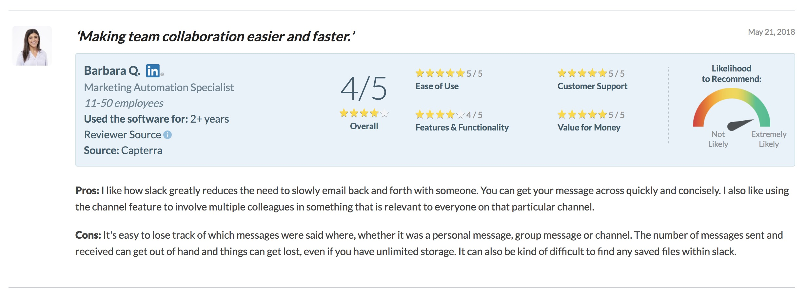
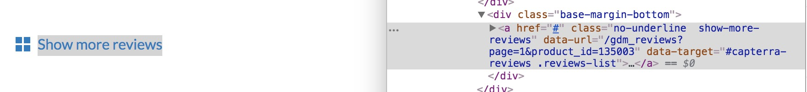

MonkeyLearn is a fantastic tool for performing sentiment analyses tailored to a particular use case. In this post I'll give an example of how you might use the `monkeylearn` R package to conduct a seamless sentiment analysis of consumer product reviews. I'll be examining reviews of the popular collaboration tool [Slack](https://slack.com/) on the product review site [Capterra](https://www.capterra.com/). You can find all of the analysis code as well the code used to generate this document on [GitHub](https://github.com/aedobbyn/sentiment-analysis-monkeylearn).

What do people who use Slack think of it? What aspects of the product are the most beloved and despised (at least among people who take the time to write a review of the product)? 

These are questions that it would be time-consuming for people to have to extract conclusions about themselves, given that there are north of 4500 reviews and counting. However, the language that people use to describe things they feel positively and negatively about follow clear enough patterns that a well-trained machine can pick them out with pretty high accuracy. We'll outsource the heavy lifting of building, training, and tweaking a model to MonkeyLearn.

<br>

#### The Plan

Specifically, MonkeyLearn will handle extracting reviews into distinct opinion units and attaching topics and sentiments to those opinion units. Most of what we have to do is shunt data back and forth between our environment and MonkeyLearn's custom machine learning modules. 

The approach here will be to first scrape and tidy reviews and their associated ratings. Next, we'll feed each of the reviews to MonkeyLearn in order to extract discrete opinion units from the text.  Finally, we'll use a custom-trained MonkeyLearn sentiment classifier to classify each opinion unit into its primary sentiment: Negative, Neutral, or Positive, as well as the category it fits into best (e.g., UI-UX, Pricing, Mobile, etc.).

The opinion unit approach gives us some more fine-grained control over what we're assigning sentiment to, since there can be multiple sentiments in the same sentence. For instance, "I love Spring time but I hate the allergies that go along with it" would hopefully be broken into the units "I love Spring time" and "but I hate the allergies that go along with it" and assigned the sentiments Positive and Negative, respectively.

Then we're left with a dataset of opinion units, each tagged with a sentiment as well as with one or many categories that we can sink our teeth into.

<br>
<br>

## Scraping the Data

First step is to collect all of the reviews of Slack that people have left on Capterra.

We'll want to make sure that the website we're considering allows for scraping. We can consult the `robots.txt` file that typically lives at the top level of a website with the handy `robotstxt` package.


```r
library(here)
library(tidyverse)
library(rvest)
library(monkeylearn)
library(glue)
library(knitr)
library(dobtools)
library(tidytext)
library(kableExtra)
```


```r
pal <- wesanderson::wes_palette("Rushmore1")

round_dec <- function(x, n_dec = 3) {
  if (is.numeric(x)) {
    x <- x %>% round(digits = 2)
  } 
  x
}

add_kable <- function(df, round_decimals = TRUE, 
                      replace_na = FALSE, capitalize = TRUE, ...) {
  
  if (round_decimals == TRUE) {
    df <- df %>% 
      map_dfc(round_dec)
  }
  
  if (replace_na == TRUE) {
    df <- 
      df %>% dobtools::replace_na_df()
  }
  
  if (capitalize == TRUE) {
    df <- 
      df %>% dobtools::cap_df()
  }
  
  df %>% 
    kable() %>% 
    kable_styling(full_width = F)
}
```


```r
robotstxt::paths_allowed(
  domain = "capterra.com",
  path = "/",
  bot = "*"
)
```

```
## [1] TRUE
```

Now that we know we're good to go, we can start scraping Capterra. I'll use the popular package `rvest` to do the scraping. `rvest` allows us to ask for content that lives inside a specific HTML tag or CSS class rather than grabbing all text on the page. We can find out which elements on the page to extract using the [SelectorGadget Chrome extension](http://selectorgadget.com/).

On Capterra, reviews are parceled into chunks including the reviewer's overall rating of the product, the text of their review, and what I'm calling sub-ratings -- the ratings of certain aspects of the product, e.g. Customer Support, Ease of Use, and Value for Money. Like the overall rating, users have the option to give these aspects a rating from 1 to 5 out of 5.

<br>



<br>

We want each review's overall rating, all of its sub-ratings, and the content of the review. 

We'll first store the URL where the Slack reviews appear,


```r
slack_url <- "https://www.capterra.com/p/135003/Slack/"
```

and write quick helper for stripping out extra whitespace and newlines from our HTML soup.


```r
strip_whitespace_newlines <- function(t) {
  out <- t %>%
    str_replace_all("\\n", " ") %>%
    trimws()

  return(out)
}
```

<br>

#### Grabbing multiple pages

Our `slack_url` loads 99 reviews of the total 4500+ at the time of scraping. To load more, the user would hit the "Show more reviews" button at the bottom of the page. This fetches more reviews from the server, but doesn't change the URL at all. That means that just using `rvest` and this URL without involving [`RSelenium`](https://github.com/ropensci/RSelenium) or something more fancy, we can only scrape the first 99 reviews.

However, through a bit of investigation of the "Show more reviews" button in the Chrome inspector, I saw that inside the link's `a` tag is a [`data-url`](https://en.wikipedia.org/wiki/Data_URI_scheme) parameter set to `"/gdm_reviews?page=1&product_id=135003"`[^1]. 

<br>



<br>

We can mash that together with our original URL to get https://www.capterra.com/gdm_reviews?page=1&product_id=135003 which reveals the same content our original URL (sans the styling). The `page=1` query parameter in this URL, though, is key; it gives us a way to select a certain page by changing the number after `page=`.

Now we can construct the URLs for all the pages we want to iterate through. From a quick perusal of a few other pages, it looks like each one contains 99 reviews. We'll create URLs for the first 45, pages putting us at nearly the full content of our 4500 or so reviews.


```r
pages_want <- 1:45
slack_full_urls <- str_c("https://www.capterra.com/gdm_reviews?page=", pages_want, "&product_id=135003", sep = "")
```

<br>

#### Defining some scraping functions

We can specify which of the 99 reviews on a page we want to scrape with from the review's number, contained in `#review-<review_number_here>` What `scrape_rating` will do is  `#review-{i} .overall-rating` We'll wrap the `scrape_rating` function in a trycatch so that we return an `NA` if something goes wrong rather than an error.


```r
scrape_rating <- function(url, i) {
  out <- url %>%
    read_html() %>%
    html_nodes(glue("#review-{i} .overall-rating")) %>%
    html_text() %>%
    strip_whitespace_newlines()

  if (length(out) == 0) {
    out <- NA_character_
  }

  return(out)
}

try_scrape_rating <- possibly(scrape_rating, otherwise = NA_character_)
```


Same deal for content and sub-ratings except we use a different selector and concatenate all of the ratings with `str_c(collapse = " ")` for now. We'll break those out later into a nested list column.


We'll similarly wrap each of these in a trycatch.


```r
try_scrape_sub_ratings <- possibly(scrape_sub_ratings, otherwise = NA_character_)
try_scrape_content <- possibly(scrape_content, otherwise = NA_character_)
```


Let's try asking for just the 42nd review on the first page.


```r
try_scrape_content(slack_full_urls[1], 42)
```

```
## [1] "Pros:  It combines instant messaging and chat. Allows us to organize. It is really hard to describe how Slack works. You just have to do it.  Cons:  I would like to use the email features more but it seems expensive for a small step up. I know the paid plans do much more, but we won't use those.   Overall:  It is just a better way to work."
```

<br>

#### Combining scraping functions

Now all that's left is to string these all together in the right order inside a function, `get_ratings_and_content`, that grabs a vector of reviews from a single page. We can keep track of which page we're scraping by extracting it straight from the URL itself. (If we use the original Slack URL which doesn't contain a page number, the `page` value gets an `NA`.)

In each iteration I go review by review here and grab both the rating and the review content before moving onto the next review to be absolutely sure that we're correctly matching rating and review. This approach is slower than grabbing all reviews and all ratings and matching them up afterward, but that could potentially get hairy if there are cases where we have more ratings than reviews on a page or vice versa. For fun we calculate a `rating_perc` which is the rating fraction string evaluated into its percent form (so "4/5" becomes 0.8).

Here we jitter the amount of wait time between each iteration using a uniform distribution around `sleep`, plus or minus half a second.

Throughout this post I'll be writing data out to small files in a directory so that if our loop fails somewhere along the way for any number of reasons, we won't lose all the data we've collected up to that point in the loop and can pick up again where we errored out on the first go-round. In this case, if we ask `get_ratings_and_content` to write what we've got so far, we create a new file in whatever `write_path` is set to.


```r
get_ratings_and_content <- function(url, review_range = 1:50,
                                    sleep = 1,
                                    write_out = TRUE, write_path = data_dir) {
  ifelse(sleep <= 1, 1, sleep)

  out <- tibble()
  page <- ifelse(str_detect(url, "page"),
    qdapRegex::ex_between(url, "page=", "&")[[1]],
    NA_character_
  )

  for (i in review_range) {
    message(glue("Beginning scrape of page {page}, review {i}"))
    
    this_rating <- try_scrape_rating(url, i)
    this_sub_ratings <- try_scrape_sub_ratings(url, i)
    this_cont <- try_scrape_content(url, i)

    this_review <- tibble(
      rating = this_rating,
      sub_ratings = this_sub_ratings,
      content = this_cont,
      page_num = page,
      review_num = i
    )

    if (write_out == TRUE) {
      write_rds(this_review, path = glue(data_dir, "page_{page}_rating_{i}.rds"))
    }

    out <- out %>%
      bind_rows(this_review)

    Sys.sleep(runif(1, sleep - 0.5, sleep + 0.5))
  }

  out <- out %>%
    rowwise() %>%
    mutate(
      rating_perc = ifelse(is.na(rating), NA_real_,
        parse(text = rating) %>% eval()
      )
    ) %>%
    select(page_num, review_num, rating, sub_ratings, rating_perc, content)

  return(out)
}
```


Let's give it a go with the first three reviews on the 10th page.


```r
get_ratings_and_content(
  url = slack_full_urls[10],
  review_range = 1:3
) %>%
  add_kable()
```

<table class="table" style="width: auto !important; margin-left: auto; margin-right: auto;">
 <thead>
  <tr>
   <th style="text-align:left;"> Page Num </th>
   <th style="text-align:right;"> Review Num </th>
   <th style="text-align:left;"> Rating </th>
   <th style="text-align:left;"> Sub Ratings </th>
   <th style="text-align:right;"> Rating Perc </th>
   <th style="text-align:left;"> Content </th>
  </tr>
 </thead>
<tbody>
  <tr>
   <td style="text-align:left;"> 10 </td>
   <td style="text-align:right;"> 1 </td>
   <td style="text-align:left;"> 5/5 </td>
   <td style="text-align:left;"> 5       /       5                                                        Ease of Use                                                                                                                               5       /       5                                                        Features &amp; Functionality                                                                                                                                                   5       /       5                                                        Customer Support                                                                                                     5       /       5                                                    Value for Money </td>
   <td style="text-align:right;"> 1.0 </td>
   <td style="text-align:left;"> Pros:  I like being able to go real time about different topics regarding what needs to happen during briefings or meetings, etc...  Cons:  I really wish that there was a way to integrate conversations about very specific topics, for example about a client...into CRM </td>
  </tr>
  <tr>
   <td style="text-align:left;"> 10 </td>
   <td style="text-align:right;"> 2 </td>
   <td style="text-align:left;"> 5/5 </td>
   <td style="text-align:left;"> 5       /       5                                                        Ease of Use                                                                                                                               4       /       5                                                        Features &amp; Functionality                                                                                                                                                   5       /       5                                                        Customer Support                                                                                                     5       /       5                                                    Value for Money </td>
   <td style="text-align:right;"> 1.0 </td>
   <td style="text-align:left;"> Pros:   You can use your own workspace url  unlimited people in the group  you can add different channels  real time messaging for all the members of the group  eliminate the use of email (which is kind of inconvenient because it's not real time  available in desktop/mobile/oush notifications  Cons:  Pretty much nothing negative about this product. Probably, just add more features? Like video calling </td>
  </tr>
  <tr>
   <td style="text-align:left;"> 10 </td>
   <td style="text-align:right;"> 3 </td>
   <td style="text-align:left;"> 4/5 </td>
   <td style="text-align:left;"> 4       /       5                                                        Ease of Use                                                                                                                               3       /       5                                                        Features &amp; Functionality                                                                                                                         4       /       5                                                    Value for Money </td>
   <td style="text-align:right;"> 0.8 </td>
   <td style="text-align:left;"> Pros:  i like the ease of use and the ability to share with multiple people.  i like the group set up and how easy it is to navigate  Cons:  i get a little anxiety over the amount of notifications i receive.  i wish i did not belong to so many groups! </td>
  </tr>
</tbody>
</table>

<br>

#### Grabbing multiple pages

Now that we can grab everything we want from a single page, let's wrap `get_ratings_and_content` up into something that iterates through multiple pages. The maximum number of reviews on a page is 99, so we'll set our default `review_range` to that.

In `get_ratings_and_content` we included the page and rating number in the review file name as its unique identifier. `get_multiple_pages` will write our results out to our same data directory.


```r
get_multiple_pages <- function(urls, review_range = 1:99, ...) {
  out <- tibble()
  for (u in urls) {
    this_page <- get_ratings_and_content(u, review_range = review_range, ...)
    out <- out %>%
      bind_rows(this_page)
  }
  return(out)
}
```


Let's scrape all of the pages!


```r
all_reviews_slack <-
  slack_full_urls %>%
  get_multiple_pages()
```

And now we can check out what we've got:


```r
all_reviews_slack %>%
  head() %>%
  add_kable()
```

<table class="table" style="width: auto !important; margin-left: auto; margin-right: auto;">
 <thead>
  <tr>
   <th style="text-align:left;"> Rating </th>
   <th style="text-align:left;"> Sub Ratings </th>
   <th style="text-align:left;"> Content </th>
   <th style="text-align:right;"> Review Num </th>
   <th style="text-align:right;"> Page Num </th>
  </tr>
 </thead>
<tbody>
  <tr>
   <td style="text-align:left;"> 5/5 </td>
   <td style="text-align:left;"> 5       /       5                                                        Ease of Use                                                                                                                             5       /       5                                                        Features &amp; Functionality                                                                                                                                                 5       /       5                                                        Customer Support                                                                                                   5       /       5                                                    Value for Money </td>
   <td style="text-align:left;"> Pros:  Ability to create groups, project rooms and add/assign people to these groups. It helps improve coordination among team members  Cons:  Since it is intended to be used by professionals, most of the professionals are using outlook and they already receive reminders for tasks and meetings, additional notifications from Meekan are unnecessary  Overall:  Team collaboration, internal correspondence, documents sharing </td>
   <td style="text-align:right;"> 1 </td>
   <td style="text-align:right;"> 1 </td>
  </tr>
  <tr>
   <td style="text-align:left;"> 5/5 </td>
   <td style="text-align:left;"> 5       /       5                                                        Ease of Use                                                                                                                             5       /       5                                                        Features &amp; Functionality </td>
   <td style="text-align:left;"> Pros:  I work across several workspaces and switching is super easy. I enjoy using Slack also because of how much work you can get done instead of constantly calling.  Cons:  The only issue I have is that the software limits your storage and sometimes it's really hard to send files over as you have a limit. But for more storage you need to pay up. No problem with it though.  Overall:  Flawless communications. </td>
   <td style="text-align:right;"> 1 </td>
   <td style="text-align:right;"> 2 </td>
  </tr>
  <tr>
   <td style="text-align:left;"> 4/5 </td>
   <td style="text-align:left;"> 5       /       5                                                        Ease of Use                                                                                                                             5       /       5                                                        Features &amp; Functionality                                                                                                                                                 4       /       5                                                        Customer Support                                                                                                   5       /       5                                                    Value for Money </td>
   <td style="text-align:left;"> Pros:  The thing I like most about this software, is the ability to include numerous people on the communication between projects.   Cons:  I wish there was an easier way to print documents out of slack. It seems as if you have to download the pdf before being able to print. </td>
   <td style="text-align:right;"> 1 </td>
   <td style="text-align:right;"> 3 </td>
  </tr>
  <tr>
   <td style="text-align:left;"> 5/5 </td>
   <td style="text-align:left;"> 5       /       5                                                        Ease of Use                                                                                                                             5       /       5                                                        Features &amp; Functionality                                                                                                                                                 5       /       5                                                        Customer Support                                                                                                   5       /       5                                                    Value for Money </td>
   <td style="text-align:left;"> Pros:  Slack is a great tool for my team and I. Slack allow us to communicate effortlessly throughout the day.  Cons:  I don't find too many cons with Slack. The price might seem a little steep for premium, but that's pretty much expected. </td>
   <td style="text-align:right;"> 1 </td>
   <td style="text-align:right;"> 4 </td>
  </tr>
  <tr>
   <td style="text-align:left;"> 5/5 </td>
   <td style="text-align:left;"> 5       /       5                                                        Ease of Use                                                                                                                             5       /       5                                                        Features &amp; Functionality                                                                                                                                                 5       /       5                                                        Customer Support                                                                                                   5       /       5                                                    Value for Money </td>
   <td style="text-align:left;"> Pros:  It's simple and it works. We're able to have conversations focused on the overall team, smaller teams, and 1:1 conversations. Either by text or media.   Cons:  Not much. This software does everything that I need it to do. My biggest problem is training people to auto-launch Slack when they start up their computers. </td>
   <td style="text-align:right;"> 1 </td>
   <td style="text-align:right;"> 5 </td>
  </tr>
  <tr>
   <td style="text-align:left;"> 4/5 </td>
   <td style="text-align:left;"> 5       /       5                                                        Ease of Use                                                                                                                             4       /       5                                                        Features &amp; Functionality                                                                                                                                                 5       /       5                                                        Customer Support                                                                                                   5       /       5                                                    Value for Money </td>
   <td style="text-align:left;"> Pros:  I like the ability to communicate with people on multiple levels. It reminds me of the old style chat rooms and you can search for specific topics. </td>
   <td style="text-align:right;"> 1 </td>
   <td style="text-align:right;"> 6 </td>
  </tr>
</tbody>
</table>


<br>

Since we saved all of these to their own files, we could also read them all in from our directory and reconstitute the dataframe. 


```r
make_files <- function(page_range) {
  a <- glue(data_dir, "page_{page_range}")
  out <- NULL

  for (i in page_range) {
    b <- c(a %>% map_chr(str_c, "_rating_", i, ".rds", sep = ""))
    out <- c(out, b)
  }
  return(out)
}

fls <- make_files(page_range = pages_want)

all_reviews_slack <-
  map_dfr(fls, read_rds) %>%
  unnest(page_num) %>%
  drop_na(content)
```


<br>
<br>


## Post-Processing

We've got data! Next a few quick cleaning steps. Our review content often represents newlines by including a lot of extra whitespace. We'll `clean_content` by cleaning out multiple spaces.


```r
clean_content <- function(t) {
  out <- t %>%
    t() %>%
    str_replace_all("[ ]{2,}", "")

  return(out)
}
```


<!-- Content consists of sub-categories like "Pros," "Cons," and "Overall". We can split those each into their own columns with a few more regexes. -->

<!-- ```{r} -->
<!-- split_pro_cons <- function(t) { -->
<!--   out <- t %>%  -->
<!--     rowwise() %>%  -->
<!--     mutate( -->
<!--       content = content %>% clean_content(), -->
<!--       pros = str_extract(content, "(?<=Pros:).*?(?=Cons:)") -->
<!--     ) -->

<!--   out <- out %>%  -->
<!--     rowwise() %>%  -->
<!--     mutate( -->
<!--       cons = ifelse(str_detect(content, "Overall:"),  -->
<!--                     str_extract(content, "(?<=Cons:).*?(?=Overall:)"), -->
<!--                     str_extract(content, "(?<=Cons:).*")), -->
<!--       overall = ifelse(str_detect(content, "Overall:"), -->
<!--                        str_extract(content, "(?<=Overall:).*"), -->
<!--                        NA_character_) -->
<!--     ) -->

<!--   return(out) -->
<!-- } -->
<!-- ``` -->

<br>

#### Tidying subratings

Now let's clean up our subratings. When we scraped subratings we concatenated all of them into one long string because there wasn't an selector for each individual subrating. We want to split sub-ratings up into their own rows; for each long string, we'll extract all numbers and the corresponding name of the sub-rating the rating number belongs to (e.g. Value for Money 5/5) into a dataframe representing the same information in tidy format. We'll nest these in their own list column for later unnesting if we so choose. Rows without any sub-ratings get the appropriate NAs in both columns.

If something goes wrong and there are more subrating numbers than names or vice versa, we'll alert ourselves of this by returning a tibble that just says "length_mismatch".


```r
split_subratings <- function(inp) {
  if (is.na(inp)) {
    out <- tibble(subrating_title = NA_character_, subrating_rating = NA_character_)
    return(out)
  }

  subrating_rating <- inp %>%
    str_extract_all("([0-9 ]+\\/[0-9 ]+)") %>%
    map(str_replace_all, "[ ]+", "") %>%
    as_vector()
  subrating_rating <- subrating_rating[subrating_rating != ""]

  subrating_title <- inp %>%
    str_split("([0-9\\. ]+\\/[0-9 ]+)") %>%
    as_vector()
  subrating_title <- subrating_title[subrating_title != ""]

  if (length(subrating_rating) != length(subrating_title)) {
    out <- tibble(subrating_title = "length_mismatch", subrating_rating = "length_mismatch")
    return(out)
  }

  out <- tibble(subrating_title = subrating_title, subrating_rating = subrating_rating)
  return(out)
}
```


Now we can take our raw reviews and get each sub-rating into a nested dataframe inside a new `sub_ratings_split` column, which can then be unnested.


```r
reviews_with_subratings <- all_reviews_slack %>%
  rowwise() %>%
  mutate(
    sub_ratings_split = split_subratings(sub_ratings) %>% list()
  ) %>%
  select(-sub_ratings) %>%
  drop_na(content) %>%
  filter(!content %in% c("", " ")) %>%
  mutate(
    page_num = as.numeric(page_num)
  )

reviews_with_subratings_unnested <-
  reviews_with_subratings %>%
  unnest() %>%
  rename(
    sub_rating_category = names,
    sub_rating_rating = nums
  ) %>%
  arrange(page_num, review_num, sub_rating_category)
```


Let's take a peek at our first 10 rows.


```r
reviews_with_subratings_unnested %>%
  slice(1:10) %>%
  add_kable()
```

<table class="table" style="width: auto !important; margin-left: auto; margin-right: auto;">
 <thead>
  <tr>
   <th style="text-align:left;"> Rating </th>
   <th style="text-align:left;"> Content </th>
   <th style="text-align:right;"> Review Num </th>
   <th style="text-align:right;"> Page Num </th>
   <th style="text-align:left;"> Sub Rating Category </th>
   <th style="text-align:left;"> Sub Rating Rating </th>
  </tr>
 </thead>
<tbody>
  <tr>
   <td style="text-align:left;"> 5/5 </td>
   <td style="text-align:left;"> Pros:  Ability to create groups, project rooms and add/assign people to these groups. It helps improve coordination among team members  Cons:  Since it is intended to be used by professionals, most of the professionals are using outlook and they already receive reminders for tasks and meetings, additional notifications from Meekan are unnecessary  Overall:  Team collaboration, internal correspondence, documents sharing </td>
   <td style="text-align:right;"> 1 </td>
   <td style="text-align:right;"> 1 </td>
   <td style="text-align:left;"> Customer Support </td>
   <td style="text-align:left;"> 5/5 </td>
  </tr>
  <tr>
   <td style="text-align:left;"> 5/5 </td>
   <td style="text-align:left;"> Pros:  Ability to create groups, project rooms and add/assign people to these groups. It helps improve coordination among team members  Cons:  Since it is intended to be used by professionals, most of the professionals are using outlook and they already receive reminders for tasks and meetings, additional notifications from Meekan are unnecessary  Overall:  Team collaboration, internal correspondence, documents sharing </td>
   <td style="text-align:right;"> 1 </td>
   <td style="text-align:right;"> 1 </td>
   <td style="text-align:left;"> Ease of Use </td>
   <td style="text-align:left;"> 5/5 </td>
  </tr>
  <tr>
   <td style="text-align:left;"> 5/5 </td>
   <td style="text-align:left;"> Pros:  Ability to create groups, project rooms and add/assign people to these groups. It helps improve coordination among team members  Cons:  Since it is intended to be used by professionals, most of the professionals are using outlook and they already receive reminders for tasks and meetings, additional notifications from Meekan are unnecessary  Overall:  Team collaboration, internal correspondence, documents sharing </td>
   <td style="text-align:right;"> 1 </td>
   <td style="text-align:right;"> 1 </td>
   <td style="text-align:left;"> Features &amp; Functionality </td>
   <td style="text-align:left;"> 5/5 </td>
  </tr>
  <tr>
   <td style="text-align:left;"> 5/5 </td>
   <td style="text-align:left;"> Pros:  Ability to create groups, project rooms and add/assign people to these groups. It helps improve coordination among team members  Cons:  Since it is intended to be used by professionals, most of the professionals are using outlook and they already receive reminders for tasks and meetings, additional notifications from Meekan are unnecessary  Overall:  Team collaboration, internal correspondence, documents sharing </td>
   <td style="text-align:right;"> 1 </td>
   <td style="text-align:right;"> 1 </td>
   <td style="text-align:left;"> Value for Money </td>
   <td style="text-align:left;"> 5/5 </td>
  </tr>
  <tr>
   <td style="text-align:left;"> 5/5 </td>
   <td style="text-align:left;"> Pros:  I like that I can share the information with one or more persons, using one or more chats, create reminders.  Cons:  When sometimes we need to share files we have to click on download, I would like that this can be automatically downloaded  Overall:  I can create my own reminders, download files and share the information using one or more chats </td>
   <td style="text-align:right;"> 2 </td>
   <td style="text-align:right;"> 1 </td>
   <td style="text-align:left;"> Customer Support </td>
   <td style="text-align:left;"> 5/5 </td>
  </tr>
  <tr>
   <td style="text-align:left;"> 5/5 </td>
   <td style="text-align:left;"> Pros:  I like that I can share the information with one or more persons, using one or more chats, create reminders.  Cons:  When sometimes we need to share files we have to click on download, I would like that this can be automatically downloaded  Overall:  I can create my own reminders, download files and share the information using one or more chats </td>
   <td style="text-align:right;"> 2 </td>
   <td style="text-align:right;"> 1 </td>
   <td style="text-align:left;"> Ease of Use </td>
   <td style="text-align:left;"> 5/5 </td>
  </tr>
  <tr>
   <td style="text-align:left;"> 5/5 </td>
   <td style="text-align:left;"> Pros:  I like that I can share the information with one or more persons, using one or more chats, create reminders.  Cons:  When sometimes we need to share files we have to click on download, I would like that this can be automatically downloaded  Overall:  I can create my own reminders, download files and share the information using one or more chats </td>
   <td style="text-align:right;"> 2 </td>
   <td style="text-align:right;"> 1 </td>
   <td style="text-align:left;"> Features &amp; Functionality </td>
   <td style="text-align:left;"> 5/5 </td>
  </tr>
  <tr>
   <td style="text-align:left;"> 5/5 </td>
   <td style="text-align:left;"> Pros:  I like that I can share the information with one or more persons, using one or more chats, create reminders.  Cons:  When sometimes we need to share files we have to click on download, I would like that this can be automatically downloaded  Overall:  I can create my own reminders, download files and share the information using one or more chats </td>
   <td style="text-align:right;"> 2 </td>
   <td style="text-align:right;"> 1 </td>
   <td style="text-align:left;"> Value for Money </td>
   <td style="text-align:left;"> 5/5 </td>
  </tr>
  <tr>
   <td style="text-align:left;"> 4/5 </td>
   <td style="text-align:left;"> Pros:  It's free and easy to set up a place where residents of our community can communicate with each other easily without that communication being visible to outsiders.  Cons:  No particular complaints, it's been very easy to manage the platform and new users don't have any trouble picking it up.  Overall:  Easy communication between individuals in a specific group. </td>
   <td style="text-align:right;"> 3 </td>
   <td style="text-align:right;"> 1 </td>
   <td style="text-align:left;"> Customer Support </td>
   <td style="text-align:left;"> 3/5 </td>
  </tr>
  <tr>
   <td style="text-align:left;"> 4/5 </td>
   <td style="text-align:left;"> Pros:  It's free and easy to set up a place where residents of our community can communicate with each other easily without that communication being visible to outsiders.  Cons:  No particular complaints, it's been very easy to manage the platform and new users don't have any trouble picking it up.  Overall:  Easy communication between individuals in a specific group. </td>
   <td style="text-align:right;"> 3 </td>
   <td style="text-align:right;"> 1 </td>
   <td style="text-align:left;"> Ease of Use </td>
   <td style="text-align:left;"> 3/5 </td>
  </tr>
</tbody>
</table>

Cool so in the `_nested` version of our data we've got one row per review with a nested `sub_ratings_split` column, and in the `_unnested` version we've got one as many rows per review as there are sub-ratings. We can still tell which review they each belong to because each has a unique `page_num` and `review_num` combination.

<br>

Now onto the data processing! This is where MonkeyLearn's custom modules come in. They make it simple to send data their way for extraction or classification without having to build, train, test, and iterate on a model ourselves. The MonkeyLearn modules, custom-trained on our scraped data, even provide metrics like the precision, recall, and accuracy of each particular module.

<br>

## Extracting Opinions and Classifying Topics & Sentiment

First step is to extract opinion units from our review content. Each review will have one or many opinion units. What we want to end up with is one row per opinion unit, meaning multiple rows per original content line. Next, we send each opinion unit to the API to be assigned a a single sentiment (Positive, Negative, or Neutral) and classified into one or multiple topics. For topic classifications, we'll only worry about the "leaf" topics for these purposes.[^2]

The `monkeylearn` R package can get us most of the way there. `monkeylearn` exposes two functions for processing data: `monkey_extract` for extraction and `monkey_classify` for classification. They accept either a vector of texts or a dataframe and a named column where the texts live and return a dataframe relating each row of input to its outputs (either nested in a `res` column or unnested if `unnest` is TRUE). If unnested, that result will include a few columns including the extraction/classification label as well as the probability (confidence) MonkeyLearn assigns its classification/extraction We also need to supply an API key either as a string or (preferably) stored as an environment variable.

As of `monkeylearn` 2.0 it is possible to send batches of texts to the API and return a dataframe relating each input to its (often) multiple outputs. We don't need to handle batching ourselves; `monkeylearn` will by default send 200 texts per batch (the recommended maximum number of texts to be sent to the API at once) and move onto the next batch of 200 until we get to the end of our input. Similarly, `monkeylearn` already takes care of rate limiting, so we don't need to put in any custom sleeps between requests ourselves.

<br>

#### Tweaking the API response

Since we're working with custom-trained extractors and classifiers, the API response is slightly different from responses that the package is set up to handle. In particular, the package's handling of `NULL` values doesn't extend perfectly to this extractor and classifier, so we'll need to do a slight modification to change the missing values into values that we can unnest correctly. For that reason, we'll set `unnest` to FALSE inside of `monkey_extract` and `monkey_classify` and do the unnesting ourselves.
<!-- The API returns zero-length vectors or `NULL`s for empty opinion units or when a unit wasn't classified into any categories. -->

If we get a `NULL` response from our classifier we'll replace it with `replacement_classifier` and likewise for `replacement_extractor`.


```r
replacement_classifier <- tribble(
  ~category_id, ~probability, ~label,
  NA_character_, NA_character_, NA_character_
) %>% list()


replacement_extractor <- tribble(
  ~count, ~tag, ~entity,
  NA_character_, NA_character_, NA_character_
)
```

We'll use these replacements inside the unnesting helpers below. They're different because of slightly different particularities to the API response. [`dobtools::replace_x`](https://github.com/aedobbyn/dobtools/blob/master/R/replace_x.R) is just a generic "replace this NULL or 0L vector with whatever replacement I specify" function that is often useful for turning `NULL`s in API response data into `NA`s so that nested values can be unnested and tidied properly. (Incidentally, this was developed before the first version of the rOpenSci [`roomba`](https://github.com/ropenscilabs/roomba) package was released, which could have proved useful for tasks like this.)


```r
unnest_result_classifier <- function(df) {
  out <- df %>%
    rowwise() %>%
    mutate(
      res = ifelse(length(res)[[1]] == 0 || is.na(res), replacement_classifier, res)
    ) %>%
    unnest(res)

  return(out)
}

unnest_result_extractor <- function(df) {
  out <- df
  df$res <- df$res %>%
    map(dobtools::replace_x, replacement = replacement_extractor)

  out <- df %>%
    unnest(res)

  return(out)
}

try_unnest_result_extractor <- safely(unnest_result_extractor)
try_unnest_result_classifier <- safely(unnest_result_classifier)
```


We wrap the usual `monkeylearn` package functions `monkey_classify` and `monkey_extract` in a trycatch using `purrr::safely` which returns a list of two things, one of which is always `NULL`; the result of the function and an error. If the function fails, we get the error and a `NULL` response and if it succeeds we get the response and a `NULL` error. We put this precaution in place because our `monkey_` function could throw an error for a few reasons; our request to MonkeyLearn could fail because either we or the server lose network connectivity, we receive a response we didn't expect and try to perform some operation on it that fails, or for some other unforeseen reason.


```r
get_classification_batch <-
  safely(monkey_classify)

get_extraction_batch <-
  safely(monkey_extract)
```

Let's test what happens something fails.


```r
safe_return <-
  NULL %>%
  get_classification_batch()

safe_return
```

```
## $result
## NULL
## 
## $error
## <simpleError in .f(...): input must be non-null.>
```

The function executes successfully and we get a record of the error message.

<br>

#### Batching input to the MonkeyLearn API

Now a function wrap up `monkey_classify` and `monkey_extract`. Rather than writing one extraction wrapper and one classifier wrapper, I combined them both into the same function below. We supply an `id` which can be either an extractor ID or a classifier ID set `type_of_problem` to either `"classification"` or `"extraction"` depending on the ID. (All classifier IDs begin with `"cl_"` and all extractor IDs begin with ``"ex_"`).

If any errors occur when we send text to the API, we log them in an error log that specifies where the error occurred and return that log along with the full response.

We'll take the same tack of storing each of these results in its own file (this time a CSV) in a user-specified directory.


```r
write_batches <- function(df, id, dir,
                          n_texts_per_batch,
                          start_row = 1,
                          unnest = FALSE,
                          write_out = TRUE, ...) {
  if (substr(id, 1, 3) == "cl_") {
    type_of_problem <- "classification"
  } else if (substr(id, 1, 3) == "ex_") {
    type_of_problem <- "extraction"
  } else {
    stop("Not a recognized classifier or extractor id.")
  }

  resp <- tibble()
  n_df_rows <- nrow(df)

  batch_start_row <- start_row
  batch_end_row <- batch_start_row + n_texts_per_batch

  error_log <- ""

  while (batch_start_row <= n_df_rows) {
    if (type_of_problem == "classification") {
      this_batch_nested <- get_classification_batch(df[batch_start_row:batch_end_row, ],
        col = content,
        classifier_id = id,
        unnest = unnest
      )
      this_batch <- this_batch_nested$result %>%
        try_unnest_result_classifier()
    } else if (type_of_problem == "extraction") {
      this_batch_nested <- get_extraction_batch(df[batch_start_row:batch_end_row, ],
        col = content,
        extactor_id = id,
        unnest = unnest
      )

      this_batch <- this_batch_nested$result %>%
        try_unnest_result_extractor()
    }

    message(glue("Processed rows {batch_start_row} to {batch_end_row}."))

    if (is.null(this_batch_nested$error) && is.null(this_batch$error)) {
      if (write_out == TRUE) {
        write_csv(
          this_batch$result,
          glue("{dir}/{type_of_problem}_batches_rows_{batch_start_row}_to_{batch_end_row}.csv")
        )
      }

      resp <- resp %>%
        bind_rows(this_batch$result)
    } else {
      error_log <- error_log %>%
        c(glue("Error between rows {batch_start_row} and {batch_end_row}: 
               {c(this_batch_nested$error, this_batch$error)}"))

      message(error_log)
    }

    batch_start_row <- batch_start_row + n_texts_per_batch
    batch_end_row <- batch_start_row + n_texts_per_batch

    if (batch_end_row > n_df_rows) {
      batch_end_row <- n_df_rows
    }
  }

  out <- list(
    resp = resp,
    error_log = error_log
  )

  return(out)
}
```


We can wrap `write_batches` in a couple helper functions with extraction- or classification-relevant results so that we don't need to specify them every time.


```r
write_extraction_batches <- function(df, n_texts_per_batch = 200,
                                     dir = opinion_batches_dir, ...) {
  write_batches(df,
    id = extractor_id, n_texts_per_batch = n_texts_per_batch,
    dir = dir, ...
  )
}

write_classification_batches <- function(df, n_texts_per_batch = 200,
                                         dir = topic_batches_dir, ...) {
  write_batches(df,
    id = topic_id, n_texts_per_batch = n_texts_per_batch,
    dir = dir, ...
  )
}
```


For example:


```r
reviews_with_subratings_nested[123, ] %>%
  write_extraction_batches(n_texts_per_batch = 1, write_out = FALSE) %>%
  write_classification_batches(n_texts_per_batch = 1, write_out = FALSE)
```


After we write all the results to their individual files, we'll want an easy way to gather up all of our result files up into a single dataframe. `gather_batches` will take a directory, create a vector of all the files that exist in it, `read_csv` in all of those files into one long list of dataframes, and then index into every element in that list to bind all of the dataframes together, rowwise.


```r
gather_batches <- function(dir, end_row) {
  fls <- fs::dir_ls(dir)

  list_o_batches <-
    map(
      fls,
      read_csv
    )

  out <- list_o_batches %>%
    modify_depth(2, as.character) %>%
    bind_rows()

  return(out)
}
```

<br>

#### Sending text the API and gathering it all up again

Cool, now we've set up everything we need to process our data and reconstitute the result. As a quick refresher, the flow here is that we'll take our scraped data, send it to the extractor to extract multiple opinion units per review, and then send each of those opinion units to the classifier to receive its sentiment rating and multiple classifications per opinion unit.


```r
# Write opinion units
reviews_with_subratings_nested %>%
  write_extraction_batches()

# Gather opinion units
opinion_batches_extracted <-
  gather_batches(dir = opinion_batches_dir) %>%
  rename(probability_unit = probability)

# Classify opinion units
opinion_batches_extracted %>%
  write_classification_batches()

# Gather classifications
dat <-
  gather_batches(dir = topic_batches_dir) %>%
  rename(probability_sentiment = probability)
```

We could even have skipped the `gather_batches` steps if everything went well with our `write_{}_batches` functions. Assigning that output to a variable also allows us to inspect the `error_log` to see if all went well.


<br>
